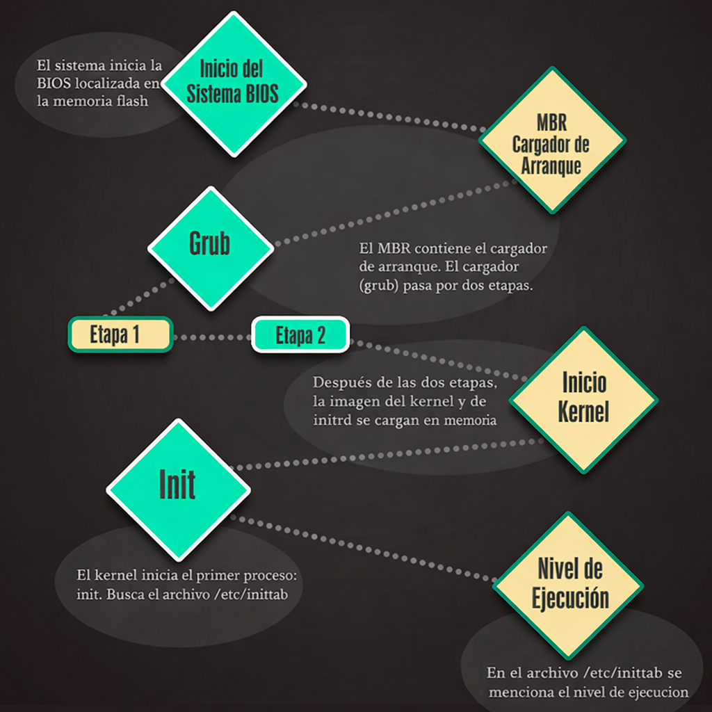
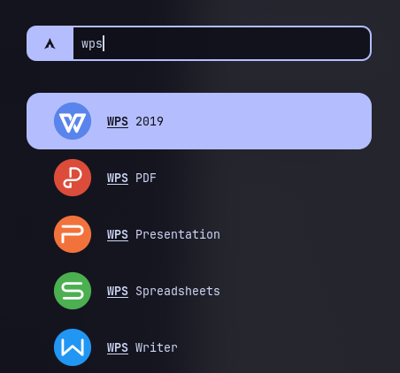

<h1 align="center">
 
  <br />
 Guia Linux 
</h1>

<div align="center">

--- 

<br>

#≽ܫ≼

<a href="https://github.com/VanitasuShieda/Meowrch/tree/Meowrch-vanitasu"></a>

<a href="https://github.com/VanitasuShieda?tab=followers">
         </a> 

<br> 

---

</div>


## Introducción

Esta es una guía traducida y adaptada sobre Linux que recopila información esencial sobre entornos de escritorio, gestores de ventanas, herramientas, aplicaciones y recursos que te ayudarán a convertirte en un usuario más competente y eficiente.

Además de la traducción, se han realizado actualizaciones en distintas secciones para reflejar el estado actual del ecosistema Linux, así como la incorporación de referencias y recursos en español, incluyendo creadores de contenido que aportan información relevante para la comunidad hispanohablante.

El objetivo de esta guía es ofrecer una base sólida tanto para nuevos usuarios como para quienes desean profundizar en el uso diario de Linux.

Fuente original:
https://github.com/mikeroyal/Linux-Guide-Spanish


 **Nota: Puedes convertir fácilmente este archivo tipo Markdown a PDF en [VSCode](https://code.visualstudio.com/) utilizando esta práctica extensión [Markdown PDF](https://marketplace.visualstudio.com/items?itemName=yzane.markdown-pdf).**
 
 
 # Tabla de Contenidos
 
- [Tabla de Contenidos](#tabla-de-contenidos)
  - [Recursos para aprender Linux](#recursos-para-aprender-linux)
    - [Repositorios de software y gestores de paquetes de Linux](#repositorios-de-software-y-gestores-de-paquetes-de-linux)
    - [Kernel de Linux](#kernel-de-linux)
    - [Systemd](#systemd)
    - [Canales de YouTube sobre Linux](#canales-de-youtube-sobre-linux)
    - [Linux Podcasts](#linux-podcasts)
- [Entornos de escritorio Linux](#entornos-de-escritorio-linux)
  - [Gestores de ventanas de Linux](#gestores-de-ventanas-de-linux)
    - [Tiling (Gestores de ventanas en mosaico)](#tiling-gestores-de-ventanas-en-mosaico)
- [Empresas Linux](#empresas-linux)
- [Proveedores de hardware para Linux](#proveedores-de-hardware-para-linux)
- [Linux en la nube](#linux-en-la-nube)
- [Obtener software](#obtener-software)
  - [Gestores de paquetes (la forma principal)](#gestores-de-paquetes-la-forma-principal)
  - [Tiendas gráficas (para usuarios nuevos)](#tiendas-gráficas-para-usuarios-nuevos)
    - [GNOME Software Center](#gnome-software-center)
    - [KDE Plasma Discover Software Center](#kde-plasma-discover-software-center)
    - [App Outlet](#app-outlet)
  - [Formatos universales (multidistribución)](#formatos-universales-multidistribución)
    - [Flatpaks](#flatpaks)
    - [Snaps](#snaps)
    - [AppImages](#appimages)
  - [Compilar desde código fuente](#compilar-desde-código-fuente)
    - [¿Qué es el código fuente?](#qué-es-el-código-fuente)
    - [Requisitos previos](#requisitos-previos)
    - [Proceso típico de compilación](#proceso-típico-de-compilación)
      - [1 - Descargar el código fuente](#1---descargar-el-código-fuente)
      - [2 - Configurar la compilación](#2---configurar-la-compilación)
      - [3 - Compilar](#3---compilar)
      - [4 - Instalar](#4---instalar)
  - [Alternativas a Microsoft Office](#alternativas-a-microsoft-office)
  - [Navegadores web seguros y centrados en la privacidad](#navegadores-web-seguros-y-centrados-en-la-privacidad)
    - [Extensiones de navegador centradas en la privacidad y la seguridad](#extensiones-de-navegador-centradas-en-la-privacidad-y-la-seguridad)
    - [Motores de búsqueda centrados en la privacidad](#motores-de-búsqueda-centrados-en-la-privacidad)
  - [Backups](#backups)
  - [Estado del disco de almacenamiento](#estado-del-disco-de-almacenamiento)
  - [Mejorar la duración de la batería](#mejorar-la-duración-de-la-batería)
  - [Herramientas para copiar/transferir archivos a tu sistema Linux](#herramientas-para-copiartransferir-archivos-a-tu-sistema-linux)
  - [Ejecutar aplicaciones Android en tu sistema Linux](#ejecutar-aplicaciones-android-en-tu-sistema-linux)
  - [Ejecutar aplicaciones de Windows en tu sistema Linux](#ejecutar-aplicaciones-de-windows-en-tu-sistema-linux)
  - [Edición profesional de audio y vídeo](#edición-profesional-de-audio-y-vídeo)
  - [Configuración de OBS Studio](#configuración-de-obs-studio)
    - [Complementos y temas útiles de terceros para OBS Studio.](#complementos-y-temas-útiles-de-terceros-para-obs-studio)
- [Gaming](#gaming)
    - [Linux Gaming Resources \& Tweak Tools](#linux-gaming-resources--tweak-tools)
    - [Game Controllers](#game-controllers)
  - [Steam](#steam)
  - [Habilitar Proton en Steam](#habilitar-proton-en-steam)
  - [ProtonDB](#protondb)
  - [Lutris](#lutris)
    - [Integración con Epic Games Store](#integración-con-epic-games-store)
    - [Integración de Blizzard Battle.net](#integración-de-blizzard-battlenet)
    - [Integración de EA Play](#integración-de-ea-play)
    - [Integración de Origin](#integración-de-origin)
    - [Integración Ubisoft Connect](#integración-ubisoft-connect)
    - [Integración de GOG Galaxy](#integración-de-gog-galaxy)
    - [Playnite](#playnite)
  - [GameHub](#gamehub)
  - [Epic Games Store](#epic-games-store)
  - [Game Streaming](#game-streaming)
    - [Cloud Game Streaming](#cloud-game-streaming)
    - [Local Game Streaming](#local-game-streaming)
  - [Emuladores](#emuladores)
    - [Frontends](#frontends)
    - [Nintendo GameCube y Wii](#nintendo-gamecube-y-wii)
    - [Nintendo Switch](#nintendo-switch)
    - [Nintendo 64](#nintendo-64)
    - [Nintendo DS](#nintendo-ds)
    - [Super Nintendo Entertainment System (SNES)](#super-nintendo-entertainment-system-snes)
    - [Nintendo Entertainment System](#nintendo-entertainment-system)
    - [Game Boy Advance](#game-boy-advance)
    - [DOS](#dos)
    - [Atari](#atari)
    - [Sega Dreamcast](#sega-dreamcast)
    - [PlayStation Portable](#playstation-portable)
    - [PlayStation 1](#playstation-1)
    - [PlayStation 2](#playstation-2)
    - [PlayStation 3](#playstation-3)
    - [Xbox](#xbox)
    - [MAME](#mame)
  - [Rendimiento del hardware (CPU, GPU, periféricos para juegos)](#rendimiento-del-hardware-cpu-gpu-periféricos-para-juegos)
    - [NVIDIA](#nvidia)
    - [AMD](#amd)
    - [Intel ARC](#intel-arc)
    - [Gaming Peripherals](#gaming-peripherals)
  - [Pruebas de rendimiento](#pruebas-de-rendimiento)
  - [Wine](#wine)
    - [Winetricks](#winetricks)
- [WireGuard](#wireguard)
- [Fortalecimiento de la seguridad de Linux](#fortalecimiento-de-la-seguridad-de-linux)
    - [Security Standards, Frameworks and Benchmarks](#security-standards-frameworks-and-benchmarks)
    - [Herramientas de seguridad](#herramientas-de-seguridad)
  - [Sistemas de archivos](#sistemas-de-archivos)
- [Debian](#debian)
  - [Introducción a Debian](#introducción-a-debian)
- [Ubuntu](#ubuntu)
  - [Introducción a Ubuntu](#introducción-a-ubuntu)
  - [Herramientas y recursos adicionales de Ubuntu para empresas y pequeñas empresas](#herramientas-y-recursos-adicionales-de-ubuntu-para-empresas-y-pequeñas-empresas)
  - [Eliminar Snap y añadir compatibilidad con Flatpak](#eliminar-snap-y-añadir-compatibilidad-con-flatpak)
  - [Configuración de PipeWire para Ubuntu/Debian](#configuración-de-pipewire-para-ubuntudebian)
    - [Revertir cambios](#revertir-cambios)
- [Pop!\_OS](#pop_os)
  - [Introducción a Pop!\_OS](#introducción-a-pop_os)
  - [Pop Shop](#pop-shop)
- [Linux Mint](#linux-mint)
    - [Primeros pasos con Linux Mint](#primeros-pasos-con-linux-mint)
    - [Installing KDE Plasma on Linux Mint](#installing-kde-plasma-on-linux-mint)
    - [Enable Firewall](#enable-firewall)
    - [Getting Software](#getting-software)
      - [Linux Mint Software Center](#linux-mint-software-center)
- [Fedora/CentOS Stream/RHEL](#fedoracentos-streamrhel)
- [Introducción a FedoraCentOS Stream/RHEL](#introducción-a-fedoracentos-streamrhel)
  - [Fedora, Red Hat Enterprise Linux (RHEL) and CentOS Stream Development Cycle](#fedora-red-hat-enterprise-linux-rhel-and-centos-stream-development-cycle)
- [SUSE/openSUSE](#suseopensuse)
    - [Introducción a SUSE/openSUSE](#introducción-a-suseopensuse)
- [Arch Linux](#arch-linux)
  - [Introduccion a Arch Linux](#introduccion-a-arch-linux)
    - [Repositorio de usuarios de Arch Linux (AUR)](#repositorio-de-usuarios-de-arch-linux-aur)
    - [Good Arch Linux Desktops for everyday use.](#good-arch-linux-desktops-for-everyday-use)
- [NixOS](#nixos)
  - [Introducción a NixOS](#introducción-a-nixos)
  - [NixOS Developer Resources](#nixos-developer-resources)
  - [NixOS Tools and Modules](#nixos-tools-and-modules)
  - [NixOS Desktop](#nixos-desktop)
  - [Contribute](#contribute)
  - [License](#license)
 
1.  [File systems](https://github.com/VanitasuShieda/Linux-Guide-Spanish#file-systems) 

2.  [Debian](https://github.com/VanitasuShieda/Linux-Guide-Spanish#debian)

3.  [Ubuntu](https://github.com/VanitasuShieda/Linux-Guide-Spanish#ubuntu)

4.  [Pop!_OS](https://github.com/VanitasuShieda/Linux-Guide-Spanish#pop_os)

5.  [Linux Mint](https://github.com/VanitasuShieda/Linux-Guide-Spanish#linux-mint)

6.  [Fedora/CentOS Stream/Red Hat Enterprise Linux](https://github.com/VanitasuShieda/Linux-Guide-Spanish#fedoracentos-streamrhel)

7.  [SUSE/openSUSE](https://github.com/VanitasuShieda/Linux-Guide-Spanish#suseopensuse)

8.  [Arch Linux](https://github.com/VanitasuShieda/Linux-Guide-Spanish#arch-linux)

9.  [NixOS](https://github.com/VanitasuShieda/Linux-Guide-Spanish#nixos)

 
 <p align="center">
 
  <br /> 
</p>

 
## Recursos para aprender Linux

[Volver al Inicio](#tabla-de-contenidos)

 * [A Brief History of Linux](https://www.digitalocean.com/community/tutorials/brief-history-of-linux)

 * [Contribute to FOSS](https://github.com/KillYourFM/contribute-foss) by Jason Evangelho, is an entensive Wiki page on how to contribute to the Linux and FOSS community.

 * [The Open Source Computer Science Degree by Forrest Knight](https://github.com/ForrestKnight/open-source-cs)

 * [MikeRoyal Windows Subsystem for Linux(WSL) Guide](https://github.com/mikeroyal/WSL-Guide)

 * [SUSE Training and Certification Program](https://training.suse.com/)
 
 * [Red Hat Training and Certification Program](https://www.redhat.com/en/services/training-and-certification)

 * [Linux Foundation Training and Certification Program](https://training.linuxfoundation.org/certification/)

NOTA: Link a sitio web oficial en ingles.

[Linux Professional Institute(LPI)](https://www.lpi.org) es una organización sin fines de lucro. Linux Professional Institute (LPI) es el estándar global de certificación y la organización de apoyo profesional para profesionales del código abierto. Con más de 175,000 personas certificadas, es el primer y mayor organismo de certificación neutro respecto a proveedores para Linux y software de código abierto en el mundo.

[Linux Foundation](https://www.linuxfoundation.org/)  alberga a Linux, Node.js y otros proyectos críticos que forman la columna vertebral de los servicios de internet modernos, incluido Pinterest. Unirse a The Linux Foundation es una excelente manera para que empresas consolidadas como la nuestra apoyen a esas comunidades.

[Cloud Native Computing Foundation (CNCF)](https://www.cncf.io/) alberga componentes críticos de la infraestructura tecnológica global. CNCF reúne a los principales desarrolladores, usuarios finales y proveedores del mundo y organiza las conferencias de desarrolladores de código abierto más grandes. CNCF forma parte de la organización sin fines de lucro Linux Foundation.

[RISC-V Foundation](https://riscv.org/) es una corporación sin fines de lucro controlada por sus miembros para promover la adopción e implementación de la arquitectura de conjunto de instrucciones (ISA) RISC-V, libre y abierta.

[Open Source Security Foundation (OpenSSF)](https://openssf.org/) es una colaboración intersectorial que reúne a líderes para mejorar la seguridad del software de código abierto mediante la construcción de una comunidad más amplia, iniciativas específicas y buenas prácticas. OpenSSF agrupa iniciativas de seguridad de código abierto bajo una misma fundación para acelerar el trabajo con el apoyo de múltiples industrias. Junto con la Core Infrastructure Initiative y la Open Source Security Coalition, incluirá nuevos grupos de trabajo que aborden la divulgación de vulnerabilidades, las herramientas de seguridad y más.

[Free Software Foundation (FSF)](https://www.fsf.org/) es una organización sin fines de lucro con la misión mundial de promover la libertad de los usuarios de computadoras.


### Repositorios de software y gestores de paquetes de Linux
[Volver al Inicio](#tabla-de-contenidos)


[dpkg(Debian Package)](https://www.digitalocean.com/community/tutorials/dpkg-command-in-linux) es el sistema de gestión de paquetes en Debian y sus derivados del sistema operativo.

[DEB](https://www.debian.org/distrib/packages) es un archivo de paquete de software de Debian usado en sistemas Linux Debian-base como Debian, Ubuntu, Linux Mint y Pop!_OS.

[APT (Advanced Package Tool)](https://en.wikipedia.org/wiki/APT_(software)) es un sistema de gestión de paquetes de nivel superior, que se utiliza más comúnmente que dpkg ya que puede obtener paquetes desde ubicaciones remotas.


[Nala](https://gitlab.com/volian/nala) es una interfaz de línea de comandos para el gestor de paquetes APT.

[Synaptic Package Manager](https://en.wikipedia.org/wiki/Synaptic_%28software%29) es una interfaz de línea de comandos para el gestor de paquetes APT.

[PPA(Personal Package Archive)](https://help.launchpad.net/Packaging/PPA) es un conjunto de repositorios de software que pueden distribuir software y actualizaciones directamente a los usuarios de Ubuntu. Crea tu paquete fuente, súbelo y Launchpad compilará los binarios y luego los alojará en tu propio repositorio apt.

[PackageKit](https://www.freedesktop.org/software/PackageKit/) es un conjunto de aplicaciones de software diseñado para proporcionar una interfaz coherente y de alto nivel para varios sistemas de gestión de paquetes en Linux.

[EPEL (Extra Packages for Enterprise Linux)](https://docs.fedoraproject.org/en-US/epel/) es un proyecto de repositorio de la comunidad, gratuito y de código abierto, del equipo de Fedora que proporciona paquetes adicionales de software de alta calidad para distribuciones Linux como RHEL (Red Hat Enterprise Linux) y CentOS Stream.

[DNF(Dandified Packaging Tool)](https://docs.fedoraproject.org/en-US/quick-docs/dnf/) es un gestor de paquetes que instala, actualiza y elimina paquetes en Fedora y es el sucesor de YUM (Yellow-Dog Updater Modified). DNF facilita el mantenimiento de paquetes comprobando automáticamente las dependencias y determinando las acciones necesarias para instalar paquetes.

[Micro DNF](https://fedoraproject.org/wiki/Changes/MajorUpgradeOfMicrodnf) es una implementación ligera en C de DNF, diseñada para realizar acciones de empaquetado simples cuando no necesitas DNF completo y deseas los entornos más pequeños posibles. Consulta [Micro DNF GitHub](https://github.com/rpm-software-management/microdnf).

[Fedora Updates System](https://bodhi.fedoraproject.org/) es un lugar para crear, probar y publicar actualizaciones de paquetes para Fedora.

<p align="center">

<br />
Fedora Updates System
</p>

[RPM Package Manager (RPM)](https://rpm.org/) es un potente sistema de gestión de paquetes capaz de compilar software desde el código fuente en paquetes fácilmente distribuibles, instalar, actualizar y desinstalar software empaquetado, y consultar información detallada sobre el software empaquetado, esté o no instalado.

[YUM (Yellowdog Updater, Modified)](https://www.digitalocean.com/community/tutorials/what-is-yum) es una utilidad de gestión de paquetes para sistemas Linux que utiliza el gestor de paquetes RPM.

[RPM Fusion](https://rpmfusion.org/) es un repositorio de software que proporciona software que el Proyecto Fedora o Red Hat no quieren incluir. Ese software se ofrece como RPMs precompilados para todas las versiones actuales de Fedora y versiones actuales de Red Hat Enterprise Linux o sus clones; puedes usar los repositorios de RPM Fusion con herramientas como yum y PackageKit.

[ROM OSTree](https://ostreedev.github.io/ostree/) es un sistema híbrido de imagen/paquete. Combina libostree como formato base de imagen y acepta RPM tanto en el lado cliente como en el servidor, compartiendo código con el proyecto dnf; específicamente libdnf. De este modo reúne muchos de los beneficios de ambos proyectos.

[YaST](https://yast.opensuse.org/) es una herramienta de instalación y configuración para openSUSE y las distribuciones SUSE Linux Enterprise. Presenta una interfaz fácil de usar y potentes capacidades de configuración.

[Zypper](https://software.opensuse.org/package/zypper) es un gestor de paquetes en línea de comandos que usa libzypp. Proporciona funciones como acceso a repositorios, resolución de dependencias, instalación de paquetes, etc. Los repositorios de Zypper son similares a los que utiliza YaST, que también hace uso de libzypp.

[Pacman](https://archlinux.org/pacman/) es una utilidad que gestiona paquetes de software en Arch Linux. Usa archivos comprimidos simples como formato de paquete y mantiene una base de datos de paquetes basada en texto (más bien una jerarquía), por si acaso es necesario realizar algún ajuste manual.

[Arch Linux User Repository (AUR)](https://aur.archlinux.org/) es un repositorio de software que contiene miles de scripts de compilación, para compilar casi 68,000 paquetes instalables desde el código fuente usando la aplicación makepkg de Arch Linux.

###  Kernel de Linux

[Volver al Inicio](#tabla-de-contenidos)

El núcleo (Kernel) Linux es el componente principal de un sistema operativo (SO) Linux y es la interfaz central entre el hardware de un ordenador y sus procesos. Se encarga de la comunicación entre ambos, gestionando los recursos de la forma más eficiente posible.

<p align="center">
  
  <br />
Linux kernel layout
</p>

**Categorías para las versiones del kernel de Linux:**

* **Prepatch:** **Pre parche:** Los kernels Prepatch o «RC (Realease Candidate)» son versiones preliminares del kernel principal destinadas principalmente a otros desarrolladores de kernels y entusiastas de Linux. Deben compilarse desde el código fuente y suelen contener nuevas características que deben probarse antes de poder incluirse en una versión estable. Los kernels Prepatch son mantenidos y publicados por Linus Torvalds.
    
* **Mainline:** **Línea principal:** El árbol de la línea principal es mantenido por  [Linus Torvalds](https://en.wikipedia.org/wiki/Linus_Torvalds). Es el árbol donde se introducen todas las nuevas características y donde se producen todos los nuevos y emocionantes desarrollos. Los nuevos núcleos de la línea principal se publican cada 9-10 semanas.
    
* **Stable:** **Estable:** Después de cada lanzamiento de un kernel mainline, se considera «estable». Cualquier corrección de errores para un kernel estable se retroporta desde el árbol mainline y la aplica un mantenedor de kernel estable designado. Por lo general, solo hay unos pocos lanzamientos de kernel con correcciones de errores hasta que el siguiente kernel mainline está disponible, a menos que se designe como «kernel de mantenimiento a largo plazo». Las actualizaciones del núcleo estable se lanzan según sea necesario, normalmente una vez a la semana.
    
* **Longterm:**  **A largo plazo:** Normalmente hay varios lanzamientos de núcleos de «mantenimiento a largo plazo» con el fin de retroportar correcciones de errores para árboles de núcleos más antiguos. Solo se aplican correcciones de errores importantes a estos núcleos y no suelen tener lanzamientos muy frecuentes, especialmente en el caso de los árboles más antiguos. 


**Núcleos actuales de versión a largo plazo**
 
| Versión | Responsable del mantenimiento    | Fecha de lanzamiento | Fecha prevista de fin de vida útil |
| ------- | -------------------------------- | -------------------- | ---------------------------------- |
| 6.18    | Greg Kroah-Hartman & Sasha Levin | 2025-11-30           | Dec, 2026                          |
| 6.12    | Greg Kroah-Hartman & Sasha Levin | 2024-11-17           | Dec, 2026                          |
| 6.6     | Greg Kroah-Hartman & Sasha Levin | 2023-10-30           | Dec, 2026                          |
| 6.1     | Greg Kroah-Hartman & Sasha Levin | 2022-12-11           | Dec, 2027                          |
| 5.15    | Greg Kroah-Hartman & Sasha Levin | 2021-10-31           | Oct, 2026                          |
| 5.10    | Greg Kroah-Hartman & Sasha Levin | 2020-12-13           | Dec, 2026                          |
| 5.4     | Greg Kroah-Hartman & Sasha Levin | 2019-11-24           | Dec, 2025                          |
| 4.19    | Greg Kroah-Hartman & Sasha Levin | 2018-10-22           | Dec, 2024                          |
| 4.14    | Greg Kroah-Hartman & Sasha Levin | 2017-11-12           | Jan, 2024                          |

### Systemd
[Volver al Inicio](#tabla-de-contenidos)

[systemd](https://systemd.io/) Es un conjunto de componentes básicos para un sistema Linux. Proporciona un administrador de sistemas y servicios que se ejecuta como PID 1 e inicia el resto del sistema. Ofrece capacidades de paralelización agresivas, utiliza activación de socket y D-Bus para iniciar servicios, ofrece inicio bajo demanda de demonios, realiza un seguimiento de los procesos utilizando grupos de control de Linux, mantiene puntos de montaje y automontaje, e implementa una elaborada lógica de control de servicios basada en dependencias transaccionales. systemd es compatible con scripts de inicio SysV y LSB y funciona como sustituto de [SysVinit](https://wiki.archlinux.org/title/SysVinit).

<p align="center">
  
  <br />
Systemd Overview
</p>

[init](https://en.wikipedia.org/wiki/Init) Es el padre de todos los procesos Linux con PID o ID de proceso 1. Es el primer proceso que se inicia cuando se arranca un ordenador y se ejecuta hasta que se apaga el sistema. **init significa inicialización**. 

<p align="center">
  
  <br />
Proceso de Arranque de Linux
</p>

> Nota: Este diagrama representa el proceso de arranque clásico.
> En sistemas modernos, `systemd` reemplaza a `init` y los runlevels.


### Canales de YouTube sobre Linux

[Volver al Inicio](#tabla-de-contenidos)

// Spanish 


  * [Linux Inmutable](https://www.youtube.com/@linuxinmutable)

  * [Ezku](https://www.youtube.com/@ezku100)

  * [Kimu x64](https://www.youtube.com/@kimu_x64)

  * [xeyt](https://www.youtube.com/@xeyt3976)

Nota Personal: estos son algunos de los creadores de contenido que me gustan por su contenido y acostumbro ver.


// English 

 * [Jeff Geerling](https://www.youtube.com/c/JeffGeerling)

 * [DistroTube](https://www.youtube.com/c/DistroTube)
 
 * [Chris Titus Tech](https://www.youtube.com/c/ChrisTitusTech)
 
 * [Level1Techs](https://www.youtube.com/c/Level1Techs)
 
 * [Level1Linux](https://www.youtube.com/c/TekLinux)
 
 * [The Linux Experiment](https://www.youtube.com/c/TheLinuxExperiment)
 
 * [Learn Linux TV](https://www.youtube.com/c/LearnLinuxtv)
 
 * [TechHut](https://www.youtube.com/c/TechHutHD)
 
 * [Gardiner Bryant | TLG](https://www.youtube.com/c/GardinerBryant)
 
 * [LinuxScoop](https://www.youtube.com/c/LinuxScoop)
 
 * [Linux For Everyone](https://www.youtube.com/c/LinuxForEveryone)
 
 * [InfinitelyGalactic](https://www.youtube.com/c/InfinitelyGalactic)
 
 * [Diolinux(Brazil)](https://www.youtube.com/c/DiolinuxBr)
 
 * [Switched to linux](https://www.youtube.com/c/SwitchedtoLinux)
 
 * [DorianDotSlash](https://www.youtube.com/c/Doriandotslash)
 
 * [This Week in Linux](https://www.youtube.com/c/TunnellVision)
 
 * [The Linux Cast](https://www.youtube.com/c/TheLinuxCast)
 
 ### Linux Podcasts
 
 [Volver al Inicio](#tabla-de-contenidos)
 
// Spanish
  * [Podcast Linux](https://podcastlinux.com/)
  
  * [Reset](https://www.tupodcast.com/@reset)
  * [Reset (ApplePodcast)](https://podcasts.apple.com/us/podcast/reset/id1796972768)
  
  
  * [Linux Radio](https://open.spotify.com/show/38mWdd0CABMNaLYQe7RezU?si=818f8aa149394de5)

  * [Ubuntu y otras hierbas](https://www.youtube.com/playlist?list=PLrtOacI496LQE-2js3gwgv2upN72zJpO8)
  * [Ubuntu y otras hierbas (ApplePodcast)](https://podcasts.apple.com/es/podcast/ubuntu-y-otras-hierbas/id1239347221)
  
  * [Atareao con Linux](https://open.spotify.com/show/2v0fC8PyeeUTQDD67I0mKW?si=a35133aba8334ea2)
  * [Atareao con Linux (ApplePodcast)](https://podcasts.apple.com/ar/podcast/atareao-con-linux/id1437197202)
 
  * [Reca Linux](https://open.spotify.com/show/70Ld7IRVbFAZuMdd60BrLz?si=42b5b708345641f8)

  * [YT - KDE Express. Comunidad y Software Libre](https://www.youtube.com/playlist?list=PLnYTvqeUgaCFSbofkYgs0KyAVnU3BlqB7)
  * [Spotify - KDE Express. Comunidad y Software Libre](https://open.spotify.com/show/5sXfRJBfy8jiE5qXIkipjB?si=2896ec15202d4826)

//English

 * [Jupiter Broadcasting](https://www.youtube.com/c/JupiterBroadcasting)
 
 * [Destination Linux](https://www.youtube.com/channel/UC6vBLLp4V4cO6-58WBOIO2Q)
 
 * [Late Night Linux](https://www.youtube.com/c/LateNightLinux)
 
 * [Linux Game Cast](https://www.youtube.com/c/linuxgamecast)

 # Entornos de escritorio Linux

[Volver al Inicio](#tabla-de-contenidos)

<h1 align="center">
  
  <br />
  KDE Plasma Desktop
</h1>

[KDE Plasma Desktop](https://kde.org), es un bonito escritorio similar al de Windows que se utiliza para navegar por Internet, mantenerse en contacto con compañeros de trabajo, amigos y familiares, gestionar archivos, disfrutar de música y vídeos, y ser creativo y productivo en el trabajo. La comunidad KDE desarrolla y mantiene más de 200 aplicaciones que se ejecutan en cualquier escritorio Linux y, a menudo, también en otras plataformas.


<h1 align="center">
  
  <br />
  GNOME Desktop
</h1>

[GNOME Desktop](https://www.gnome.org/), GNOME, una forma fácil y elegante de utilizar tu ordenador, está diseñado para que tú tengas el control y puedas hacer todo lo que necesites.


<h1 align="center">
  
  <br />
  MATE Desktop
</h1>

[MATE Desktop](https://mate-desktop.org/), es la continuación del entorno de escritorio GNOME 2.  


<h1 align="center">
  
  <br />
  Budgie Desktop
</h1>

[Budgie Desktop](https://getsol.us/solus/experiences/), Un escritorio moderno y con numerosas funciones, diseñado para no interferir en el trabajo del usuario. 


<h1 align="center">
  
  <br />
  XFCE Desktop
</h1>

[XFCE Desktop](https://xfce.org/), Un entorno de escritorio ligero para sistemas operativos similares a UNIX. 


<h1 align="center">
  
  <br />
  Cinnamon Desktop
</h1>

[Cinnamon Desktop](https://cinnamon-spices.linuxmint.com/), Un escritorio Linux que ofrece funciones avanzadas e innovadoras y una experiencia de usuario tradicional.


<h1 align="center">
  
  <br />
  LXQt Desktop
</h1>

[LXQt Desktop](https://lxqt.org/),El entorno de escritorio ligero Qt.


<h1 align="center">
  
  <br />
  Pantheon Desktop
</h1>

[Pantheon Desktop](https://elementary.io/), un escritorio GTK basado en el software GNOME mantenido por los desarrolladores de elementary OS.


<h1 align="center">
  
  <br />
  Deepin Desktop
</h1>

[Deepin Desktop](https://www.deepin.org/en/dde/), Un entorno de escritorio doméstico elegante, fácil de usar y fiable.


<h1 align="center">
  
  <br />
  Unity Desktop
</h1>

[Unity Desktop](https://unity8.io/), Una interfaz gráfica para el entorno de escritorio GNOME desarrollada originalmente por Canonical Ltd.


## Gestores de ventanas de Linux

 [Volver al Inicio](#tabla-de-contenidos)

<h1 align="center">
  
  <br />
  KWin WM
</h1>

[KWin](https://invent.kde.org/plasma/kwin) Es el gestor de ventanas del escritorio KDE Plasma. Te ofrece un control total sobre tus ventanas, asegurándose de que no te estorben y te ayuden en tus tareas.  Dibuja la decoración de las ventanas, la barra situada en la parte superior de cada ventana con botones (configurables) como cerrar, maximizar y minimizar.


<h1 align="center">
  
  <br />
  Mutter WM
</h1>

[Mutter](https://gitlab.gnome.org/GNOME/mutter) es un servidor de pantalla Wayland y una biblioteca de gestión y composición de ventanas X11. Cuando se utiliza como servidor de pantalla Wayland, se ejecuta sobre KMS y libinput. Implementa el lado compositor del protocolo central Wayland, así como varias extensiones del protocolo. 


<h1 align="center">
  
  <br />
 FluxBox
</h1>

[Fluxbox](https://fluxbox.org/) Es un gestor de ventanas apilables para el sistema X Window, basado en Blackbox.


<h1 align="center">
  
  <br />
 OpenBox
</h1>

[Openbox](http://openbox.org/) Es un gestor de ventanas apilable ligero, potente y altamente configurable con amplia compatibilidad con los estándares.


### Tiling (Gestores de ventanas en mosaico)

<h1 align="center">
  
  <br />
  i3 wm
</h1>

[i3-wm](https://i3wm.org/), Un gestor de ventanas en mosaico para X11.


<h1 align="center">
  
  <br />
 awesome wm
</h1>

[Awesome](https://awesomewm.org/), Un gestor de ventanas de marco de trabajo de última generación y altamente configurable para X. 


<h1 align="center">
  
  <br />
  Bspwm
</h1>

[Bspwm](https://github.com/baskerville/bspwm), Un gestor de ventanas basado en la partición binaria del espacio, centrado en la eficiencia de los recursos.


<h1 align="center">
  
  <br />
  Hyprland
</h1>

[Hyprland](https://github.com/hyprwm/Hyprland), Hyprland es un compositor Wayland 100 % independiente y dinámico que no sacrifica su aspecto.


 # Empresas Linux

 [Volver al Inicio](#tabla-de-contenidos)

 * [Red Hat](https://www.redhat.com/en) creadores de Red Hat Enterprise Linux y patrocinadores de la empresa [Fedora Project](https://getfedora.org/).

 * [Canonical](https://canonical.com) creadores de Ubuntu Desktop y Server.

 * [SUSE](https://www.suse.com) creadores de SUSE Enterprise Linux.

 * [Manjaro](https://manjaro.org) creadores de Manjaro Linux.

 * [System76](https://system76.com) creadores de [Pop!_OS](https://pop.system76.com/)

 # Proveedores de hardware para Linux

[Volver al Inicio](#tabla-de-contenidos)

 * [Valve](https://www.valvesoftware.com/) creadores de [Steam Deck](http://www.steamdeck.com/).

 * [System76](https://system76.com)

 * [Tuxedo Computers](https://www.tuxedocomputers.com/en)

 * [Entroware](https://www.entroware.com/store/)
 
 * [Pine64](https://pine64.com/)

 * [SlimBooks](https://slimbook.es/en/)

 * [Star Labs](https://starlabs.systems/)

 * [Lenovo](https://techtoday.lenovo.com/us/en/workstations/linux)

 * [HP](https://hpdevone.com/)

 * [Dell](https://www.dell.com/en-us/work/shop/overview/cp/linuxsystems) 
 
 * [Framework Laptop](https://frame.work/), Tenga en cuenta que deberá instalar Linux en su dispositivo, ya que no viene incluido con el portátil.

 # Linux en la nube

 [Volver al Inicio](#tabla-de-contenidos)

[Amazon Linux 2](https://aws.amazon.com/amazon-linux-2/) Una nueva generación de Amazon Linux, un sistema operativo Linux para servidores de Amazon Web Services (AWS). Proporciona un entorno de ejecución seguro, estable y de alto rendimiento para desarrollar y ejecutar aplicaciones empresariales y en la nube. Con Amazon Linux 2, obtienes un entorno de aplicaciones que ofrece soporte a largo plazo con acceso a las últimas innovaciones del ecosistema Linux.

[Amazon Linux AMI](https://aws.amazon.com/amazon-linux-ami/) Es una imagen de Linux compatible y mantenida por Amazon Web Services para su uso en Amazon Elastic Compute Cloud (Amazon EC2). Está diseñada para proporcionar un entorno de ejecución estable, seguro y de alto rendimiento para las aplicaciones que se ejecutan en Amazon EC2.

[Bottlerocket](https://aws.amazon.com/bottlerocket/) es un sistema operativo de código abierto basado en Linux, diseñado específicamente por Amazon Web Services para ejecutar contenedores en máquinas virtuales o hosts bare metal. La mayoría de los clientes actuales ejecutan aplicaciones en contenedores en sistemas operativos de uso general que se actualizan paquete por paquete, lo que dificulta la automatización de las actualizaciones del sistema operativo.

 * [Getting Started with Bottlerocket and Certified AWS Partners](https://aws.amazon.com/blogs/apn/getting-started-with-bottlerocket-and-certified-aws-partners/)

 * [Using Bottlerocket with Amazon ECS](https://docs.aws.amazon.com/AmazonECS/latest/developerguide/ecs-bottlerocket.html)

 * [Ubuntu on AWS](https://ubuntu.com/aws)

[CBL-Mariner](https://github.com/microsoft/CBL-Mariner) es una distribución interna de Linux para la infraestructura en la nube y los productos y servicios periféricos de Microsoft. CBL-Mariner está diseñado para proporcionar una plataforma coherente para estos dispositivos y servicios, y mejorará la capacidad de Microsoft para mantenerse al día con las actualizaciones de Linux. Esta iniciativa forma parte de la creciente inversión de Microsoft en una amplia gama de tecnologías Linux, tales como [SONiC](https://azure.microsoft.com/en-us/blog/sonic-the-networking-switch-software-that-powers-the-microsoft-global-cloud/), [Azure Sphere OS](https://docs.microsoft.com/en-us/azure-sphere/product-overview/what-is-azure-sphere) y [Windows Subsystem for Linux (WSL)](https://docs.microsoft.com/en-us/windows/wsl/about). 

[SONiC](https://azure.github.io/SONiC/) Es un sistema operativo de red de código abierto basado en Linux que se ejecuta en conmutadores de múltiples proveedores y ASIC. Ofrece un conjunto completo de funciones de red, como BGP y RDMA, que se han probado en entornos de producción en los centros de datos de algunos de los mayores proveedores de servicios en la nube.

[Azure Sphere](https://www.microsoft.com/en-us/azure-sphere/) es una plataforma de aplicaciones segura y de alto nivel con funciones de comunicación y seguridad integradas para dispositivos conectados a Internet. La plataforma consiste en la integración de hardware construido en torno a un chip de silicio seguro; el sistema operativo Azure Sphere, un sistema operativo personalizado de alto nivel basado en Linux; y el servicio de seguridad Azure Sphere, un servicio de seguridad basado en la nube que proporciona seguridad continua.

 * [Ubuntu on Azure](https://ubuntu.com/azure)

 * [Ubuntu Pro for Azure](https://ubuntu.com/azure/pro)

 * [Linux on Azure](https://azure.microsoft.com/en-us/overview/linux-on-azure/)

 * [Creating a Linux VM in the Azure portal](https://docs.microsoft.com/en-us/azure/virtual-machines/linux/quick-create-portal)

 * [Creating a virtual Linux workstation in Google Cloud](https://cloud.google.com/solutions/creating-a-virtual-linux-workstation).

 * [Preparing Linux VMs migrating to Google Cloud with Migrate for Compute Engine](https://cloud.google.com/migrate/compute-engine/docs/4.5/how-to/prepare-vms-servers/preparing-linux-vms)

 * [Understanding OpenStack on Red Hat](https://www.redhat.com/en/topics/openstack)

 * [Understanding OpenStack on Ubuntu](https://ubuntu.com/openstack/what-is-openstack)

 * [Tutorials for Setting up Linux workspaces on DigitalOcean](https://www.digitalocean.com/community/tutorials?q=linux)

 * [DigitalOcean Marketplace](https://marketplace.digitalocean.com/)

 * [Linode](https://linode.com/)

 # Obtener software

 [Volver al Inicio](#tabla-de-contenidos)

En Linux, el software se obtiene de manera diferente a otros sistemas operativos.
En lugar de descargar archivos ejecutables desde páginas web, la forma principal de instalar programas es a través de repositorios oficiales gestionados por el sistema.

Un repositorio es un servidor que contiene software verificado y compatible con tu distribución. El sistema utiliza un gestor de paquetes para descargar, instalar y actualizar automáticamente estos programas, manteniendo todo organizado y seguro.

Además de los repositorios tradicionales, existen otros métodos para obtener software, como formatos universales (Flatpak, Snap, AppImage) o la compilación manual desde el código fuente.


## Gestores de paquetes (la forma principal)
En Linux, el software se instala mediante gestores de paquetes que descargan programas desde repositorios oficiales.

Ejemplos según distribución:

Debian / Ubuntu
`sudo apt install nombre-paquete`


Arch Linux
`sudo pacman -S nombre-paquete`


Fedora
`sudo dnf install nombre-paquete`

## Tiendas gráficas (para usuarios nuevos)

Muchos entornos tienen tiendas, funcionan como una tienda de apps, pero usan el gestor de paquetes del sistema por debajo:

* GNOME Software
* KDE Discover
* Ubuntu Software

### GNOME Software Center


### KDE Plasma Discover Software Center


**Note: Todo este software también está disponible en otras distribuciones populares de Linux, como [Debian](https://www.debian.org/), [Linux Mint](https://linuxmint.com/), [elementary OS](https://elementary.io/), [Pop!_OS](https://pop.system76.com/), [Fedora](https://getfedora.org), [Manjaro Linux](https://manjaro.org/), [EndeavourOS](https://endeavouros.com/) y [Arch Linux](https://archlinux.org/).
** Además, si sigues desplazándote hacia abajo, verás otras formas sencillas de obtener aplicaciones de software a través de Flathub, Snap Store y AppImages.**

### App Outlet

[App Outlet](https://app-outlet.github.io/) es una tienda de aplicaciones universal (Flatpaks, Snaps y AppImages) inspirada en el servicio en línea Linux App Store.

 

## Formatos universales (multidistribución)
Además de los repositorios tradicionales, existen formatos universales que permiten instalar aplicaciones de forma independiente a la distribución.

### Flatpaks

Flatpak es un sistema de paquetes universal enfocado en aplicaciones de escritorio. Es común en distribuciones modernas y se integra bien con entornos como GNOME y KDE.

Ventajas:
- Funciona en múltiples distribuciones.
- Aísla las aplicaciones mediante sandboxing.
- Permite instalar versiones más recientes que las disponibles en los repositorios oficiales.

Desventajas:
- Puede ocupar más espacio en disco debido a dependencias incluidas.
- Requiere configuración inicial (por ejemplo, añadir Flathub).

Ejemplo:

`flatpak install flathub org.mozilla.firefox`

[FlatHub](https://flathub.org/) es un servicio de compilación y distribución para aplicaciones Flatpak.

[Flatseal](https://github.com/tchx84/flatseal) es una utilidad gráfica para revisar y modificar los permisos desde tu [Flatpak](https://flatpak.org/). [Get it on Flathub store](https://flathub.org/apps/details/com.github.tchx84.Flatseal).

[FlatHub Forum](https://discourse.flathub.org/)

 
 
### Snaps

Snap es un formato desarrollado por Canonical (empresa detrás de Ubuntu). Es más común en Ubuntu y sus derivadas.

Ventajas:
- Instalación sencilla.
- Actualizaciones automáticas.
- Buen aislamiento de aplicaciones.

Desventajas:
- Puede tener tiempos de arranque más lentos.
- Mayor consumo de espacio.
- Menor integración en distribuciones que no son Ubuntu.

Ejemplo:

`sudo snap install vlc`


[Snap Store](https://snapcraft.io/store) es un servicio de compilación y distribución para aplicaciones Snap.

[Snapcraft Forum](https://forum.snapcraft.io/)

 
 

### AppImages

AppImage es un formato portable que no requiere instalación. El programa se descarga como un único archivo ejecutable.

Ventajas:
- No necesita instalación.
- No modifica el sistema.
- Ideal para probar aplicaciones rápidamente.

Desventajas:
- No se actualiza automáticamente.
- Mo se integra completamente con el gestor de paquetes.
- El usuario debe gestionar los permisos manualmente.

Uso típico:
```
chmod +x programa.AppImage
./programa.AppImage
```

[AppImageHub](https://www.appimagehub.com) es un servicio de compilación y distribución para aplicaciones AppImage.

[AppImage Manager](https://github.com/AppImageCrafters/appimage-manager) es un gestor de paquetes para AppImages.

[AppImage Forum](https://discourse.appimage.org/)

 

## Compilar desde código fuente

Compilar desde código fuente significa descargar el código original de un programa y construirlo manualmente en tu sistema.

Este método es más avanzado y normalmente se utiliza cuando:

- El programa no está disponible en los repositorios oficiales.
- Se necesita una versión más reciente.
- Se desea personalizar la compilación.
- Se quiere entender mejor cómo funciona el software internamente.

Para usuarios principiantes, generalmente no es el método recomendado, pero es importante conocerlo.

---

### ¿Qué es el código fuente?

El código fuente es el conjunto de archivos escritos en un lenguaje de programación (como C, C++ o Rust) que describen cómo funciona un programa.

Para poder ejecutarlo, ese código debe convertirse en binarios mediante un proceso llamado **compilación**.

---

### Requisitos previos

Antes de compilar, necesitas herramientas de desarrollo instaladas.

- Debian / Ubuntu
  
`sudo apt install build-essential`


 - Arch Linux
  
`sudo pacman -S base-devel`

### Proceso típico de compilación

Muchos proyectos siguen este flujo clásico:

#### 1 - Descargar el código fuente

El código puede obtenerse desde:
* El sitio oficial del proyecto
* GitHub o GitLab
* Un archivo comprimido (.tar.gz, .tar.xz)

Ejemplo:
```
tar -xvf programa.tar.gz
cd programa
```
####  2 - Configurar la compilación

Algunos proyectos usan el sistema tradicional configure:

`./configure`


Este paso:
* Verifica dependencias
* Prepara el entorno
* Genera archivos necesarios para compilar

Si falta alguna dependencia, el proceso mostrará un error.

#### 3 - Compilar

`make`

Aquí el compilador transforma el código fuente en archivos ejecutables.

Este proceso puede tardar desde segundos hasta varios minutos, dependiendo del tamaño del proyecto.

#### 4 - Instalar
  
`sudo make install`

Este paso copia los archivos compilados al sistema (normalmente en /usr/local/).

---

Otros sistemas de compilación modernos

No todos los proyectos usan configure y make. Algunos sistemas modernos incluyen:

* CMake
* Meson
* Cargo (Rust)
* Go build (Go)
* npm / yarn (JavaScript)

Cada proyecto suele incluir instrucciones específicas en un archivo README.md o INSTALL.


## Alternativas a Microsoft Office
[Volver al Inicio](#tabla-de-contenidos)

[OnlyOffice](https://www.onlyoffice.com/) es una suite ofimática segura, tanto offline como online, altamente compatible con los formatos de MS Office  para Windows, Mac y Linux.

<p align="center">
 
  <br />
  OnlyOffice
</p>

[FreeOffice](https://www.freeoffice.com/) Es una suite ofimática segura y altamente compatible con los formatos de MS Office para Windows, Mac y Linux.

<p align="center">
 
  <br />
  FreeOffice
</p>

[LibreOffice](https://www.libreoffice.org/) es una suite de software de productividad ofimática gratuita y de código abierto similar a Microsoft Office.

<p align="center">
 
  <br />
  LibreOffice
</p>

[WPS Office](https://www.wps.com/office/linux/) es una suite ofimática gratuita desarrollada por Kingsoft. Ofrece procesador de textos, hojas de cálculo y presentaciones con una interfaz y compatibilidad muy similares a Microsoft Office, lo que la convierte en una alternativa popular para usuarios que migran desde Windows.

Aunque es gratuita, WPS Office no es completamente de código abierto.
 
<p align="center">
 
  <br />
  WPS Office
</p>


         
         
## Navegadores web seguros y centrados en la privacidad
[Volver al Inicio](#tabla-de-contenidos)

[Mozilla Firefox](https://www.mozilla.org/firefox/) is a free and open-source web browser developed by the Mozilla Foundation.

<p align="center">
 
  <br />
  Firefox
</p>

[LibreWolf](https://librewolf.net/) Está diseñado para aumentar la protección contra las técnicas de rastreo y huellas digitales, al tiempo que incluye algunas mejoras de seguridad. Elimina toda la telemetría, la recopilación de datos y las molestias, además de desactivar funciones que restringen la libertad, como el DRM.

<p align="center">
 
  <br />
  LibreWolf
</p>

[Brave](https://brave.com/) Es un navegador web rápido, privado y seguro para PC, Mac y dispositivos móviles. Incluye [Brave Search](https://brave.com/search/), un motor de búsqueda privado que te da prioridad a ti, y no a las grandes tecnológicas, para aquellos que no quieren utilizar Google Search.

<p align="center">
 
  <br />
  Brave
</p>

[Ungoogled-Chromium](https://github.com/ungoogled-software/ungoogled-chromium) Es un enfoque sencillo para eliminar la dependencia del servicio web de Google.

<p align="center">
 
  <br />
 Ungoogled-Chromium
</p>

[Vivaldi](https://vivaldi.com/) Es un navegador web rápido, privado y seguro para PC, Mac y dispositivos móviles. Incluye funciones integradas como Notas, Captura de pantalla, Propiedades de imagen y (muchas) más. Tenga en cuenta que Vivaldi es un software propietario y no de código abierto.

<p align="center">
 
  <br />
  Vivaldi
</p>

[Ghostery Dawn](https://www.ghostery.com/dawn) Es un navegador web rápido, privado y seguro para PC, Mac y dispositivos móviles. Incluye el paquete completo Ghostery Privacy Suite, que contiene [Ghostery Glow](https://www.ghostery.com/glow), un motor de búsqueda privado que no registra tu historial de búsqueda, lo que significa que obtienes resultados objetivos, no resultados filtrados según la probabilidad de que hagas clic en ellos.

<p align="center">
 
  <br />
  Ghostery Dawn
</p>

### Extensiones de navegador centradas en la privacidad y la seguridad

[Volver al Inicio](#tabla-de-contenidos)

[UBlock Origin](https://ublockorigin.com/) es una extensión de navegador gratuita y de código abierto, multiplataforma, destinada al filtrado de contenidos y cuyo objetivo principal es neutralizar la invasión de la privacidad de una forma eficaz y fácil de usar.

 * [Firefox extension](https://addons.mozilla.org/en-US/firefox/addon/ublock-origin/)
 * [Chrome extension](https://chrome.google.com/webstore/detail/ublock-origin/cjpalhdlnbpafiamejdnhcphjbkeiagm)

[Privacy Badger](https://privacybadger.org/) es una extensión del navegador que aprende automáticamente a bloquear rastreadores invisibles.

 * [Firefox extension](https://addons.mozilla.org/en-US/firefox/addon/privacy-badger17/)
 * [Chrome extension](https://chrome.google.com/webstore/detail/privacy-badger/pkehgijcmpdhfbdbbnkijodmdjhbjlgp)

[DuckDuckGo Privacy Essentials](https://duckduckgo.com/app) It is a browser extension that automatically learns to block invisible trackers.

 * [Firefox extension](https://addons.mozilla.org/en-US/firefox/addon/duckduckgo-for-firefox/)
 * [Chrome extension](https://chrome.google.com/webstore/detail/duckduckgo-privacy-essent/bkdgflcldnnnapblkhphbgpggdiikppg?hl=fr)

[Ghostery](https://www.ghostery.com/ghostery-browser-extension) es una extensión de navegador Ad Blocker que ofrece una protección integral de la privacidad.

 * [Firefox extension](https://www.ghostery.com/ghostery-ad-blocker-firefox)
 * [Chrome extension](https://www.ghostery.com/ghostery-ad-blocker-chrome)

[HTTPS Everywhere](https://www.eff.org/https-everywhere)  es una extensión creada por EFF y el Proyecto Tor que cambia automáticamente miles de sitios web de «http» (no seguro) a «https» (seguro).

 * [Firefox extension](https://addons.mozilla.org/en-US/firefox/addon/https-everywhere/)
 * [Chrome extension](https://chrome.google.com/webstore/detail/https-everywhere/gcbommkclmclpchllfjekcdonpmejbdp?hl=en)

[CleanURLs](https://gitlab.com/KevinRoebert/ClearUrls) es una extensión que elimina automáticamente los elementos de seguimiento de las URL para ayudar a proteger tu privacidad cuando navegas por Internet.

 * [Firefox extension](https://addons.mozilla.org/en-US/firefox/addon/clearurls/)
 * [Chrome extension](https://chrome.google.com/webstore/detail/clearurls/lckanjgmijmafbedllaakclkaicjfmnk/)

**PixelBlock** es una extensión de Gmail que bloquea los intentos de rastreo de correos electrónicos utilizados para detectar cuándo abres y lees los correos electrónicos. 

 * [Chrome extension](https://chrome.google.com/webstore/detail/pixelblock/jmpmfcjnflbcoidlgapblgpgbilinlem/)

[Sitejabber](https://www.sitejabber.com/) es una extensión para que los consumidores encuentren negocios online fiables y eviten estafas.

[Firefox extension](https://addons.mozilla.org/en-US/firefox/addon/sitejabber/)

[Chrome extension](https://chrome.google.com/webstore/detail/sitejabber-ratings-review/ckiddbafgcfifpioacgfijgicacanflo)

[1Password](https://1password.com/) Es un gestor de contraseñas que proporciona a los usuarios un lugar donde almacenar diversas contraseñas, licencias de software y otra información confidencial en una caja fuerte virtual protegida con una contraseña maestra protegida por PBKDF2.

 * [Firefox extension](https://addons.mozilla.org/en-US/firefox/addon/1password-x-password-manager/)
 * [Chrome extension](https://chrome.google.com/webstore/detail/1password-%E2%80%93-password-mana/aeblfdkhhhdcdjpifhhbdiojplfjncoa?hl=en)

[Bitwarden](https://bitwarden.com/) Es un servicio gratuito y de código abierto para la gestión de contraseñas que almacena información confidencial, como credenciales de sitios web, en una bóveda cifrada.

 * [Firefox extension](https://addons.mozilla.org/en-US/firefox/addon/bitwarden-password-manager/)
 * [Chrome extension](https://chrome.google.com/webstore/detail/bitwarden-free-password-m/nngceckbapebfimnlniiiahkandclblb)

[Guardio](https://guard.io/) es una extensión ligera diseñada para ayudarte a navegar de forma rápida y segura. Limpiará tu navegador, lo acelerará y protegerá tu información privada.

 * [Chrome extension](https://chrome.google.com/webstore/detail/guardio-protection-for-ch/gjfpmkejnolcfklaaddjnckanhhgegla)

[OneTab](https://www.one-tab.com/) Es una extensión que convierte tus pestañas en una lista y acelera tu navegador.

 * [Firefox extension](https://addons.mozilla.org/en-US/firefox/addon/onetab/)
 * [Chrome extension](https://chrome.google.com/webstore/detail/onetab/chphlpgkkbolifaimnlloiipkdnihall)

### Motores de búsqueda centrados en la privacidad

[Volver al Inicio](#tabla-de-contenidos)

 * [Brave Search](https://brave.com/search/)

<p align="center">
 
  <br />

</p>

 * [Ghostery Glow](https://www.ghostery.com/glow)

 <p align="center">
 
  <br />

</p>

 * [DuckDuckGo](https://duckduckgo.com/)

 <p align="center">
 
  <br />

</p>

 * [Startpage](https://www.startpage.com/)

 <p align="center">
 
  <br />

</p>

 * [Qwant](https://www.qwant.com/)

 <p align="center">
 
  <br />

</p>

 * [Ecosia](https://www.ecosia.org/)

 <p align="center">
 
  <br />

</p>

 * [Swisscows](https://swisscows.com/)

 <p align="center">
 
  <br />

</p>

 * [searX](https://searx.info/)

 <p align="center">
 
  <br />

</p>

 * [Mojeek](https://www.mojeek.com/)

 <p align="center">
 
  <br />

</p>

## Backups

[Volver al Inicio](#tabla-de-contenidos)

[TimeShift](https://github.com/linuxmint/timeshift) Es una herramienta de restauración del sistema para Linux. Crea instantáneas del sistema de archivos utilizando rsync+hardlinks o instantáneas BTRFS. Admite instantáneas programadas, múltiples niveles de copia de seguridad y filtros de exclusión. 

[Vorta](https://vorta.borgbase.com/) Es un cliente de copia de seguridad para equipos de escritorio macOS y Linux. Integra el potente Borg Backup con tu entorno de escritorio favorito para proteger tus datos contra fallos del disco, ransomware y robos. [Disponible como Flatpak en Flathub](https://flathub.org/apps/details/com.borgbase.Vorta)

[Pika Backup](https://apps.gnome.org/app/org.gnome.World.PikaBackup/) es una herramienta de copia de seguridad diseñada para guardar tus datos personales y no admite la recuperación completa del sistema. Pika Backup funciona con el software BorgBackup, que ha sido probado exhaustivamente. [Disponible como Flatpak en Flathub](https://flathub.org/apps/details/org.gnome.World.PikaBackup)

## Estado del disco de almacenamiento 

[Volver al Inicio](#tabla-de-contenidos)

[Dirstat-rs](https://github.com/scullionw/dirstat-rs) Es una interfaz de línea de comandos rápida y multiplataforma para el uso del disco, similar a [Windirstat](https://windirstat.net/). 

[Dutree](https://github.com/nachoparker/dutree) es una herramienta para analizar el uso del sistema de archivos escrita en Rust.

[Scrutiny](https://github.com/AnalogJ/scrutiny) Es una herramienta WebUI para smartd [monitorización S.M.A.R.T](https://www.crucial.com/articles/about-ssd/smart-and-ssds), tendencias históricas y umbrales de fallo en el mundo real.

<p align="center">

<br />
Scrutiny UI
</p>

## Mejorar la duración de la batería
[Volver al Inicio](#tabla-de-contenidos)

* [Laptop Power Management tutorial by Chris Titus Tech](https://christitus.com/laptop-power-management/)

[auto-cpufreq](https://github.com/AdnanHodzic/auto-cpufreq) es un optimizador automático de la velocidad y el consumo de la CPU para Linux basado en la supervisión activa del estado de la batería del portátil, el uso de la CPU, la temperatura de la CPU y la carga del sistema. En definitiva, le permite mejorar la duración de la batería sin renunciar a nada. 

[TLP](https://linrunner.de/tlp/index.html) es una herramienta gratuita de código abierto, con numerosas funciones y línea de comandos para la gestión avanzada de la energía, que ayuda a optimizar la duración de la batería en ordenadores portátiles con sistema operativo Linux. 

[TLPUI](https://github.com/d4nj1/TLPUI) es una interfaz de usuario GTK para TLP escrita en Python.

<p align="center">

<br />
TLPUI
</p>    

[Asus linux drivers](https://github.com/asus-linux-drivers) Controladores Linux no oficiales para portátiles y accesorios Asus. Mantenido por el fundador de la organización y la comunidad. Cualquier contribución es bienvenida (incidencias, debates, relaciones públicas).

 
## Herramientas para copiar/transferir archivos a tu sistema Linux
 [Volver al Inicio](#tabla-de-contenidos)
 
[KDE Connect](https://kdeconnect.kde.org/) es una herramienta que te permite conectar fácilmente tu teléfono a tu ordenador, tu ordenador a tu tableta o tu ordenador a tu dispositivo Steam Deck. Se puede utilizar para compartir archivos entre dispositivos, leer y enviar SMS directamente desde tu ordenador portátil y bloquear tu ordenador de forma remota.

[Warpinator](https://github.com/linuxmint/warpinator) Es una herramienta gratuita y de código abierto para enviar y recibir archivos entre ordenadores que se encuentran en la misma red. [Warpinator Flatpak](https://flathub.org/apps/details/org.x.Warpinator)

[FileZilla Client](https://filezilla-project.org/) Es un cliente FTP, FTPS y SFTP multiplataforma rápido y fiable con muchas funciones útiles y una interfaz gráfica de usuario intuitiva. [FileZilla Flatpak](https://flathub.org/apps/details/org.filezillaproject.Filezilla)

[Dragit](https://github.com/sireliah/dragit) es una aplicación para compartir archivos de forma intuitiva entre dispositivos. Es útil cuando se desea enviar archivos de un ordenador a otro con el mínimo esfuerzo. Dragit detecta automáticamente los dispositivos de la red local con la ayuda del protocolo mDNS y permite enviar archivos de forma inmediata. [Dragit Flatpak](https://flathub.org/apps/details/com.sireliah.Dragit)

[WinFsp](https://github.com/winfsp/winfsp) Es un conjunto de componentes de software para ordenadores con Windows que permite la creación de sistemas de archivos en modo usuario. En este sentido, es similar a FUSE (Filesystem in Userspace), que proporciona la misma funcionalidad en ordenadores similares a UNIX.

[SSHFS-Win](https://github.com/winfsp/sshfs-win) Es una adaptación mínima de SSHFS a Windows. Si nos fijamos en su funcionamiento interno, utiliza Cygwin para el entorno POSIX y WinFsp para la funcionalidad FUSE (Filesystem in Userspace).

[RiftShare](https://riftshare.app) es una herramienta multiplataforma (Windows, MacOS, Linux) para compartir archivos que admite transferencias totalmente cifradas tanto en la red local como fuera de ella mediante una sencilla contraseña. RiftShare utiliza [magic-wormhole](https://github.com/magic-wormhole/magic-wormhole) y es compatible con otros clientes magic-wormhole. Además, es totalmente de código abierto y tiene licencia GPLv3. [RiftShare Flatpak](https://flathub.org/apps/details/app.riftshare.RiftShare)

[SyncThing](https://syncthing.net/) Es un programa de sincronización continua de archivos. Sincroniza archivos entre dos o más ordenadores en tiempo real, protegidos de forma segura contra miradas indiscretas. Funciona con Mac OS X, Windows, Linux, FreeBSD, Solaris, OpenBSD, Android y muchos otros. Se puede descargar en Discover. También es de código abierto y tiene licencia MPL-2.0.

[Usermode FTP Server](https://gitlab.com/ergoithz/umftpd) es una herramienta que te permite iniciar un servidor FTP como usuario y transferir archivos con cualquier cliente FTP. Te permite acceder a tus archivos directamente con el soporte FTP integrado en muchos exploradores de archivos: Explorador de archivos de Windows, Thunar, Gnome Files, Dolphin y muchos más. [Usermode FTP Server on FlatHub](https://flathub.org/apps/details/eu.ithz.umftpd)

## Ejecutar aplicaciones Android en tu sistema Linux
[Volver al Inicio](#tabla-de-contenidos)

[Waydroid](https://github.com/waydroid/waydroid) es un enfoque basado en contenedores para arrancar un sistema Android completo en un sistema Linux normal. Asegúrate de consultar el [Waydroid Arch wiki page](https://wiki.archlinux.org/title/Waydroid). 

<p align="center">
 
  <br />
</p>

[Anbox](https://github.com/anbox) es un software basado en contenedores para ejecutar un sistema Android completo en distribuciones Linux. Asegúrate de consultar [Anbox Arch wiki page](https://wiki.archlinux.org/title/Anbox).


## Ejecutar aplicaciones de Windows en tu sistema Linux
[Volver al Inicio](#tabla-de-contenidos)

[Bottles](https://usebottles.com/) Es una herramienta de software que te permite ejecutar software de Windows en Linux. Su sistema de instalación de dependencias integrado garantiza el acceso automático a la compatibilidad del software. El gestor de descargas puede descargar los componentes oficiales, tales como: el ejecutor (Wine, Proton), DXVK, dependencias, etc. Disponible en [FlatHub](https://flathub.org/apps/details/com.usebottles.bottles) o a través de la tienda [KDE Discover](https://apps.kde.org/discover/).

<p align="center">
 
 </p>
 
## Edición profesional de audio y vídeo

[Volver al Inicio](#tabla-de-contenidos)

<p align="center">

</p>


[H.264(AVC)](https://en.wikipedia.org/wiki/H.264/MPEG-4_AVC) Es un estándar de compresión de vídeo basado en la codificación DCT entera orientada a bloques y con compensación de movimiento que define múltiples perfiles (herramientas) y niveles (velocidades de bits y resoluciones máximas) con soporte hasta 8K.

[H.265(HEVC)](https://en.wikipedia.org/wiki/High_Efficiency_Video_Coding) Es un estándar de compresión de vídeo sucesor del H.264 (AVC). Ofrece una compresión de datos entre un 25 % y un 50 % mejor con el mismo nivel de calidad de vídeo, o una calidad de vídeo mejorada con la misma velocidad de bits.

[FFmpeg](https://ffmpeg.org) es un marco multimedia líder que puede decodificar, codificar, transcodificar, multiplexar, demultiplexar, transmitir, filtrar y reproducir prácticamente cualquier cosa que hayan creado los seres humanos y las máquinas. Es compatible con los formatos antiguos más desconocidos y con los más avanzados en múltiples plataformas, como Windows, macOS y Linux.

[HandBrake](https://handbrake.fr/) Es una herramienta para transcodificar vídeo desde casi cualquier formato con una selección de códecs ampliamente compatibles. Es compatible con Windows, macOS y Linux.
 
[Dynamic Adaptive Streaming over HTTP (DASH)](https://developer.mozilla.org/en-US/docs/Web/HTML/DASH_Adaptive_Streaming_for_HTML_5_Video) Es un protocolo de transmisión adaptativa que permite que una transmisión de vídeo cambie entre velocidades de bits en función del rendimiento de la red, con el fin de mantener la reproducción del vídeo.

[OpenMAX™](https://www.khronos.org/openmax/) es una API multiplataforma que proporciona una amplia compatibilidad con códecs y aplicaciones de streaming multimedia, ya que permite desarrollar, integrar y programar componentes multimedia acelerados en múltiples sistemas operativos y plataformas de silicio.

[DaVinci Resolve](https://www.blackmagicdesign.com/products/davinciresolve/) es la única solución del mundo que combina edición profesional 8K, corrección de color, efectos visuales y posproducción de audio, todo en una sola herramienta de software. Puede pasar instantáneamente de la edición al color, los efectos y el audio con un solo clic. DaVinci Resolve Studio es también la única solución diseñada para la colaboración entre múltiples usuarios, de modo que editores, asistentes, coloristas, artistas de efectos visuales y diseñadores de sonido pueden trabajar en directo en el mismo proyecto al mismo tiempo.

[Blender](https://www.blender.org/features/video-editing/) Incluye un editor de secuencias de vídeo integrado que le permite realizar acciones básicas como cortes y empalmes de vídeo, así como tareas más complejas como el enmascaramiento de vídeo o la gradación de color. El editor de vídeo incluye: vista previa en directo, forma de onda de luminancia, vectorscopio de crominancia y visualización de histogramas. Mezcla de audio, sincronización, desplazamiento y visualización de formas de onda.

[Kdenlive](https://kdenlive.org/en/) es una herramienta de edición de vídeo de código abierto que admite archivos multimedia ilimitados. Se basa en MLT Framework, KDE y Qt. Es ideal para quienes buscan una herramienta de edición de vídeo muy versátil y repleta de funciones. La última versión 25.12 incluye funciones muy interesantes, como diseños de interfaz, compatibilidad con múltiples flujos de audio, gestión de datos en caché y barras de zoom en el monitor de clips y el panel de efectos, pero se podría decir que lo más destacado de esta versión son las mejoras en la estabilidad y la interfaz.

[OpenShot](https://www.openshot.org/) es una herramienta de edición de vídeo de código abierto diseñada para usuarios nuevos en el entorno de edición. Cuenta con funciones sencillas, como la función de arrastrar y soltar, y ofrece una interfaz de usuario fácil de usar y rápida de aprender. Este potente editor de vídeo ofrece un montón de formas eficientes de cortar y recortar tus vídeos. Puedes utilizar libremente las pistas ilimitadas, el motor de efectos de vídeo, el editor de títulos, las animaciones 3D, la cámara lenta y los efectos de tiempo. Es compatible con los códecs de vídeo más utilizados que son compatibles con FFmpeg, como WebM (VP9), AVCHD (libx264), HEVC (libx265) y códecs de audio como mp3 (libmp3lame) y aac (libfaac). El programa puede renderizar vídeos MPEG4, ogv, Blu-ray y DVD, así como vídeos Full HD para subirlos a sitios web de vídeos en Internet como YouTube.

[Lightworks](https://www.lwks.com/) Es una aplicación de edición de vídeo no lineal para editar y masterizar vídeo digital utilizada por la industria cinematográfica. Su edición profesional se ha utilizado para éxitos de taquilla como Shutter Island, Pulp Fiction y Misión imposible. Interfaz de usuario intimidante. Al igual que los editores de vídeo profesionales, como Adobe Premiere Pro, Lightworks es bastante complicado de usar para los nuevos usuarios.

[Shotcut](https://www.shotcut.org/) es un editor de vídeo multiplataforma de código abierto. Permite realizar diversas acciones, como editar vídeos (incluida la calidad de vídeo 4K), añadir efectos, crear nuevas películas, importar la mayoría de formatos de archivos de imagen, exportar a casi cualquier formato de archivo y mucho más.

[Olive](https://www.olivevideoeditor.org) Es un editor de vídeo no lineal gratuito cuyo objetivo es ofrecer una alternativa completa al software profesional de edición de vídeo de alta gama.

[Natron](https://natrongithub.github.io/) es un potente compositor digital capaz de satisfacer todas tus necesidades en 2D/2.5D. Sus robustos formatos de archivo OIIO y su arquitectura OpenFX hacen de Natron el compositor de código abierto más flexible para la comunidad de efectos visuales. Su interfaz y funcionalidad son las mismas en todas las plataformas, como MacOS, Linux y Windows.

[OBS (Open Broadcaster Software)](https://obsproject.com/) es un software gratuito y de código abierto para la grabación de vídeo y la transmisión en directo. Transmite a Twitch, YouTube y muchos otros proveedores o graba tus propios vídeos con codificación H264 / AAC de alta calidad.

[REAPER](https://www.reaper.fm/) Es una aplicación completa de producción de audio digital para ordenadores que ofrece un conjunto completo de herramientas para la grabación, edición, procesamiento, mezcla y masterización multipista de audio y MIDI. REAPER es compatible con una amplia gama de hardware, formatos digitales y complementos, y se puede ampliar, programar y modificar de forma integral. 

[JACK Audio Connection Kit AKA JACK](https://jackaudio.org/) es un demonio de servidor de sonido profesional que proporciona conexiones en tiempo real y de baja latencia para datos de audio y MIDI entre aplicaciones que implementan su API. JACK se puede configurar para enviar datos de audio a través de una red a una máquina «maestra», que luego envía el audio a un dispositivo físico. Esto puede ser útil para mezclar audio de varios ordenadores «esclavos» sin necesidad de cables adicionales o mezcladores de hardware, y manteniendo la ruta de audio digital durante el mayor tiempo posible.

[Bitwig Studio](https://www.bitwig.com) Es una estación de trabajo de audio digital que cuenta con flujos de trabajo lineales y no lineales para el diseño de sonido, la grabación, las actuaciones en directo y mucho más. Incluye más de 90 instrumentos, efectos y otras herramientas creativas. Es compatible con Windows, macOS y Linux.

[PipeWire](https://pipewire.org) es una API de servidor y espacio de usuario para gestionar canalizaciones multimedia. Proporciona un motor de procesamiento basado en gráficos y de baja latencia sobre dispositivos de audio y vídeo que se puede utilizar para dar soporte a los casos de uso que actualmente gestionan tanto pulseaudio como JACK. PipeWire se diseñó con un potente modelo de seguridad que facilita la interacción con dispositivos de audio y vídeo desde aplicaciones en contenedores. Los nodos del gráfico se pueden implementar como procesos independientes, que se comunican con sockets e intercambian contenido multimedia mediante el paso de fd.

[Yabridge](https://github.com/robbert-vdh/yabridge) es una forma moderna y transparente de utilizar los plugins VST2 y VST3 de Windows en Linux. Yabridge es compatible con el uso de plugins VST2 y VST3 de Windows de 32 y 64 bits en un host VST de Linux de 64 bits, como si fueran plugins VST2 y VST3 nativos, con compatibilidad opcional con [grupos de complementos](https://github.com/robbert-vdh/yabridge#plugin-groups) para permitir la comunicación entre complementos VST2 y tiempos de inicio rápidos. 

[Sonobus](https://sonobus.net) Es una aplicación fácil de usar para transmitir audio peer-to-peer de alta calidad y baja latencia entre dispositivos a través de Internet o una red local.

[Avid Pro Tools](https://www.avid.com/pro-tools) Es un software de producción de audio estándar en la industria para compositores, músicos, productores e ingenieros.

[LMMS](https://lmms.io/) es un programa de aplicación de estación de trabajo de audio digital de código abierto. Cuando LMMS se combina con el hardware informático adecuado, permite producir música mediante la organización de muestras, la síntesis de sonidos, la reproducción en un teclado MIDI y la combinación de las funciones de rastreadores y secuenciadores. Desarrollado por Paul Giblock y Tobias Junghans, este programa significa «Linux MultiMedia Studio» y es compatible con prácticos complementos que le permiten funcionar en diferentes sistemas operativos.

[Ardour](http://ardour.org/) es un proyecto colaborativo de código abierto en el que participa un equipo internacional formado por músicos, programadores e ingenieros de sonido profesionales. El desarrollo es transparente: cualquiera puede ver nuestro trabajo a medida que se realiza. Al igual que con un buen equipo vintage, puedes abrir la caja y mirar dentro.

[Audacity](https://www.audacityteam.org/) Es un editor y grabador de audio multipista fácil de usar para Windows, Mac OS X, GNU/Linux y otros sistemas operativos. Desarrollado por un grupo de voluntarios como código abierto y ofrecido de forma gratuita. Increíble comunidad de soporte.

[Glimpse](https://glimpse-editor.github.io/) Es un editor de gráficos rasterizados multiplataforma basado en el Programa de Manipulación de Imágenes GNU, disponible para Linux, MacOS y Windows. Una herramienta excelente para crear miniaturas de vídeos de YouTube.
 
 ## Configuración de OBS Studio

[Volver al Inicio](#tabla-de-contenidos)

<p align="center">
 
  <br />
</p>

[OBS (Open Broadcaster Software)](https://obsproject.com/) es un software gratuito y de código abierto para la grabación de vídeo y la transmisión en directo. Transmite a Twitch, YouTube y muchos otros proveedores o graba tus propios vídeos con codificación H264 / AAC de alta calidad. OBS Studio añadió **compatibilidad nativa con PipeWire y Wayland en la versión 27**. 

 [](https://flathub.org/apps/details/com.obsproject.Studio)
 
 <p align="center">
 
  <br />
  OBS Studio
</p>

 * [OBS PipeWire Audio Capture](https://github.com/dimtpap/obs-pipewire-audio-capture) Es un complemento que añade tres fuentes para OBS Studio con el fin de capturar salidas de audio, entradas y aplicaciones utilizando PipeWire.
 
 * [OBS Scale To Sound](https://github.com/dimtpap/obs-scale-to-sound) Es un complemento para OBS Studio que añade un filtro que escala una fuente en función de los niveles de audio de cualquier fuente de audio que elijas.
 
  * [OBS Studio Fully-loaded](https://github.com/wimpysworld/obs-fully-loaded) es un script para sistemas basados en Ubuntu/Debian que instala OBS Studio junto con funciones y complementos adicionales preinstalados. Este proyecto ha sido desarrollado y es mantenido por [Martin Wimpress](https://github.com/wimpysworld/).
 
 ### Complementos y temas útiles de terceros para OBS Studio.

| Tipo         | Nombre                                                                                  | Descripcion                                                                                                                                                            |
| ------------ | --------------------------------------------------------------------------------------- | ---------------------------------------------------------------------------------------------------------------------------------------------------------------------- |
| Complemento  | **[Advanced Scene Switcher](https://github.com/WarmUpTill/SceneSwitcher)**              | un cambiador de escenas automatizado.                                                                                                                                  |
| Complemento  | **[Audio Pan](https://github.com/norihiro/obs-audio-pan-filter)**                       | controla la panoramización estéreo de la fuente de audio.                                                                                                              |
| Complemento  | **[Browser](https://github.com/obsproject/obs-browser)**                                | complemento del navegador OBS Studio basado en CEF.                                                                                                                    |
| Complemento  | **[Directory Watch Media](https://github.com/exeldro/obs-dir-watch-media)**             | filtro que se puede añadir a la fuente multimedia para cargar el archivo más antiguo o más reciente de un directorio.                                                  |
| Complemento  | **[Downstream Keyer](https://github.com/exeldro/obs-downstream-keyer)**                 | añade un muelle Downstream Keyer.                                                                                                                                      |
| Complemento  | **[Dynamic Delay](https://github.com/exeldro/obs-dynamic-delay)**                       | filtro para retrasar dinámicamente una fuente de vídeo.                                                                                                                |
| Complemento  | **[Freeze Filter](https://github.com/exeldro/obs-freeze-filter)**                       | congela una fuente utilizando un filtro.                                                                                                                               |
| Complemento  | **[Gradient Source](https://github.com/exeldro/obs-gradient-source)**                   | añade degradados como fuente.                                                                                                                                          |
| Complementos | **[GStreamer](https://github.com/fzwoch/obs-gstreamer)**                                | alimenta los canales de lanzamiento de GStreamer en OBS Studio y utiliza elementos codificadores de GStreamer.                                                         |
| Complemento  | **[Move Transition](https://github.com/exeldro/obs-move-transition)**                   | mueve la fuente a una nueva posición durante la transición de escena.                                                                                                  |
| Complemento  | **[Multi Source Effect](https://github.com/norihiro/obs-multisource-effect)**           | proporciona un efecto personalizado para renderizar múltiples fuentes.                                                                                                 |
| Complemento  | **[NDI](https://github.com/Palakis/obs-ndi)**                                           | red A/V a través de NDI de NewTek.                                                                                                                                     |
| Complemento  | **[NvFBC](https://gitlab.com/fzwoch/obs-nvfbc)**                                        | captura de pantalla a través de la API FBC de NVIDIA. Requiere [parches NvFBC para controladores Nvidia](https://github.com/keylase/nvidia-patch) para GPU de consumo. |
| Complemento  | **[Pulse App Capture](https://github.com/jbwong05/obs-pulseaudio-app-capture)**         | captura el audio de la aplicación desde PulseAudio.                                                                                                                    |
| Complemento  | **[Soundboard](https://github.com/cg2121/obs-soundboard)**                              | añade un panel de sonido.                                                                                                                                              |
| Complemento  | **[Source Copy](https://github.com/exeldro/obs-source-copy)**                           | añade opciones de copiar y pegar al menú de herramientas.                                                                                                              |
| Complemento  | **[Source Dock](https://github.com/exeldro/obs-source-dock)**                           | crea un Dock para una fuente, que te permite ver los niveles de audio, cambiar el volumen y controlar los medios.                                                      |
| Complemento  | **[Recursion Effect](https://github.com/exeldro/obs-recursion-effect)**                 | filtro de efecto de recursividad.                                                                                                                                      |
| Complemento  | **[Replay Source](https://github.com/exeldro/obs-replay-source)**                       | reproducción a cámara lenta de fuentes asíncronas desde la memoria.                                                                                                    |
| Complemento  | **[RGB Levels](https://github.com/petrifiedpenguin/obs-rgb-levels-filter)**             | filtro sencillo para ajustar los niveles RGB.                                                                                                                          |
| Complemento  | **[RTSPServer](https://github.com/iamscottxu/obs-rtspserver/)**                         | codifica y publica en una transmisión RTSP.                                                                                                                            |
| Complemento  | **[Scale to Sound](https://github.com/Qufyy/obs-scale-to-sound)**                       | añade un filtro que escala una fuente en función de los niveles de audio de cualquier fuente de audio que elijas.                                                      |
| Complemento  | **[Scene Collection Manager](https://github.com/exeldro/obs-scene-collection-manager)** | filtra, realiza copias de seguridad y restaura colecciones de escenas.                                                                                                 |
| Complemento  | **[Scene Notes Dock](https://github.com/exeldro/obs-scene-notes-dock)**                 | crea un Dock para mostrar y editar notas de la escena activa actual.                                                                                                   |
| Complemento  | **[Source Record](https://github.com/exeldro/obs-source-record)**                       | permite grabar fuentes a través de un filtro.                                                                                                                          |
| Complemento  | **[Source Switcher](https://github.com/exeldro/obs-source-switcher)**                   | para cambiar entre una lista de fuentes.                                                                                                                               |
| Complemento  | **[Spectralizer](https://github.com/univrsal/spectralizer)**                            | visualización de audio mediante fftw.                                                                                                                                  |
| Complemento  | **[StreamFX](https://github.com/Xaymar/obs-StreamFX)**                                  | colección de filtros y transiciones de efectos modernos.                                                                                                               |
| Complemento  | **[Teleport](https://github.com/fzwoch/obs-teleport)**                                  | sustituto abierto similar a NDI.                                                                                                                                       |
| Complemento  | **[Text Pango](https://github.com/kkartaltepe/obs-text-pango)**                         | proporciona una fuente de texto renderizada con Pango con soporte multilingüe, soporte para emojis, renderización vertical y soporte RTL.                              |
| Complemento  | **[Text PThread](https://github.com/norihiro/obs-text-pthread)**                        | complemento de fuente de texto enriquecido con muchas funciones avanzadas.                                                                                             |
| Complemento  | **[Time Warp Scan](https://github.com/exeldro/obs-time-warp-scan)**                     | filtro de escaneo con distorsión temporal.                                                                                                                             |
| Complemento  | **[Transition Table](https://github.com/exeldro/obs-transition-table)**                 | personaliza las transiciones entre escenas.                                                                                                                            |
| Complemento  | **[Virtual Cam Filter](https://github.com/exeldro/obs-virtual-cam-filter)**             | permite que las fuentes estén disponibles para la cámara virtual a través de un filtro.                                                                                |
| Complemento  | **[VNC Source](https://github.com/norihiro/obs-vnc)**                                   | visor VNC que funciona como fuente.                                                                                                                                    |
| Complemento  | **[Websockets](https://github.com/Palakis/obs-websocket)**                              | controla OBS Studio de forma remota a través de WebSockets, compatible con [StreamControl](https://play.google.com/store/apps/details?id=dev.t4ils.obs_remote&hl=en).  |
  
# Gaming
[Volver al Inicio](#tabla-de-contenidos)

<p align="center">
 
  <br />
</p>

Durante muchos años, los videojuegos fueron una de las principales limitaciones al usar Linux como sistema principal. Sin embargo, en la actualidad, el panorama ha cambiado significativamente.

Gracias a tecnologías como **Proton**, **Wine**, **Vulkan** y al creciente soporte por parte de desarrolladores y plataformas como **Steam**, Linux se ha convertido en una opción viable para jugar una gran variedad de títulos, incluyendo muchos juegos originalmente diseñados para Windows.

Existen múltiples herramientas y plataformas que permiten:

- Ejecutar juegos nativos de Linux.
- Jugar títulos de Windows mediante capas de compatibilidad.
- Integrar bibliotecas de tiendas como Epic Games, Battle.net o Ubisoft.
- Utilizar controladores modernos sin configuraciones complejas.
- Hacer streaming de juegos desde la nube o desde otra máquina.
- Emular consolas clásicas y sistemas antiguos.

Aunque algunos juegos con sistemas anti-cheat aún pueden presentar limitaciones, la compatibilidad general mejora constantemente.


### Linux Gaming Resources & Tweak Tools
 
 * [GamingOnLinux](https://www.gamingonlinux.com/)
 * [BoilinSteam](https://boilingsteam.com/)
 * [PCGamingWiki](https://www.pcgamingwiki.com/wiki/Home)
 * [Rootgamer](https://rootgamer.com/about-us/)
 * [Linux Gaming Central](https://linuxgamingcentral.com/)
 * [Linux Game Cast](https://www.youtube.com/c/linuxgamecast)
 * [r/linux_gaming subreddit](https://www.reddit.com/r/linux_gaming)
 
### Game Controllers

[Back to Top](#table-of-contents)

[Steam Contoller](https://www.ebay.com/sch/i.html?_from=R40&_trksid=p2380057.m570.l1313&_nkw=steam+controller&_sacat=0)

 * **Note:** Los mandos Steam Controller dejaron de fabricarse el 26 de noviembre de 2019, aunque todavía se pueden comprar en eBay.

 * [Steam Controller Setup](https://help.steampowered.com/en/faqs/view/41C5-7D8C-1671-411E)
 
 <p align="center">
 
 
</p>

<p align="center">
 
 
</p>


[Xbox Wireless Controller + USB-C® Cable](https://www.xbox.com/en-us/accessories/controllers/xbox-wireless-controller-usb-c)

 * [XONE](https://github.com/medusalix/xone) Es un controlador del kernel de Linux para accesorios de Xbox One y Xbox Series X|S. Sirve como un sustituto moderno de xpad, con el objetivo de ser compatible con el Protocolo de Entrada de Juegos (GIP) de Microsoft.
 * [XPAD neo](https://github.com/atar-axis/xpadneo) Es un controlador avanzado de Linux para el mando inalámbrico Xbox One (incluido con Xbox One S).

<p align="center">
  
  <br />
    Xbox Controller
</p>

[PlayStation 5 DualSense™ Wireless Controller](https://www.playstation.com/en-us/accessories/dualsense-wireless-controller/)

* [Update the wireless controller firmware](https://controller.dl.playstation.net/controller/lang/gb/fwupdater.html)

* [DS4Windows](https://ds4-windows.com/) es un mapeador de entrada de mando de código abierto y un emulador virtual diseñado para utilizar y conectar tu mando de PlayStation (DualShock 3/4 y DualSense 5) a un PC con Windows 10 y 11. También resulta útil para emular un mando de Xbox y engañar al ordenador para que piense que el DS4 es, en realidad, un mando de Xbox (se produce una emulación virtual).

**Note:** Asegúrate de utilizar [Bottles](https://usebottles.com/) para ejecutar esta actualización de firmware y DS4Windows.
 
<p align="center">
  
  <br />
    PS 5  DualSense™ Controller
</p>

[Nintendo Switch Pro Controller](https://www.amazon.com/Nintendo-Switch-Pro-Controller/dp/B01NAWKYZ0)

<p align="center">
  
  <br />
    Nintendo Switch Pro Controller
</p>

[8Bitdo Ultimate Bluetooth Controller](https://www.8bitdo.com/ultimate-bluetooth-controller/) Con base de carga, mando inalámbrico Pro para Switch, Windows y Steam Deck.


<p align="center">
  
</p>

[GuliKit KingKong 2 Pro Wireless Controller](https://www.amazon.com/KingKong-Wireless-Controller-Nintendo-Switch-Bluetooth/dp/B09QJN8ZD9)

<p align="center">
  
</p>

[Amazon Luna Controller](https://www.amazon.com/luna/getting-started)

* **The Luna Controller** Está diseñado para el servicio de juegos en la nube de Amazon. Con tecnología Cloud Direct, se conecta directamente a los servidores de juegos personalizados de Amazon cuando se juega en Luna, lo que reduce la latencia de ida y vuelta entre 17 y 30 milisegundos en comparación con una conexión Bluetooth local entre PC con Windows, Mac y Fire TV. 

 <p align="center">
 
</p>
  
## Steam
[Volver al Inicio](#tabla-de-contenidos)

[Steam Flatpak](https://flathub.org/apps/details/com.valvesoftware.Steam) disponible en FlatHub.

[Steam Remote Play Together](https://store.steampowered.com/remoteplay/#together) es un servicio de Steam que te permite compartir tus juegos multijugador locales de Steam con amigos a través de Internet, de forma gratuita. Con Remote Play Together, un jugador es el propietario y ejecuta el juego, y luego pueden unirse hasta cuatro jugadores más.

[Proton](https://github.com/ValveSoftware/Proton/) Es una herramienta para usar con el cliente Steam que permite ejecutar juegos exclusivos de Windows en el sistema operativo Linux. Para ello, utiliza Wine.

[Proton Next](https://github.com/ValveSoftware/Proton/wiki/Changelog) Es una forma más sencilla de probar y evaluar las próximas versiones estables de las nuevas versiones de Proton para ordenadores de escritorio Linux y Steam Deck.

 ** Proton 10.0-4 **
* Now playable (previously worked with Proton Experimental):
* * Surgeon Simulator: Experience Reality
* * Changeling VR
* * Summoners War: RUSH
* * Quantum Threshold
* * REACH
* * Fellowship
* * Metal Slug: Awakening
* * The Obsessive Shadow
* * Drop Dead: The Cabin
* * Zero Caliber 2 Remastered
* * Lost Memories 3 Side Stories
* * Death by Scrolling
* * Stellar Reach
* * Girls' Frontline
* * Modules
* * Distant Worlds 2
* * 懒人修仙传2
* * Ring Runner: Flight of the Sages
* * Chronology
* Fixed Agatha Christie: Evil Under the Sun not being playable in French.
* Fixed Far Cry 5 showing old GPU drivers warning with AMD gpus.
* Fixed Age of Empires IV Anniversary Edition showing GPU driver warning with Intel gpus.
* Fixed music playback in Transcendence.
* Fixed Mystery Manor: Hidden Objects not displaying anything on gamescope.
* Fixed HDR in Far Cry 5 on OLED Steam Decks.
* Fixed Crystal of Atlan crashing on desktops.
* Fixed broken account switching in Crystal of Atlan with gamescope.
* Fixed Adventures Of Fluzz wrongly displaying "No Device" window which made game unplayable with gamescope.
* Fixed Marvel Rivals crashing in benchmark with AMD GPUs.
* Fixed Assassin's Creed Shadows and Wild Assault incorrectly warning about being installed on a HDD.
* Fixed long wait on every launch of many Xbox Game Studios games including Avowed, Grounded 2, Indiana Jones and the Great Circle, and The Outer Worlds 2.
* Fixed Dragon's Dogma Dark Arisen crashing on system with long Steam Library path.
* Fixed in-game browser in Figmin XR.
* Fixed server / lobby listing in Men of War II.
* Fixed Ara: History Untold displaying GPU error.
* Fixed Ultimate Marvel vs Capcom 3 crashing with monitors that support many resolutions.
* Fixed Arc Riders stutter on systems with non-Nvidia GPUs due to the game seeing and trying to continually load nvapi.
* Improved support for Sony controllers in Tekken 8.
* Fixed haptics support for DualSense controllers which should now work in most games that support it.
* Fixed audio playback in Rocket Jockey.
* Fixed For Honor not starting on non-Steam Decks.
* Fixed store in For Honor not working on desktops.
* Fixed in-game screenshot feature in Mohrta.
* Fixed Cladun X3 hanging on exit.
* Fixed Rocket Jockey not being playable on some installations.
* Fixed Xalia not interacting correctly with dialogs produced by ARC Raiders.
* Fixed Atelier Resleriana [JP] not working on certain setups.
* Added support for speech recognition in Phasmophobia.
* Fixed video playback in Okayunyumu! and AQUARIUM.
* Fixed Assassin's Creed Shadows not being playable after a recent game update.
* Fixed language selection not working in Black Squad's launcher.
* Fixed voice line playback in Rigid Force Alpha.
* Fixed 7.1 audio channel mapping in Ghost of Tsushima DIRECTOR'S CUT, Clair Obscur: Expedition 33 and potentially many other games.
* Fixed horizontal mouse scroll being incorrectly registered as back / forward buttons.
* Fixed Thai font rendering in Warframe's launcher.
* Fixed Revolver360 Re:Actor crashing on keyboard input.
* Fixed text input in Secrets of Grindea.
* Fixed video playback in Conquer the World.
* Fixed a crash in Marvin's Mittens after the cutscenes.
* Fixed Sword of the Stars: The Pit crashing when clicking an enemy.
* Fixed Lemma randomly crashing.
* Fixed Ukrainian and Russian font rendering in Trainatic.
* Fixed Proton 10 regressions:
* * Video should play correctly again in King of Bones and Indivisible.
* * Sackboy: A Big Adventure should no longer display a series of errors on fresh prefix.
* * GodsArena Online is now registering touch/mouse input correctly.
* * Lost Planet: Extreme Condition is playable again.
* * Killer Instinct should no longer crash at the end of match.
* * Workshop integration in The Conquest of Go should work again.
* * CHRONO TRIGGER should no longer flicker in fullscreen mode.
* * Camera panning should work as expected in Dungeons & Dragons Online.
* * Blood Rush should no longer crash with new proton prefixes.
* Added support for SteamWorks SDK 1.63.
* Updated Wine Mono to 10.4.1.
* Updated vkd3d-proton to v3.0b.
* Updated vkd3d to 1.18.

[ProtonUp-Qt](https://github.com/DavidoTek/ProtonUp-Qt) es una herramienta para instalar y gestionar [Proton-GE](https://github.com/GloriousEggroll/proton-ge-custom) y [Luxtorpeda](https://github.com/luxtorpeda-dev/luxtorpeda) para Steam y [Wine-GE] (https://github.com/GloriousEggroll/wine-ge-custom) para Lutris con esta interfaz gráfica de usuario. Basado en [ProtonUp](https://github.com/AUNaseef/protonup) de AUNaseef, creado con Python 3 y Qt 6.

## Habilitar Proton en Steam

 - Haga clic en «Steam» y luego en «Configuración» para abrir la ventana de configuración en la esquina izquierda.
 - En la ventana «Configuración», haga clic en «Steam Play». Asegúrese de marcar las casillas «Habilitar Steam Play para archivos compatibles» y «Habilitar Steam Play para   todos los demás títulos». Por último, seleccione la versión de Proton que desea utilizar en el menú desplegable.
  
 

## ProtonDB
[Volver al Inicio](#tabla-de-contenidos)

[ProtonDB](https://www.protondb.com) es una recopilación de más de 100 000 informes de otros jugadores que prueban juegos con Proton en Linux y proporcionan puntuaciones agregadas sobre el rendimiento de los juegos. Un conjunto cada vez mayor de sugerencias ofrece ajustes que puedes probar para que los juegos funcionen mientras Proton continúa su desarrollo. Además, puedes explorar el catálogo de juegos de Steam en este sitio web para descubrir una amplia gama de títulos que antes no estaban disponibles para Linux.


<p align="center">

</p>

<p align="center">

</p>

## Lutris
[Volver al Inicio](#tabla-de-contenidos)

[Lutris](https://lutris.net) Es un cliente de juegos para Linux. Te permite acceder a todos tus videojuegos, excepto a los de la generación actual de consolas. Además, se integra perfectamente con otras tiendas como GOG, Steam, Battle.net, Origin, Uplay y muchas otras fuentes que te permiten importar tu biblioteca de juegos existente, y los scripts de instalación mantenidos por la comunidad te ofrecen una configuración totalmente automatizada.

### Integración con Epic Games Store

[Volver al Inicio](#tabla-de-contenidos)

[Add Epic Games Store](https://lutris.net/games/epic-games-store/)

 
 
 ### Integración de Blizzard Battle.net
[Volver al Inicio](#tabla-de-contenidos)

[Blizzard Battle.net](https://lutris.net/games/battlenet/) es una plataforma de juegos en línea, distribución digital y gestión de derechos digitales basada en Internet desarrollada por Activision y Blizzard Entertainment. Battle.net es el lanzador de World of Warcraft, Diablo III, StarCraft II, Hearthstone, Heroes of the Storm, Overwatch y Call of Duty.


### Integración de EA Play 
[Volver al Inicio](#tabla-de-contenidos)

[EA Play](https://lutris.net/games/ea-desktop/) Es un servicio de videojuegos por suscripción de Electronic Arts para las plataformas Xbox One, Xbox Series X/S, PlayStation 4, PlayStation 5 y Microsoft Windows, que ofrece acceso a una selección de juegos publicados por Electronic Arts, además de incentivos adicionales.


### Integración de Origin
[Volver al Inicio](#tabla-de-contenidos)
 
[Origin](https://lutris.net/games/origin/) es una plataforma de juegos en línea, distribución digital y gestión de derechos digitales (DRM) desarrollada por Electronic Arts que permite a los usuarios comprar juegos en Internet para PC y plataformas móviles, y descargarlos con el cliente Origin (anteriormente EA Download Manager, EA Downloader y EA Link).


### Integración Ubisoft Connect
[Volver al Inicio](#tabla-de-contenidos)

[Ubisoft Connect](https://lutris.net/games/ubisoft-connect/) Es un servicio de distribución digital, gestión de derechos digitales, multijugador y comunicaciones creado por Ubisoft para ofrecer una experiencia similar a los logros/trofeos que ofrecen otras empresas de videojuegos.


### Integración de GOG Galaxy
[Volver al Inicio](#tabla-de-contenidos)

[GOG GALAXY](https://lutris.net/games/gog-galaxy/) es un cliente totalmente opcional para instalar, jugar y actualizar tus juegos.


### Playnite

[Volver al Inicio](#tabla-de-contenidos)

[Playnite](https://playnite.link/) Es un gestor y lanzador de bibliotecas de videojuegos de código abierto compatible con bibliotecas de terceros como Steam, GOG, Origin, Battle.net y Ubisoft Connect. Incluye compatibilidad con emulación de juegos, lo que proporciona una interfaz unificada para tus juegos.

<p align="center">
  
</p>

## GameHub
[Volver al Inicio](#tabla-de-contenidos)

[GameHub](https://github.com/tkashkin/GameHub) Es una biblioteca unificada para todos tus juegos. Te permite almacenar tus juegos de diferentes plataformas en un solo programa para que te resulte más fácil gestionarlos.


**GameHub supports:**

 - native games for Linux
 - **multiple compatibility layers:**
   - Wine
   - Proton
   - [DOSBox](https://www.dosbox.com/)
   - [RetroArch](https://store.steampowered.com/app/1118310/RetroArch/)
   - [ScummVM](https://www.scummvm.org/)
   - [WineWrap](https://www.gog.com/forum/general/adamhms_linux_wine_wrappers_news_faq_discussion/post1) — a set of preconfigured wrappers for [supported games](https://www.gog.com/forum/general/adamhms_linux_wine_wrappers_news_faq_discussion/post3);
   - custom emulators

 - **multiple game platforms:**
   - [Steam](https://store.steampowered.com/)
   - [GOG](https://www.gog.com/)
   - [Humble Bundle (including Humble Trove)](https://www.humblebundle.com/)
   - [itch.io](https://itch.io/)


## Epic Games Store
[Volver al Inicio](#tabla-de-contenidos)

[Heroic](https://heroicgameslauncher.com/) Es un lanzador de juegos de código abierto para Linux, Windows y macOS (tanto para juegos nativos como para juegos de Windows que utilizan Crossover). Permite iniciar juegos desde Epic Games Store utilizando Legendary, una alternativa CLI al Epic Games Launcher. [Flatpak for Heroic Games Launcher](https://flathub.org/apps/details/com.heroicgameslauncher.hgl)

[Epic Games Store](https://www.epicgames.com/store/) is a digital video game storefront for Microsoft Windows and macOS, operated by Epic Games.

<p align="center">
 
</p>

## Game Streaming
[Volver al Inicio](#tabla-de-contenidos)

### Cloud Game Streaming

[Volver al Inicio](#tabla-de-contenidos)

[Xbox Cloud Gaming](https://www.xbox.com/en-US/xbox-game-pass/cloud-gaming) es la tecnología de streaming de juegos Xbox basada en la nube de Microsoft **(actualmente en fase beta)**. **Juega a títulos como Forza Horizon 4, Halo 5: Guardians, Gears of War 4, Sea of Thieves, Cuphead, Red Dead Redemption 2 y más de 100 juegos adicionales en tu dispositivo móvil o navegador web Chrome**. Xbox Cloud Gaming requiere una suscripción a **[Xbox Game Pass Ultimate](https://www.xbox.com/en-US/xbox-game-pass/cloud-gaming)**.


[Geforce NOW](https://www.nvidia.com/en-us/geforce-now/download/) es el servicio de juegos en la nube de NVIDIA.


[Amazon Luna](https://www.amazon.com/luna/landing-page) es el servicio de juegos en la nube de Amazon. Amazon Luna es compatible/admite una gran variedad de [Devices and Browsers](https://www.amazon.com/gp/help/customer/display.html?nodeId=GUFHUSX8X324T4XE).

<p align="center">
  
</p>

[Shadow](https://shadow.tech/) Es un ordenador de gama alta con todas las funciones, basado en la nube. Es el único servicio remoto que ofrece un rendimiento capaz de competir con un PC local. Disponible en Windows, macOS, Linux, Android/AndroidTV e iOS/tvOS.

<p align="center">
 
</p>

### Local Game Streaming

[Volver al Inicio](#tabla-de-contenidos)

[Steam Remote Play Together](https://store.steampowered.com/remoteplay/#together) es un servicio de Steam que te permite compartir tus juegos multijugador locales de Steam con amigos a través de Internet, de forma gratuita. Con Remote Play Together, un jugador es el propietario y ejecuta el juego, y luego pueden unirse hasta cuatro jugadores más.

[Steam Link app](https://store.steampowered.com/steamlink/about) está disponible de forma gratuita y permite transmitir tus juegos de Steam para PC a teléfonos, tabletas y televisores.

<p align="center">
  
</p>

[Chiaki](https://git.sr.ht/~thestr4ng3r/chiaki) Es un cliente de software libre y de código abierto para **PlayStation 4 y PlayStation 5 Remote Play** para Linux, FreeBSD, OpenBSD, Android, macOS, Windows, Nintendo Switch y, potencialmente, incluso más plataformas. [Chiaki Flatpak](https://flathub.org/apps/details/re.chiaki.Chiaki)

<p align="center">
 
</p>

[Parsec](https://parsec.app/cloud-gaming) es una plataforma de streaming de videojuegos que ofrece una amplia variedad de juegos y géneros entre los que elegir y proporciona una experiencia de juego fluida y de alta calidad. SParsec se ha desarrollado con el fin de proporcionar una experiencia de juego fluida y de alta calidad, a la vez que está libre de anuncios y compras dentro del juego.

<p align="center">
  
</p>

[Moonlight Game Streaming](https://moonlight-stream.org/) es un programa que te permite transmitir tus juegos de PC a través de Internet sin necesidad de configuración. Transmite desde casi cualquier dispositivo, ya sea que te encuentres en otra habitación o a kilómetros de distancia de tu equipo de juegos. [Sunshine](https://github.com/LizardByte/Sunshine) es un **host de transmisión de juegos para Moonlight** que es una solución de juegos en la nube autohospedada y de baja latencia compatible con GPU AMD, Intel y NVIDIA.

<p align="center">
  
</p>

## Emuladores
[Volver al Inicio](#tabla-de-contenidos)

**Also checkout these subreddits for more great Game Emulators recommendations**
  
   - [r/emulation](https://www.reddit.com/r/emulation/)
   - [r/emulations](https://www.reddit.com/r/emulators/)
   - [r/RetroArch](https://www.reddit.com/r/RetroArch/)
   - [r/DolphinEmulator](https://www.reddit.com/r/DolphinEmulator/)
   - [r/Citra](https://www.reddit.com/r/Citra/)
   - [r/cemu](https://www.reddit.com/r/cemu/)
   - [r/yuzu](https://www.reddit.com/r/yuzu/)
   - [r/OpenEmu](https://www.reddit.com/r/OpenEmu/)
   - [r/MAME](https://www.reddit.com/r/MAME/)
   - [r/EmuDev](https://www.reddit.com/r/EmuDev/)
   - [r/Roms](https://www.reddit.com/r/Roms/)

### Frontends

[EmulationStation Desktop Edition (ES-DE)](https://www.es-de.org/) es una aplicación frontal para explorar y ejecutar juegos de tu colección multiplataforma. Está  disponible para Unix/Linux, macOS (M1 e Intel) y Windows. 

[RetroArch](https://www.retroarch.com/) es una interfaz para emuladores, motores de juegos y reproductores multimedia. Te permite ejecutar juegos clásicos en una amplia gama de ordenadores y consolas a través de su elegante interfaz gráfica. Los ajustes también están unificados, por lo que la configuración se realiza de una vez por todas. [RetroArch Flatpak](https://flathub.org/apps/details/org.libretro.RetroArch)

[RetroPie](https://retropie.org.uk/) es una interfaz para emuladores que te permite convertir tu Raspberry Pi, ODroid C1/C2 o PC en una máquina de juegos retro. Se basa en Raspbian, [EmulationStation](https://github.com/Aloshi/EmulationStation), RetroArch y muchos otros proyectos para permitirte jugar a tus juegos favoritos de arcade, consolas domésticas y PC clásicos con una configuración mínima.

[Pegasus](https://pegasus-frontend.org/) es una interfaz gráfica multiplataforma y personalizable para iniciar emuladores y gestionar tu biblioteca de juegos (especialmente juegos retro) e iniciarlos desde un solo lugar. Se centra en la personalización, la compatibilidad multiplataforma (incluidos los dispositivos integrados) y el alto rendimiento. [Pegasus Flatpak](https://flathub.org/apps/details/org.pegasus_frontend.Pegasus)

[Mednaffe](https://github.com/AmatCoder/mednaffe) es una interfaz (GUI) para el emulador mednafen, que es un emulador multisistema portátil controlado por argumentos (línea de comandos). [Mednaffe Flatpak](https://flathub.org/apps/details/com.github.AmatCoder.mednaffe)


**The following systems are supported:**

  * Atari Lynx
  * Neo Geo Pocket (Color)
  * WonderSwan
  * GameBoy (Color)
  * GameBoy Advance
  * Nintendo Entertainment System
  * Super Nintendo Entertainment System/Super Famicom
  * Virtual Boy
  * PC Engine/TurboGrafx 16 (CD)
  * SuperGrafx
  * PC-FX
  * Sega Game Gear
  * Sega Genesis/Megadrive
  * Sega Master System
  * Sega Saturn (experimental, x86_64 only)
  * Sony PlayStation

[Cartridge](https://github.com/unclebacon-live/cartridge) Es una biblioteca de juegos autohospedada creada con Laravel + Vue.js.

Características de Cartridge

- Busca archivos ROM y los compara con la información de juegos de IGDB.
- Proporciona enlaces de descarga de ROM junto con los detalles del juego.
- Gestiona el acceso a la biblioteca con la creación de usuarios y permisos (en desarrollo).
- Permite a los usuarios solicitar juegos (previsto).
- Reproduce ROM seleccionadas en el navegador utilizando emuladores JS (previsto).
- Realiza un seguimiento de los juegos jugados y favoritos (incluso aquellos que no están disponibles para su descarga) (previsto).

<p align="center">
  
    <br />
      Cartridge UI
</p>

### Nintendo GameCube y Wii

[Dolphin](https://dolphin-emu.org) es un emulador para dos consolas de videojuegos recientes de Nintendo: GameCube y Wii. Permite a los jugadores de PC disfrutar de los juegos de estas dos consolas en Full HD (1080p) con varias mejoras: compatibilidad con todos los mandos de PC, velocidad turbo, multijugador en red y mucho más. [Dolphin Flatpak](https://flathub.org/apps/details/org.DolphinEmu.dolphin-emu)

### Nintendo Switch 

[Ryujinx](https://ryujinx.org/) es un emulador de Nintendo Switch de código abierto creado por gdkchan y escrito en C#. Este emulador tiene como objetivo proporcionar una excelente precisión y rendimiento, una interfaz fácil de usar y compilaciones consistentes. [Ryujinx Flatpak](https://flathub.org/apps/details/org.ryujinx.Ryujinx)

[yuzu](https://yuzu-emu.org) es un emulador experimental de código abierto para Nintendo Switch de los creadores de Citra. [yuzu](https://yuzu-emu.org) es un emulador experimental de código abierto para Nintendo Switch creado por los desarrolladores de Citra. [Yuzu Flatpak](https://flathub.org/apps/details/org.yuzu_emu.yuzu)

### Nintendo 64

[m64p](https://m64p.github.io/) es un emulador de Nintendo 64. Utiliza mupen64plus-gui, una nueva interfaz de mupen64plus escrita en Qt5. Es compatible con todas las funciones que se esperan de una interfaz (gestión de estados guardados, pausa, capturas de pantalla). [m64p Flatpak](https://flathub.org/apps/details/io.github.m64p.m64p)

[simple64](https://github.com/simple64/simple64) es un emulador basado en una versión muy modificada de mupen64plus-core y ParaLLEl RSP/RDP. Incluye una interfaz gráfica de usuario, juego en red, configuración del mando y mucho más. [simple64 Flatpak](https://flathub.org/apps/details/io.github.simple64.simple64)

Nintendo 3DS

[Citra](https://citra-emu.org/) es un emulador de código abierto para Nintendo 3DS capaz de reproducir muchos de tus juegos favoritos. [Citra Flatpak](https://flathub.org/apps/details/org.citra_emu.citra)

### Nintendo DS

[DeSmuME](https://desmume.org/) es un emulador de Nintendo DS. [DeSmuME Flatpak](https://flathub.org/apps/details/org.desmume.DeSmuME)

[melonDS](https://github.com/melonDS-emu/melonDS) es una herramienta que tiene como objetivo proporcionar una emulación rápida y precisa de Nintendo DS. Aunque todavía está en desarrollo, cuenta con un conjunto de características bastante sólido. [melonDS Flatpak](https://flathub.org/apps/details/net.kuribo64.melonDS)

**Características:**

   * Núcleo casi completo (CPU, vídeo, audio, etc.)
   * Renderizador OpenGL, escalado 3D
   * RTC, micrófono, apertura/cierre de la tapa
   * Compatibilidad con joystick
   * Estados guardados   
   * Varios modos de posición/tamaño/rotación de la pantalla.
   * Emulación Wi-Fi en desarrollo para conectividad en línea y multijugador local.
   * Emulación experimental de Nintendo DSi.

### Super Nintendo Entertainment System (SNES)

[Snes9x](https://www.snes9x.com/) es un emulador portátil y gratuito de la Super Nintendo Entertainment System (SNES). [Snes9x Flatpak](https://flathub.org/apps/details/com.snes9x.Snes9x) 

[bsnes](https://github.com/bsnes-emu/bsnes) es un emulador de Super Nintendo (SNES) centrado en el rendimiento, las funciones y la facilidad de uso. [bsnes flatpak](https://flathub.org/apps/details/dev.bsnes.bsnes)

### Nintendo Entertainment System

[Nestopia](https://github.com/0ldsk00l/nestopia) es un emulador portátil de NES/Famicom escrito en C++. [Nestopia Flatpak](https://flathub.org/apps/details/ca._0ldsk00l.Nestopia)

### Game Boy Advance

[mGBA](https://mgba.io/) es un nuevo emulador para ejecutar juegos de Game Boy Advance. Su objetivo es ser más rápido y preciso que muchos emuladores de Game Boy Advance existentes, además de añadir características que otros emuladores no tienen. [mGBA Flatpak](https://flathub.org/apps/details/io.mgba.mGBA)

[SameBoy](https://github.com/LIJI32/SameBoy) es un emulador de código abierto para Game Boy (DMG) y Game Boy Color (CGB), escrito en C portátil. Tiene una interfaz SDL y un núcleo libretro. [SameBoy Flatpak](https://flathub.org/apps/details/io.github.sameboy.SameBoy)

[GB Enhanced+](https://github.com/shonumi/gbe-plus) es un emulador original de Game Boy, Game Boy Color y Game Boy Advance. Se centra en la emulación completa, incluidos los periféricos. [GB Enhanced+ Flatpak](https://flathub.org/apps/details/com.github.shonumi.gbe-plus)

### DOS

[DOSBox](https://www.dosbox.com/) es un emulador de DOS de código abierto que se centra principalmente en ejecutar juegos de DOS.

[DOSBox Staging](https://github.com/dosbox-staging/dosbox-staging) es un emulador completo de CPU x86 (independiente de la arquitectura del host), capaz de ejecutar programas DOS que requieren modo real o protegido. [DOSBox Staging Flatpak](https://flathub.org/apps/details/io.github.dosbox-staging)

### Atari

[Stella](https://stella-emu.github.io/) es un emulador multiplataforma de Atari 2600 VCS publicado bajo la Licencia Pública General GNU (GPL). Stella está disponible para Windows, MacOS, Linux y FreeBSD. [Stella Flatpak](https://flathub.org/apps/details/io.github.stella_emu.Stella)

[Hatari](https://hatari.tuxfamily.org/) es un emulador de Atari ST/STE/TT/Falcon para Linux, BSD, MacOS, Windows y otros sistemas compatibles con la biblioteca SDL. El Atari ST era un sistema informático de 16/32 bits lanzado por primera vez por Atari en 1985. [Hatrai Flatpak](https://flathub.org/apps/details/org.tuxfamily.hatari)

### Sega Dreamcast

[Flycast](https://github.com/flyinghead/flycast) es un emulador multiplataforma de Sega Dreamcast, Naomi y Atomiswave derivado de reicast. [Flycast Flatpak](https://flathub.org/apps/details/org.flycast.Flycast)

### PlayStation Portable

[PPSSPP](https://www.ppsspp.org/) es un emulador de PSP que puede ejecutar juegos en resolución Full HD. Incluso puede mejorar las texturas que, de otro modo, serían demasiado borrosas, ya que fueron creadas para la pequeña pantalla de la PSP original. [PPSSPP Flatpak](https://flathub.org/apps/details/org.ppsspp.PPSSPP)

### PlayStation 1

[DuckStation](https://www.duckstation.org/) es un simulador/emulador de la consola Sony PlayStation 1, centrado en la jugabilidad, la velocidad y el mantenimiento a largo plazo. [DuckStation Flatpak](https://flathub.org/apps/details/org.duckstation.DuckStation).

[Avocado](https://github.com/JaCzekanski/Avocado) es un emulador moderno de PlayStation 1.

### PlayStation 2

[PCSX2](https://pcsx2.net/) es un «emulador» de PlayStation 2, un programa gratuito que intenta replicar la consola PlayStation 2 para permitirte jugar a juegos de PS2 en tu PC. [PCSX2 Flatpak](https://flathub.org/apps/details/net.pcsx2.PCSX2)

[Play!](https://github.com/jpd002/Play-) es un emulador de PlayStation 2 para Windows, macOS, Linux, Android, iOS y navegadores web. [Play! Flatpak](https://flathub.org/apps/details/org.purei.Play)

### PlayStation 3

[RPCS3](https://rpcs3.net/) es un emulador y depurador experimental de código abierto para Sony PlayStation 3 escrito en C++ para Windows y Linux. RPCS3 comenzó a desarrollarse en mayo de 2011 por sus fundadores DH y Hykem. Actualmente, el emulador es capaz de ejecutar más de 1800 títulos comerciales con tecnología Vulkan y OpenGL. [RPCS3 Flatpak](https://flathub.org/apps/details/net.rpcs3.RPCS3)

### Xbox

[xemu](https://xemu.app/) es un emulador original de Xbox. [xemu Flatpak](https://flathub.org/apps/details/app.xemu.xemu)

[Xenia](https://github.com/xenia-project/xenia) es un emulador de Xbox 360. 

### MAME

[MAME](https://www.mamedev.org/) es un emulador de máquinas recreativas. [MAME Flatpak](https://flathub.org/apps/details/org.mamedev.MAME)


## Rendimiento del hardware (CPU, GPU, periféricos para juegos)
[Volver al Inicio](#tabla-de-contenidos)

### NVIDIA
[Volver al Inicio](#tabla-de-contenidos)

<p align="center">
 
  <br />
</p>

 * [Código fuente del módulo del kernel NVIDIA Linux Open GPU](https://github.com/NVIDIA/open-gpu-kernel-modules)

[GreenWithEnvy (GWE)](https://gitlab.com/leinardi/gwe) es una utilidad del sistema GTK diseñada por Roberto Leinardi para proporcionar información, controlar los ventiladores y overclockear tu tarjeta de vídeo NVIDIA para obtener un mejor rendimiento. Disponible como [Flatpak en FlatHub](https://flathub.org/apps/details/com.leinardi.gwe).

 
 
 ### AMD 
 [Volver al Inicio](#tabla-de-contenidos)
 
 <p align="center">
 
  <br />
</p>
 
* **[AMD FidelityFX Super Resolution (FSR)](https://www.amd.com/en/technologies/radeon-software-fidelityfx)** es una solución de código abierto y alta calidad para producir fotogramas de alta resolución a partir de entradas de menor resolución. FSR permite un «rendimiento práctico» para operaciones de renderizado costosas, como el trazado de rayos por hardware para las arquitecturas AMD RDNA™ y AMD RDNA™ 2.

* **[AMD FidelityFX Super Resolution (FSR) 2.0](https://github.com/GPUOpen-Effects/FidelityFX-FSR2)** es una solución de código abierto y alta calidad para producir fotogramas de alta resolución a partir de entradas de menor resolución. Utiliza datos temporales y antialiasing optimizado para aumentar la velocidad de fotogramas en los juegos compatibles, al tiempo que ofrece una calidad de imagen similar o superior a la resolución nativa.

* **[Controlador de código abierto AMD para Vulkan®](https://github.com/GPUOpen-Drivers/AMDVLK)** es un controlador Vulkan de código abierto para adaptadores gráficos Radeon™ en Linux®. Se basa en la biblioteca de abstracción de plataforma (PAL) de AMD, un componente compartido diseñado para encapsular ciertos detalles de programación específicos del hardware y del sistema operativo para muchos de los controladores 3D y de cálculo de AMD. 

* **[Vulkan® Memory Allocator (VMA)](https://gpuopen.com/vulkan-memory-allocator/)** es una biblioteca que proporciona una API sencilla y fácil de integrar para ayudarle a asignar memoria para el almacenamiento de imágenes y búferes Vulkan®. 

* **[Radeon™ Raytracing Analyzer (RRA)](https://gpuopen.com/radeon-raytracing-analyzer/)** es una herramienta que investiga el rendimiento de sus aplicaciones de trazado de rayos y destaca los posibles cuellos de botella.

* **[Radeon™ GPU Profiler](https://gpuopen.com/rgp/)** Es una herramienta de optimización de bajo nivel que proporciona información detallada sobre las GPU Radeon™.

* **[Radeon™ GPU Analyzer](https://gpuopen.com/rga/)** es un compilador sin conexión y una herramienta de análisis del rendimiento para DirectX®, Vulkan®, SPIR-V™, OpenGL® y OpenCL™. Se puede utilizar junto con [RGP](https://gpuopen.com/rgp/), [RMV](https://gpuopen.com/rmv/) y [RDP](https://gpuopen.com/rdp/).

 * **[Radeon™ Developer Panel (RDP)](https://gpuopen.com/rdp/)** es una parte esencial del conjunto de herramientas para desarrolladores Radeon™. Proporciona el canal de comunicación que envía solicitudes y recibe datos del controlador AMD Radeon™.

* **[Radeon™ Memory Visualizer (RMV)](https://gpuopen.com/learn/radeon-memory-visualizer-on-linux/)** es una potente herramienta que permite a los usuarios analizar el uso de la memoria de vídeo en las GPU AMD Radeon.

<p align="center">
 
  <br />
  Radeon™ Memory Visualizer (RMV)
</p>

* **[CoreCtrl](https://gitlab.com/corectrl/corectrl)** es una aplicación Linux gratuita y de código abierto que te permite controlar fácilmente el hardware de tu ordenador mediante perfiles de aplicación para aplicaciones nativas y Windows, junto con controles básicos de la CPU y controles completos de las GPU AMD (tanto para modelos antiguos como nuevos). 

<p align="center">
 
  <br />
  CoreCtrl
</p>

### Intel ARC
[Volver al Inicio](#tabla-de-contenidos)

<p align="center">
 
  <br />
</p>

**Requisitos de versión para el hardware DG2/Alchemist en Linux:**

* **[Kernel de Linux 6.0 o posterior](https://git.kernel.org/pub/scm/linux/kernel/git/torvalds/linux.git)**
* **[Mesa 22.2 o superior](https://gitlab.freedesktop.org/mesa/mesa/-/tree/22.2)** para ANV Vulkan e Iris OpenGL funcionarán de inmediato con las tarjetas actuales al arrancar con el soporte del kernel necesario.
* **[Última versión de linux-firmware.git](https://git.kernel.org/pub/scm/linux/kernel/git/firmware/linux-firmware.git)** para el soporte más reciente del firmware GuC.

**Nota:** Con Linux 6.0, la compatibilidad con la clase DG2 no está expuesta de forma predeterminada, sino que requiere configurar la **opción del módulo i915.force_probe=[PCI-ID]** para forzar al controlador a inicializar la tarjeta gráfica. 

**On Debian-based systems:**

```sudo dmesg | grep -i i915```

**On Arch Linux-based systems:**

```su dmesg | grep -i i915```

[Intel Xe Super Sampling (XeSS)](https://www.intel.com/content/www/us/en/products/docs/arc-discrete-graphics/xess.html) es una tecnología de renderizado con IA para el escalado temporal de imágenes que aumenta el rendimiento gráfico de forma similar a [DLSS (Deep Learning Super Sampling) de NVIDIA](https://developer.nvidia.com/dlss) . La arquitectura de GPU Arc de Intel (otoño de 2022) contará con GPU que incorporan núcleos Xe dedicados para ejecutar XeSS. Las GPU tendrán motores Xe Matrix eXtenstions matrix (XMX) para el procesamiento de IA acelerado por hardware. XeSS podrá ejecutarse en dispositivos sin XMX, incluidos los gráficos integrados, aunque el rendimiento de XeSS será menor en las tarjetas gráficas que no sean de Intel, ya que funcionará con la [instrucción DP4a](https://www.intel.com/content/dam/www/public/us/en/documents/reference-guides/11th-gen-quick-reference-guide.pdf).


* [ Intel XeSS ML Upscaling | The Digital Foundry Tech Review | XeSS vs DLSS vs Native](https://www.youtube.com/watch?v=rfLwZy650s0)

<p align="center">
 
  <br />
</p>

Intel ARC GPUs Overview. Creditos: [Intel](https://www.intel.com/content/www/us/en/products/details/discrete-gpus/arc.html)

### Gaming Peripherals
[Volver al Inicio](#tabla-de-contenidos)

[OpenRazer](https://openrazer.github.io/) is a collection of Linux drivers for Razer devices - providing kernel drivers, DBus services and Python bindings to interact with the DBus interface.

<p align="center">
 
  <br />
</p>

[OpenRGB](https://gitlab.com/CalcProgrammer1/OpenRGB) es un kit de desarrollo de software basado en red que permite que software de terceros controle todo tu RGB. Esto permite integraciones de juegos, visualización de música, iluminación ambiental y cualquier otra cosa que puedas imaginar. Es compatible con ASUS, ASRock, Corsair, G.Skill, Gigabyte, HyperX, MSI, Razer, ThermalTake y más.

<p align="center">
 
  <br />
</p>

[GX52](https://gitlab.com/leinardi/gx52) es una aplicación GTK diseñada para controlar los LED y el MFD de Logitech X52 y X52 Pro H.O.T.A.S.

<p align="center">
 
  <br />
</p>

[Coolero](https://gitlab.com/coolero/coolero) es un programa para supervisar y controlar sus dispositivos de refrigeración. Ofrece una interfaz de usuario fácil de usar con diversas funciones de control y también proporciona detalles en tiempo real sobre el rendimiento térmico.

<p align="center">
 
  <br />
</p>
 
[Piper](https://github.com/libratbag/piper/) is a frontend GTK application to configure gaming devices(mainly Gaming Mice).

<p align="center">
 
  <br />
</p>
 
[StreamDeck-UI](https://timothycrosley.github.io/streamdeck-ui/) es una interfaz de usuario compatible con Linux para el [Elgato Stream Deck](https://www.elgato.com/en/stream-deck).

<p align="center">
 
  <br />
</p>
 
[Asusctl](https://asus-linux.org/) es un demonio de control, herramientas CLI y una colección de crates para interactuar con las computadoras portátiles ASUS ROG.
<p align="center">
 
  <br />
</p>

[MangoHud](https://github.com/flightlessmango/MangoHud) es una superposición de Vulkan y OpenGL para supervisar los FPS, las temperaturas, la carga de la CPU/GPU y mucho más.

[GOverlay](https://github.com/benjamimgois/goverlay) es un proyecto de código abierto cuyo objetivo es crear una interfaz gráfica de usuario para gestionar las superposiciones de Vulkan/OpenGL. Todavía se encuentra en una fase inicial de desarrollo.

## Pruebas de rendimiento
[Volver al Inicio](#tabla-de-contenidos)

[Geekbench 5](https://www.geekbench.com/download/) es una prueba de rendimiento multiplataforma que mide el rendimiento de tu sistema con solo pulsar un botón.

[Phoronix Test Suite](https://www.phoronix-test-suite.com/)

[UNIGINE Superposition](https://benchmark.unigine.com/superposition) Es una prueba extrema de rendimiento y estabilidad para el hardware de la computadora: tarjeta de video, fuente de alimentación, sistema de refrigeración.


## Wine
[Volver al Inicio](#tabla-de-contenidos)

[WINE(Wine Is Not an Emulator)](https://www.winehq.org) es una capa de compatibilidad capaz de ejecutar aplicaciones de Windows en varios sistemas operativos compatibles con POSIX, como Linux, macOS y BSD. En lugar de simular la lógica interna de Windows como una máquina virtual o un emulador, Wine traduce las llamadas a la API de Windows en llamadas POSIX sobre la marcha, lo que elimina las penalizaciones de rendimiento y memoria de otros métodos y le permite integrar limpiamente las aplicaciones de Windows en su escritorio.

### Winetricks

[Winetricks](https://github.com/Winetricks/winetricks) es una forma fácil de solucionar problemas en Wine. 
  
# WireGuard
[Back to the Top](https://github.com/VanitasuShieda/Self-Hosting-Guide#table-of-contents)

<p align="center">
 
  <br />
</p>


[WireGuard®](https://www.wireguard.com/) es una VPN sencilla, rápida y moderna que utiliza criptografía de última generación. Su objetivo es ser más rápida, sencilla, ágil y útil que IPsec, evitando al mismo tiempo los enormes dolores de cabeza. Pretende ser considerablemente más eficaz que OpenVPN. WireGuard está diseñado como una VPN de uso general para funcionar tanto en interfaces integradas como en supercomputadoras, y se adapta a muchas circunstancias. Lanzado inicialmente para el kernel de Linux, ahora es multiplataforma (Windows, macOS, BSD, iOS, Android) y se puede implementar ampliamente. Actualmente se encuentra en fase de desarrollo masivo, pero ya se puede considerar como la solución VPN más segura, más cómoda de usar y más sencilla del sector.

[Wiretrustee](https://wiretrustee.com/) es una red en malla basada en WireGuard® que conecta sus dispositivos en una única red privada.

[Wireguard Manager](https://github.com/complexorganizations/wireguard-manager) es una herramienta que le permite crear su propia VPN en menos de un minuto.

[Tailscale](https://github.com/tailscale) es una aplicación basada en WireGuard que facilita la creación de redes privadas y seguras para equipos de cualquier tamaño. Funciona como una [red superpuesta](https://tailscale.com/blog/how-tailscale-works/) entre las computadoras de sus redes utilizando todo tipo de [magia NAT traversal](https://tailscale.com/blog/how-nat-traversal-works/).

[Headscale](https://github.com/juanfont/headscale) es una implementación de código abierto y autohospedada del servidor de coordinación Tailscale.

[Firezone](https://firezone.dev/) es un servidor VPN autohospedado basado en WireGuard® y un firewall para Linux.

[Mistborn](https://gitlab.com/cyber5k/mistborn) es una plataforma segura para crear y administrar fácilmente sus propios servicios en la nube, incluyendo firewall, bloqueo de anuncios y acceso VPN WireGuard multifactorial.

[Mistborn CLI](https://gitlab.com/cyber5k/mistborn-cli) es una interfaz de línea de comandos para [Mistborn](https://gitlab.com/cyber5k/mistborn).

[BoringTun](https://github.com/cloudflare/boringtun) es una implementación del protocolo WireGuard® diseñada para ofrecer portabilidad y velocidad. Se ha implementado con éxito en millones de dispositivos [iOS](https://apps.apple.com/us/app/1-1-1-1-faster-internet/id1423538627) y [Android](https://play.google.com/store/apps/details?id=com.cloudflare. onedotonedotonedotone&hl=en_US), así como en miles de servidores Linux de Cloudflare.

[PiVPN](https://pivpn.io/) es el instalador de VPN más sencillo, diseñado para [Raspberry Pi](https://www.raspberrypi.com).

[Algo VPN](https://github.com/trailofbits/algo) es un conjunto de scripts de Ansible que simplifican la configuración de una VPN personal WireGuard e IPsec. Utiliza los valores predeterminados más seguros disponibles y funciona con los proveedores de nube más comunes.

[Pro Custodibus](https://www.procustodibus.com/features/) es una herramienta para gestionar WireGuard con una variedad de casos de uso de VPN (red privada virtual) empresarial, como conectividad de sitio a sitio, acceso remoto seguro desde cualquier lugar, acceso seguro a la nube (Amazon Web Services, Google Cloud Platform, Microsoft Azure, etc.) y mucho más.

[Drago](https://seashell.github.io/drago) es un administrador de configuración flexible para WireGuard diseñado para simplificar la configuración de superposiciones de red seguras que abarcan nodos heterogéneos distribuidos en diferentes nubes y ubicaciones físicas. Drago se encuentra en fase de desarrollo activo y agradecemos las contribuciones de la comunidad de código abierto.

[Netmaker](https://netmaker.org/) es una herramienta que ayuda a conectar cualquier computadora a través de una red privada, segura y rápida, y a administrar múltiples redes desde un servidor central.

[Kilo](https://github.com/squat/kilo) es una superposición de red multinube basada en WireGuard y diseñada para Kubernetes. Kilo conecta los nodos de un clúster proporcionando una red cifrada de capa 3 que puede abarcar centros de datos y nubes públicas. La red Pod creada por Kilo está siempre totalmente conectada, incluso cuando los nodos se encuentran en redes diferentes o detrás de NAT. Al permitir que grupos de nodos en diferentes ubicaciones se comuniquen de forma segura, Kilo hace posible el funcionamiento de clústeres multicloud. El diseño de Kilo permite a los clientes conectarse mediante VPN a un clúster para acceder de forma segura a los servicios que se ejecutan en él.

[Subspace](https://github.com/subspacecloud/subspace) es una sencilla interfaz gráfica de usuario para servidores VPN WireGuard.

[WG UI](https://github.com/EmbarkStudios/wg-ui) es un servicio de gestión básico e independiente para WireGuard con una interfaz gráfica de usuario web de autoservicio.

[WireHole](https://github.com/IAmStoxe/wirehole) es una combinación de WireGuard, PiHole y Unbound en un proyecto docker-compose con la intención de permitir a los usuarios crear y desplegar de forma rápida y sencilla una VPN WireGuard de túnel completo o dividido gestionada personalmente con capacidades de bloqueo de anuncios (a través de Pihole) y almacenamiento en caché de DNS con opciones de privacidad adicionales (a través de Unbound).

[Gluetun](https://github.com/qdm12/gluetun) es un cliente VPN ligero en un contenedor Docker delgado para múltiples proveedores de VPN, escrito en Go, que utiliza OpenVPN o Wireguard, DNS sobre TLS, con algunos servidores proxy integrados.

[Ethr](https://github.com/microsoft/ethr) es una herramienta multiplataforma de medición del rendimiento de la red escrita en golang. El objetivo de este proyecto es proporcionar una herramienta nativa para realizar mediciones exhaustivas del rendimiento de la red en cuanto a ancho de banda, conexiones/s, paquetes/s, latencia, pérdida y fluctuación, en múltiples protocolos como TCP, UDP, HTTP, HTTPS y en múltiples plataformas como Windows, Linux y otros sistemas Unix.

# Fortalecimiento de la seguridad de Linux
[Volver al Inicio](#tabla-de-contenidos)

<p align="center">
 
  <br />
</p>

### Security Standards, Frameworks and Benchmarks 

 * [Lista de verificación de seguridad personal](https://github.com/Lissy93/personal-security-checklist) es una lista seleccionada con más de 300 consejos para proteger la seguridad digital y la privacidad en 2022.

 * [Awesome Privacy](https://github.com/Lissy93/awesome-privacy) es una lista seleccionada de software y servicios centrados en la privacidad y la seguridad. 
* 
 * [STIGs Benchmarks - Security Technical Implementation Guides](https://public.cyber.mil/stigs/)

 * [CIS Benchmarks - CIS Center for Internet Security](https://www.cisecurity.org/cis-benchmarks/)

 * [CIS Top 18 Critical Security Controls](https://www.cisecurity.org/controls/cis-controls-list)

 * [OSSTMM (Open Source Security Testing Methodology Manual) PDF](https://github.com/VanitasuShieda/Open-Source-Security-Guide/files/8834704/osstmm.en.2.1.pdf)

 * [NIST Technical Guide to Information Security Testing and Assessment (PDF)](https://github.com/VanitasuShieda/Open-Source-Security-Guide/files/8834705/nistspecialpublication800-115.pdf)

 * [NIST - Current FIPS](https://www.nist.gov/itl/current-fips)

 * [ISO Standards Catalogue](https://www.iso.org/standards.html)

 * [Common Criteria for Information Technology Security Evaluation (CC)](https://www.commoncriteriaportal.org/cc/) es una norma internacional (ISO/IEC 15408) para la seguridad informática. Permite realizar una evaluación objetiva para validar que un producto concreto cumple un conjunto definido de requisitos de seguridad. 

 * [ISO 22301](https://www.iso.org/en/contents/data/standard/07/51/75106.html) es la norma internacional que proporciona un marco de buenas prácticas para implementar un BCMS (sistema de gestión de la continuidad del negocio) optimizado.

 * [ISO 27001](https://www.iso.org/isoiec-27001-information-security.html) es la norma internacional que describe los requisitos para un SGSI (sistema de gestión de la seguridad de la información). El marco está diseñado para ayudar a las organizaciones a gestionar sus prácticas de seguridad en un solo lugar, de forma coherente y rentable.

 * La norma [ISO 27701](https://www.iso.org/en/contents/data/standard/07/16/71670.html) especifica los requisitos para un PIMS (sistema de gestión de la información privada) basándose en los requisitos de la norma ISO 27001. Se amplía con un conjunto de requisitos, objetivos de control y controles específicos para la privacidad. Las empresas que hayan implementado la norma ISO 27001 podrán utilizar la norma ISO 27701 para ampliar sus esfuerzos de seguridad y abarcar la gestión de la privacidad.
 
 * [SOC 2](https://www.aicpa.org/interestareas/frc/assuranceadvisoryservices/aicpasoc2report.html) es un procedimiento de auditoría que garantiza que sus proveedores de servicios gestionen sus datos de forma segura para proteger los intereses de su empresa u organización y la privacidad de sus clientes. 

 * [NIST CSF](https://www.nist.gov/national-security-standards) es un marco voluntario destinado principalmente a organizaciones de infraestructuras críticas para gestionar y mitigar los riesgos de ciberseguridad basándose en las mejores prácticas existentes.

 * [Landlock LSM (Módulo de seguridad de Linux)](https://www.kernel.org/doc/html/latest/security/landlock.html) es un marco para crear un control de acceso limitado (sandboxing). Landlock está diseñado para que lo puedan utilizar procesos sin privilegios, al tiempo que sigue la política de seguridad del sistema impuesta por otros mecanismos de control de acceso (DAC, LSM, etc.).
 
### Herramientas de seguridad

[OpenSCAP](https://www.open-scap.org/) es un estándar estadounidense mantenido por el [Instituto Nacional de Estándares y Tecnología (NIST)](https://www.nist.gov/). Proporciona múltiples herramientas para ayudar a los administradores y auditores en la evaluación, medición y aplicación de las bases de referencia de seguridad. OpenSCAP mantiene una gran flexibilidad e interoperabilidad al reducir los costos de realizar auditorías de seguridad. Tanto si desea evaluar los DISA STIG, el USGCB del NIST o el contenido del Equipo de Respuesta de Seguridad de Red Hat, todos ellos son compatibles con OpenSCAP.

El [Lenguaje Abierto de Vulnerabilidad y Evaluación](https://oval.mitre.org/) es un esfuerzo comunitario para estandarizar la forma de evaluar e informar sobre el estado de los sistemas informáticos. OVAL incluye un lenguaje para codificar los detalles del sistema y repositorios comunitarios de contenido. Las herramientas y servicios que utilizan OVAL proporcionan a las empresas información precisa, coherente y útil para mejorar su seguridad.

[OWASP](https://www.owasp.org/index.php/Main_Page) es una comunidad en línea que produce artículos, metodologías, documentación, herramientas y tecnologías de libre acceso en el campo de la seguridad de las aplicaciones web.

[OWASP Nettacker](https://github.com/OWASP/Nettacker) es un proyecto creado para automatizar la recopilación de información, el análisis de vulnerabilidades y, finalmente, la generación de un informe para redes, que incluye servicios, errores, vulnerabilidades, configuraciones incorrectas y otra información. Este software utilizará TCP SYN, ACK, ICMP y muchos otros protocolos para detectar y eludir dispositivos Firewall/IDS/IPS. 

[OWASP Zed Attack Proxy (ZAP)](https://owasp.org/www-project-zap/) es una herramienta gratuita y de código abierto para pruebas de penetración que se mantiene bajo el paraguas del Open Web Application Security Project (OWASP). ZAP está diseñado específicamente para probar aplicaciones web y es flexible y extensible. Ideal para pentesters, desarrolladores, control de calidad e integración CI/CD. En esencia, ZAP es lo que se conoce como un «proxy man-in-the-middle».

[SELinux](https://github.com/SELinuxProject/selinux) es una mejora de seguridad para Linux que permite a los usuarios y administradores un mayor control sobre el control de acceso. El acceso se puede restringir en función de variables tales como qué usuarios y aplicaciones pueden acceder a qué recursos. Estos recursos pueden adoptar la forma de archivos. Los controles de acceso estándar de Linux, como los modos de archivo (-rwxr-xr-x), pueden ser modificados por el usuario y las aplicaciones que este ejecuta. Por el contrario, los controles de acceso de SELinux están determinados por una política cargada en el sistema que no puede ser modificada por usuarios descuidados o aplicaciones que se comportan de forma incorrecta.

[AppArmor](https://www.apparmor.net/) es un sistema de seguridad para aplicaciones Linux eficaz y fácil de usar. AppArmor protege de forma proactiva el sistema operativo y las aplicaciones contra amenazas externas o internas, incluso ataques de día cero, imponiendo un buen comportamiento y evitando que se aprovechen los fallos conocidos y desconocidos de las aplicaciones. AppArmor complementa el modelo tradicional de control de acceso discrecional (DAC) de Unix proporcionando un control de acceso obligatorio (MAC). Se ha incluido en el núcleo principal de Linux desde la versión 2.6.36 y su desarrollo ha sido respaldado por Canonical desde 2009.

[Grupos de control (Cgroups)](https://www.redhat.com/sysadmin/cgroups-part-one) es una función del kernel de Linux que permite asignar recursos como tiempo de CPU, memoria del sistema, ancho de banda de red o cualquier combinación de estos recursos a grupos de tareas (procesos) definidos por el usuario que se ejecutan en un sistema.

[SpiderFoot](https://github.com/smicallef/spiderfoot) es una herramienta de automatización de inteligencia de fuentes abiertas (OSINT). Se integra con casi todas las fuentes de datos disponibles y utiliza una variedad de métodos para el análisis de datos, lo que facilita la navegación por ellos.

[Lynis](https://cisofy.com/lynis/) es una herramienta de auditoría de seguridad para sistemas basados en Linux, macOS y UNIX. Ayuda con las pruebas de cumplimiento (HIPAA/ISO27001/PCI DSS) y el fortalecimiento del sistema. No requiere agente y la instalación es opcional.

[Fail2Ban](http://www.fail2ban.org/) es un marco de software de prevención de intrusiones de código abierto que analiza archivos de registro como /var/log/auth.log y bloquea las direcciones IP que realizan demasiados intentos fallidos de inicio de sesión. Para ello, actualiza las reglas del firewall del sistema para rechazar nuevas conexiones desde esas direcciones IP durante un periodo de tiempo configurable. 

[Aircrack-ng](https://www.aircrack-ng.org/) es un paquete de software de red que consta de un detector, un analizador de paquetes, un descifrador de WEP y WPA/WPA2-PSK y una herramienta de análisis para redes LAN inalámbricas 802.11. Funciona con cualquier controlador de interfaz de red inalámbrica cuyo controlador admita el modo de monitoreo sin procesar y puede rastrear el tráfico 802.11a, 802.11b y 802.11g.

[Burp Suite](https://portswigger.net/burp) es una gama líder de herramientas de ciberseguridad.

[KernelCI](https://foundation.kernelci.org/) es un sistema de automatización de pruebas distribuido de código abierto basado en la comunidad y centrado en el desarrollo del kernel upstream. El objetivo principal de KernelCI es utilizar una filosofía de pruebas abierta para garantizar la calidad, la estabilidad y el mantenimiento a largo plazo del kernel de Linux.

[Continuous Kernel Integration project](https://github.com/cki-project) ayuda a encontrar errores en los parches del kernel antes de que se incorporen al árbol del kernel upstream. Somos un equipo de desarrolladores de kernel, probadores de kernel e ingenieros de automatización.

[Snowpatch](https://github.com/ruscur/snowpatch) es una herramienta de integración continua para proyectos que utilizan un flujo de trabajo git basado en parches y centrado en listas de correo. Este flujo de trabajo es utilizado por varios proyectos de código abierto muy conocidos, como el kernel de Linux.

[Snort](https://www.snort.org/) es un software de código abierto, gratuito y ligero, que funciona como sistema de detección de intrusiones en la red (NIDS) para Linux y Windows con el fin de detectar amenazas emergentes.

[Wireshark](https://www.wireshark.org/) es un analizador de paquetes gratuito y de código abierto. Se utiliza para la resolución de problemas de red, el análisis, el desarrollo de software y protocolos de comunicación, y la educación. 

[Tink](https://github.com/google/tink) es una biblioteca de código abierto, multilingüe y multiplataforma que proporciona API criptográficas seguras, fáciles de usar correctamente y más difíciles de utilizar de forma indebida. 

[OSSEC HIDS (Host Intrusion Detection System)](https://www.ossec.net/) es una herramienta de seguridad de código abierto que realiza análisis de registros, comprobación de integridad, detección de rootkits, alertas basadas en el tiempo y respuesta activa. Además de su funcionalidad IDS, se utiliza comúnmente como solución SEM/SIM.

[Scapy](https://scapy.net/) es una potente herramienta interactiva de manipulación de paquetes, generador de paquetes, escáner de redes, herramienta de descubrimiento de redes y sniffer de paquetes.

[Certgen](https://github.com/cilium/certgen) es una herramienta muy útil para generar y almacenar certificados para Hubble Relay mTLS.

[syzkaller](https://github.com/google/syzkaller) es un fuzzer de kernel no supervisado y guiado por cobertura.

[SchedViz](https://github.com/google/schedviz) es una herramienta para recopilar y visualizar trazas de programación del kernel en máquinas Linux.

[oss-fuzz](https://google.github.io/oss-fuzz/) tiene como objetivo hacer que el software de código abierto común sea más seguro y estable combinando técnicas modernas de fuzzing con una ejecución escalable y distribuida.

[Wfuzz](https://github.com/xmendez/wfuzz) se creó para facilitar la tarea de evaluar aplicaciones web y se basa en un concepto sencillo: sustituye cualquier referencia a la palabra clave FUZZ por el valor de una carga útil determinada.

[Nmap](https://nmap.org/) es un escáner de seguridad que se utiliza para descubrir hosts y servicios en una red informática, creando así un «mapa» de la red. 

[Acra](https://cossacklabs.com/acra) es una suite de seguridad de bases de datos única con nueve potentes controles de seguridad: cifrado a nivel de aplicación, cifrado con capacidad de búsqueda, enmascaramiento de datos, tokenización de datos, autenticación segura, prevención de fugas de datos, firewall de solicitudes de bases de datos, registro de auditoría con firma criptográfica y automatización de eventos de seguridad. Está diseñada para cubrir los requisitos de seguridad de datos más importantes con bases de datos SQL y NoSQL y aplicaciones distribuidas de una manera rápida, cómoda y confiable.

[Netdata](https://github.com/netdata/netdata) es una herramienta de monitoreo y resolución de problemas de infraestructura de alta fidelidad. El agente de monitoreo en tiempo real recopila miles de métricas de sistemas, hardware, contenedores y aplicaciones sin necesidad de configuración. Se ejecuta de forma permanente en todos sus servidores físicos/virtuales, contenedores, implementaciones en la nube y dispositivos periféricos/IoT, y es perfectamente seguro instalarlo en sus sistemas en medio de un incidente sin necesidad de preparación previa.

[Themis](https://cossacklabs.com/themis) es una biblioteca criptográfica de alto nivel, gratuita y de código abierto para plataformas móviles y backend. Recomendada por OWASP para la seguridad de las aplicaciones, permite proteger datos confidenciales (información de identificación personal, ubicaciones, mensajes, etc.). Además de ofrecer una API fácil de usar y difícil de utilizar indebidamente, Themis proporciona almacenamiento seguro de datos, intercambio de mensajes, conexiones de socket y autenticación en aplicaciones de 15 plataformas y lenguajes.

[Trivy](https://aquasecurity.github.io/trivy/) es un escáner de seguridad integral para detectar vulnerabilidades en imágenes de contenedores, sistemas de archivos y repositorios Git, así como problemas de configuración y secretos codificados.

[Lynis](https://cisofy.com/lynis/) es una herramienta de auditoría de seguridad para sistemas basados en Linux, macOS y UNIX. Ayuda con las pruebas de cumplimiento (HIPAA/ISO27001/PCI DSS) y el fortalecimiento del sistema. Sin agente y con instalación opcional. 

[RustScan](https://github.com/RustScan/RustScan) es un escáner de puertos moderno.

[gosec](https://github.com/securego/gosec) es un verificador de seguridad de Golang que inspecciona el código fuente en busca de problemas de seguridad mediante el escaneo del AST de Go.

[Prowler](https://github.com/prowler-cloud/prowler) es una herramienta de seguridad de código abierto que permite realizar evaluaciones de las mejores prácticas de seguridad de AWS, auditorías, respuesta a incidentes, supervisión continua, refuerzo y preparación forense. Contiene más de 240 controles que cubren CIS, PCI-DSS, ISO27001, GDPR, HIPAA, FFIEC, SOC2, AWS FTR, ENS y marcos de seguridad personalizados. 

[eNgine](https://github.com/yogeshojha/rengine) es un marco de reconocimiento automatizado para aplicaciones web que se centra en un proceso de reconocimiento optimizado y altamente configurable a través de motores, la correlación y organización de datos de reconocimiento, la supervisión continua, respaldada por una base de datos, y una interfaz de usuario sencilla e intuitiva. 

[Osmedeus](https://github.com/j3ssie/osmedeus) es un motor de flujo de trabajo para seguridad ofensiva. Se diseñó para crear una base con la capacidad y flexibilidad que le permiten crear su propio sistema de reconocimiento y ejecutarlo en un gran número de objetivos.

[Terrascan](https://runterrascan.io/) es un analizador de código estático para infraestructura como código que mitiga el riesgo antes de aprovisionar la infraestructura nativa de la nube. 

[Sliver](https://github.com/BishopFox/sliver) es un marco de emulación de adversarios/equipo rojo multiplataforma de código abierto que pueden utilizar organizaciones de todos los tamaños para realizar pruebas de seguridad. Los implantes de Sliver son compatibles con C2 sobre Mutual TLS (mTLS), WireGuard, HTTP(S) y DNS, y se compilan dinámicamente con claves de cifrado asimétricas por binario.

[Payloads All The Things](https://github.com/swisskyrepo/PayloadsAllTheThings) es una lista de cargas útiles y bypass útiles para la seguridad de aplicaciones web y Pentest/CTF. 

[TheHive](https://thehive-project.org/) es una plataforma de respuesta a incidentes de seguridad escalable, 3 en 1, de código abierto y gratuita, diseñada para facilitar la vida de los SOC, CSIRT, CERT y cualquier profesional de la seguridad de la información que se ocupe de incidentes de seguridad que deben investigarse y resolverse con rapidez. Es el complemento perfecto para [MISP](http://www.misp-project.org/). 

[MITRE ATT&CK®](https://attack.mitre.org/) es una base de conocimientos global sobre tácticas y técnicas adversarias basada en observaciones de seguridad del mundo real. Se utiliza como base para el desarrollo de modelos y metodologías de amenazas específicos en el sector privado, en el gobierno y en la comunidad de productos y servicios de ciberseguridad.

[CALDERA™](https://caldera.mitre.org/) es una plataforma de ciberseguridad diseñada para automatizar fácilmente la emulación de adversarios, ayudar a los equipos rojos manuales y automatizar la respuesta a incidentes.

[Atomic Red Team™](https://github.com/redcanaryco/atomic-red-team) es una biblioteca de pruebas mapeadas al marco [MITRE ATT&CK®](https://attack.mitre.org/). Los equipos de seguridad pueden utilizar Atomic Red Team para probar sus entornos de forma rápida, portátil y reproducible.

[OpenCTI](https://www.opencti.io/) es una plataforma de código abierto que permite a las organizaciones gestionar sus conocimientos y observaciones sobre amenazas cibernéticas. Se ha creado con el fin de estructurar, almacenar, organizar y visualizar información técnica y no técnica sobre amenazas cibernéticas.

[Amass](https://owasp.org/www-project-amass/) es un proyecto de OWASP que realiza el mapeo de redes de superficies de ataque y el descubrimiento de activos externos utilizando técnicas de recopilación de información de código abierto y reconocimiento activo.

[IVRE](https://ivre.rocks/) es un marco de reconocimiento de redes. Le permite crear sus propias alternativas autohospedadas y totalmente controladas a Shodan, ZoomEye, Censys y GreyNoise. IVRE puede ejecutar su servicio DNS pasivo, recopilar y analizar información de red de sus sensores y mucho más.

[MISP](https://www.misp-project.org/) es una solución de software de código abierto para recopilar, almacenar, distribuir y compartir indicadores de ciberseguridad y amenazas sobre el análisis de incidentes de ciberseguridad y el análisis de malware. MISP está diseñado por y para analistas de incidentes, profesionales de la seguridad y las TIC o reversores de malware para apoyar sus operaciones diarias y compartir información estructurada de manera eficiente.

[Nikto](https://github.com/sullo/nikto) es un escáner de servidores web de código abierto que realiza pruebas exhaustivas en servidores web para detectar múltiples elementos, incluyendo más de 6400 archivos/CGI potencialmente peligrosos, comprueba si hay versiones obsoletas en más de 1200 servidores y problemas específicos de versión en más de 270 servidores.

[eBPF](https://ebpf.io/) es una tecnología que permite ejecutar programas en entornos aislados en el kernel de Linux sin cambiar el código fuente del kernel ni cargar módulos del kernel. Al hacer que el kernel de Linux sea programable, el software de infraestructura puede aprovechar las capas existentes, haciéndolas más inteligentes y con más funciones sin seguir añadiendo capas adicionales de complejidad al sistema.

[Cilium](https://cilium.io/) utiliza eBPF para acelerar la entrada y salida de datos en proxies L7 como Envoy, lo que permite una visibilidad eficiente de protocolos API como HTTP, gRPC y Kafka.

[Hubble](https://github.com/cilium/hubble) es una herramienta de observabilidad de redes, servicios y seguridad para Kubernetes que utiliza eBPF.

[Patchwork](https://github.com/getpatchwork/patchwork) es un sistema de seguimiento de parches basado en la web diseñado para facilitar la contribución y la gestión de las contribuciones a un proyecto de código abierto.

[pfSense](https://www.pfsense.org/) es un firewall y enrutador gratuito y de código abierto que también ofrece gestión unificada de amenazas, equilibrio de carga, multi WAN y mucho más.

[Emissary](https://github.com/NationalSecurityAgency/emissary) es un motor de flujo de trabajo basado en datos P2P que se ejecuta en una red P2P heterogénea, posiblemente muy dispersa y de varios niveles, de recursos informáticos. Los itinerarios del flujo de trabajo no se planifican de antemano como en los motores de flujo de trabajo convencionales, sino que se descubren a medida que se descubre más información sobre los datos.

[MADCert](https://github.com/NationalSecurityAgency/MADCert) es una herramienta multiplataforma que consta de un generador de certificados, un administrador de certificados del sistema de archivos y una interfaz de línea de comandos con fines de prueba.

[Priam](https://github.com/Netflix/Priam) es una herramienta/proceso para la copia de seguridad/recuperación, la gestión de tokens y la gestión centralizada de la configuración para Cassandra.


## Sistemas de archivos

[Volver al Inicio](#tabla-de-contenidos)

[GlusterFS](https://www.gluster.org/) es un sistema de archivos de red escalable, gratuito y de código abierto. Gluster es un sistema de archivos de red escalable. Utilizando hardware común disponible en el mercado, puede crear soluciones de almacenamiento distribuido de gran tamaño para la transmisión de medios, el análisis de datos y otras tareas que requieren un uso intensivo de datos y ancho de banda.

[Ceph](https://ceph.io/) es una solución de almacenamiento definida por software diseñada para satisfacer las necesidades de almacenamiento de objetos, bloques y archivos de los centros de datos que adoptan el código abierto como la nueva norma para el almacenamiento en bloques, los almacenes de objetos y los lagos de datos de alto crecimiento. Ceph proporciona almacenamiento escalable para empresas, al tiempo que mantiene los costos de CAPEX (https://corporatefinanceinstitute.com/resources/knowledge/modeling/how-to-calculate-capex-formula/) y OPEX (https://www.investopedia.com/terms/o/operating_expense.asp) en línea con los precios de los discos básicos.

[Hadoop Distributed File System (HDFS)](https://www.ibm.com/analytics/hadoop/hdfs) es un sistema de archivos distribuido que maneja grandes conjuntos de datos que se ejecutan en hardware básico. Se utiliza para escalar un único clúster Apache Hadoop a cientos (e incluso miles) de nodos. HDFS es uno de los componentes principales de Apache Hadoop, junto con [MapReduce](https://www.ibm.com/analytics/hadoop/mapreduce) y [YARN](https://hadoop.apache.org/docs/current/hadoop-yarn/hadoop-yarn-site/YARN.html).

[ZFS](https://docs.oracle.com/cd/E19253-01/819-5461/zfsover-2/) es un sistema de archivos y gestor de volúmenes de código abierto listo para su uso en empresas, con una flexibilidad sin precedentes y un compromiso inquebrantable con la integridad de los datos.

[OpenZFS](https://openzfs.org/wiki/Main_Page ) es una plataforma de almacenamiento de código abierto. Incluye la funcionalidad tanto de los sistemas de archivos tradicionales como del gestor de volúmenes. Cuenta con muchas características avanzadas, entre las que se incluyen:

- Protección contra la corrupción de datos.
  - Comprobación de la integridad tanto de los datos como de los metadatos.
- Verificación continua de la integridad y reparación automática «autocorrectiva».

[Btrfs](https://btrfs.wiki.kernel.org/index.php/Main_Page) es un moderno sistema de archivos de copia en escritura (CoW) para Linux destinado a implementar características avanzadas, al tiempo que se centra en la tolerancia a fallos, la reparación y la facilidad de administración. Sus principales características y ventajas son:

- Instantáneas que no realizan una copia completa de los archivos.
- RAID: compatibilidad con RAID 0, RAID 1 y RAID 10 basados en software.
- Autorreparación: sumas de comprobación para datos y metadatos, detección automática de corrupciones silenciosas de datos.
  
[MergerFS](https://github.com/trapexit/mergerfs) es un sistema de archivos de unión orientado a simplificar el almacenamiento y la gestión de archivos en numerosos dispositivos de almacenamiento básicos. Es similar a mhddfs, unionfs y aufs.


**Características de MergerFS**

  - Comportamientos configurables / ubicación de archivos
  - Posibilidad de añadir o eliminar sistemas de archivos a voluntad
  - Resistencia al fallo de sistemas de archivos individuales
  - Compatibilidad con atributos extendidos (xattrs)
  - Compatibilidad con atributos de archivo (chattr)
  - Configurable en tiempo de ejecución (a través de xattrs)
  - Funciona con tipos de sistemas de archivos heterogéneos
- Traslado de archivos cuando el sistema de archivos se queda sin espacio durante la escritura
- Ignora los sistemas de archivos de solo lectura al crear archivos
- Convierte los archivos de solo lectura en enlaces simbólicos al archivo subyacente
- Copia en escritura de enlaces duros / CoW
- Compatibilidad con ACL POSIX
  
[Bcachefs](https://bcachefs.org/) es un nuevo y avanzado sistema de archivos para Linux, que hace hincapié en la fiabilidad y la robustez y cuenta con el conjunto completo de características que se esperan de un sistema de archivos moderno. Se ha probado su escalabilidad hasta más de 50 TB, y con el tiempo se podrá escalar mucho más. 

[Squashfs](https://www.kernel.org/doc/html/latest/filesystems/squashfs.html) es un sistema de archivos comprimido de solo lectura para Linux. Utiliza compresión zlib, lz4, lzo o xz para comprimir archivos, inodos y directorios. Los inodos del sistema son muy pequeños y todos los bloques se comprimen para minimizar la sobrecarga de datos.

#  Debian
 [Volver al Inicio](#tabla-de-contenidos)

<p align="center">
 
  <br /> 
</p>

## Introducción a Debian

[Debian](https://www.debian.org/) es un sistema operativo y una distribución de software libre. Se mantiene y actualiza gracias al trabajo de muchos usuarios que dedican su tiempo y esfuerzo de forma voluntaria.

[Debian GitLab](https://salsa.debian.org/explore/projects)

[Install Docker Engine on Debian](https://docs.docker.com/engine/install/debian/)

[Installing Debian on WSL (Windows Subsystem for Linux)](https://wiki.debian.org/InstallingDebianOn/Microsoft/Windows/SubsystemForLinux)

[Debian for WSL GitLab](https://salsa.debian.org/debian/WSL)

[Debian Wiki](https://wiki.debian.org/NetworkConfiguration)

[Etcher](https://www.balena.io/etcher/) es un software de código abierto y multiplataforma que facilita la grabación de imágenes del sistema operativo en una tarjeta microSD o un dispositivo USB.
 
<h2 align="center">
 
  <br />
  Debian 11 Desktop
</h2>

# Ubuntu

 [Volver al Inicio](#tabla-de-contenidos)

<p align="center">
 
  <br />
 
</p>

## Introducción a Ubuntu

[Ubuntu](https://ubuntu.com/) es un moderno sistema operativo de código abierto basado en Linux para servidores empresariales, equipos de escritorio, nube e IoT desarrollado por Canonical. Además, echa un vistazo al nuevo [Ubuntu Desktop Installer](https://discourse.ubuntu.com/t/refreshing-the-ubuntu-desktop-installer/20659), que estará disponible para probar en la versión 21.10 (octubre de 2021).

[Ubuntu Flavours](https://www.ubuntu.com/download/flavours) es para aquellos que prefieren un entorno de escritorio alternativo, como [KDE Plasma Desktop](https://kubuntu.org/), [MATE](https://ubuntu-mate.org/), [Xfce](https://xubuntu.org/), [LXQt](https://lubuntu.me/), [Budgie](https://ubuntubudgie.org/) y [UKUI](https://www.ubuntukylin.com/). Puede descargar una variante para su entorno de escritorio preferido y utilizarla para instalar Ubuntu, preconfigurado para el entorno de escritorio que elija.
 
<h3 align="center">
 
  <br />
  Ubuntu Desktop
</h3>

[Etcher](https://www.balena.io/etcher/) es un software de código abierto y multiplataforma que facilita la grabación de imágenes del sistema operativo en una tarjeta microSD o un dispositivo USB.

<h2 align="center">
 
  <br />
  Etcher UI
</h2>

## Herramientas y recursos adicionales de Ubuntu para empresas y pequeñas empresas

[Ubuntu Community Hub](https://discourse.ubuntu.com/)

[Ubuntu Tutorials](https://ubuntu.com/tutorials)

[FreeRDP](https://github.com/FreeRDP/FreeRDP) es una biblioteca y clientes gratuitos de protocolo de escritorio remoto.

[apt-get](https://github.com/wimpysworld/deb-get) es una herramienta que proporciona funcionalidad para los archivos .deb publicados en repositorios de terceros o mediante descarga directa. Funciona en Ubuntu y distribuciones derivadas. 

[ZFS](https://docs.oracle.com/cd/E19253-01/819-5461/zfsover-2/) es un sistema de archivos y gestor de volúmenes de código abierto listo para empresas con una flexibilidad sin precedentes y un compromiso inquebrantable con la integridad de los datos.

[OpenZFS](https://openzfs.org/wiki/Main_Page ) es una plataforma de almacenamiento de código abierto. Incluye la funcionalidad tanto de los sistemas de archivos tradicionales como del administrador de volúmenes. Cuenta con muchas características avanzadas, entre las que se incluyen:

- Protección contra la corrupción de datos.
- Comprobación de la integridad tanto de los datos como de los metadatos.
- Verificación continua de la integridad y reparación automática «autocorrectiva».

[Multipass](https://multipass.run/) es una interfaz de línea de comandos para iniciar, administrar y, en general, realizar pruebas con instancias de Linux (Ubuntu) en una máquina virtual. Funciona en Linux, Windows y macOS.

[LXD](https://linuxcontainers.org/lxd/) es un gestor de contenedores de sistemas de última generación. Ofrece una experiencia de usuario similar a la de las máquinas virtuales, pero utilizando contenedores Linux en su lugar. Se basa en imágenes prefabricadas disponibles para un gran número de distribuciones Linux y está construido en torno a una API REST muy potente, pero bastante sencilla.

[MAAS](https://maas.io/) es una solución SDDC de código abierto utilizada por empresas de telecomunicaciones, instituciones financieras, empresas de medios de comunicación y administradores de supercomputadoras para ocuparse de todos los detalles de bajo nivel. PXE, IPMI, ILO y todos los protocolos personalizados necesarios para la compatibilidad con hardware de diversos proveedores se unen en una API REST limpia con enlaces Python para facilitar la integración y la automatización.

[JuJu](https://juju.is/) es una herramienta de modelado de aplicaciones de código abierto para nubes públicas y privadas. Forma parte de la cartera de productos en la nube de Ubuntu, junto con Ubuntu Server, Ubuntu OpenStack, MAAS para el aprovisionamiento de bare metal y Landscape para la gestión y supervisión de sistemas.

[JAAS (Juju as a Service)](https://jaas.ai/) es un servicio que facilita la implementación de [OpenStack](https://www.openstack.org/) a gran escala. Permite crear de forma rápida y fiable una nube a escala empresarial que se ejecuta en Ubuntu.

[Ubuntu OpenStack](https://ubuntu.com/openstack) es la plataforma n.º 1 para [OpenStack](https://www.openstack.org/) y la plataforma n.º 1 para operaciones en la nube pública en [AWS](https://aws.amazon.com/), [Microsoft Azure](https://azure.microsoft.com/) y [Google Cloud](https://cloud.google.com/).

[Ubuntu es la plataforma de referencia para Kubernetes](https://ubuntu.com/kubernetes) en todas las principales nubes públicas, incluido el soporte oficial en las ofertas CAAS de GKE de Google, AKS de Microsoft y EKS de Amazon. 

[Ubuntu on WSL](https://wiki.ubuntu.com/WSL) iEs una guía wiki sobre cómo empezar a utilizar la última versión de Ubuntu instalada y configurada en WSL para Windows 10.

[Ubuntu Pro para Azure](https://azuremarketplace.microsoft.com/en-us/marketplace/apps/canonical.0001-com-ubuntu-pro-focal?tab=Overview) es una imagen premium diseñada por Canonical y optimizada para entornos de producción que se ejecutan en Azure. Incluye servicios de seguridad y cumplimiento, habilitados de forma predeterminada, en un formato adecuado para operaciones empresariales Linux a pequeña y gran escala sin necesidad de contrato. 

[Ubuntu on AWS](https://ubuntu.com/aws)

[Ubuntu on Azure](https://ubuntu.com/azure)

[Active Directory Integration on Ubuntu](https://github.com/VanitasuShieda/Perfect-Ubuntu-Guide/files/6064814/Active_Directory_Integration_Ubuntu_Desktop_Final.pdf)

## Eliminar Snap y añadir compatibilidad con Flatpak

[Unsnap](https://github.com/popey/unsnap) es una herramienta para migrar rápidamente del uso de paquetes snap a flatpaks.

<p align="center">
 
  <br />
</p>

Ejecuta unsnap en la terminal. Crédito: [Alan Pope](https://github.com/popey/)

## Configuración de PipeWire para Ubuntu/Debian

**Nota:** Para aquellos que utilicen Pop!_OS 22.04 o posterior, PipeWire ya está configurado por defecto.

**Añadir PipeWire PPA**

```$ sudo add-apt-repository ppa:pipewire-debian/pipewire-upstream```

**Instala pipewire-audio-client-libraries y las bibliotecas adicionales para utilizar dispositivos Bluetooth, GStreamer o JACK con tu sistema Ubuntu/Debian.**
 
 ```$ sudo apt update```
  ```  $ sudo apt install pipewire pipewire-audio-client-libraries gstreamer1.0-pipewire libpipewire-0.3-{0,dev,modules} libspa-0.2-{bluetooth,dev,jack,modules} pipewire{,-{audio-client-libraries,pulse,media-session,bin,locales,tests}}```

**Una vez completada la instalación, ejecute el siguiente comando para volver a cargar el demonio en systemd.**

```$ systemctl --user daemon-reload```

**Desactiva PulseAudio en Ubuntu. Ya no será necesario, ya que estamos utilizando PipeWire.**

```$ systemctl --user --now disable pulseaudio.service pulseaudio.socket```

**PulseAudio está desactivado, podemos iniciar PipeWire y habilitarlo para que se ejecute automáticamente al arrancar el sistema.**

```$ systemctl --user --now enable pipewire pipewire-pulse```

**Ejecute el siguiente comando para asegurarse de que PipeWire se está ejecutando.**

```$ pactl info```

### Revertir cambios

```$ sudo apt remove pipewire pipewire-audio-client-libraries gstreamer1.0-pipewire libpipewire-0.3-{0,dev,modules} libspa-0.2-{bluetooth,dev,jack,modules} pipewire{,-{audio-client-libraries,pulse,media-session,bin,locales,tests}}```

**Recargue el demonio en systemd.**

```$ systemctl --user daemon-reload```

**Vuelve a habilitar el servicio PulseAudio después de reiniciar el sistema.**

```$ systemctl --user --now enable pulseaudio.service pulseaudio.socket```

**Asegúrate de que PulseAudio se haya restaurado por completo.**
 
```$ pactl info```

# Pop!_OS

 [Volver al Inicio](#tabla-de-contenidos)

<p align="center">
 
  <br />
  
</p>

## Introducción a Pop!_OS

[Pop!_OS](https://pop.system76.com/) es un sistema operativo (basado en [Ubuntu](https://ubuntu.com/)) para profesionales creativos y del ámbito STEM que utilizan su computadora como herramienta para descubrir y crear, desarrollado por [System76](https://system76.com/).

[Pop!_OS COSMIC (Componentes principales de la interfaz del sistema operativo informático)](https://blog.system76.com/post/655369428109869056/popos-2104-a-release-of-cosmic-proportions) es un entorno de escritorio personalizado desarrollado por [System76](https://system76.com/). Esto hace que navegar por el escritorio con el ratón, el teclado o el trackpad sea mucho más sencillo y eficiente.

[PipeWire](https://pipewire.org) es una API de servidor y espacio de usuario para gestionar canalizaciones multimedia. Proporciona un motor de procesamiento basado en gráficos y de baja latencia sobre dispositivos de audio y vídeo que se puede utilizar para dar soporte a los casos de uso que actualmente gestionan tanto pulseaudio como JACK. PipeWire se diseñó con un potente modelo de seguridad que facilita la interacción con dispositivos de audio y vídeo desde aplicaciones en contenedores. Los nodos del gráfico se pueden implementar como procesos independientes, que se comunican con sockets e intercambian contenido multimedia mediante el paso de fd.


- [Diferencias entre Pop!_OS y Ubuntu](https://support.system76.com/articles/difference-between-pop-ubuntu/)

- [System76 Support (Ask a question/submit a ticket)](https://support.system76.com/)

- [System76 Laptops](https://system76.com/laptops)

- [System76 Desktops](https://system76.com/desktops)

- [HP Dev One laptop with Pop!_OS](https://hpdevone.com/)

- [Pop!_OS GitHub](https://github.com/pop-os)

- [Pop!_OS reddit](https://www.reddit.com/r/pop_os/)

[Popsicle](https://github.com/pop-os/popsicle) es una utilidad de Linux para flashear varios dispositivos USB en paralelo, escrita en Rust.

<p align="center">
 
  <br />
  Popsicle UI
</p>

[Etcher](https://www.balena.io/etcher/) es un software de código abierto y multiplataforma que facilita la grabación de imágenes del sistema operativo en una tarjeta microSD o un dispositivo USB.

<p align="center">
 
  <br />
  Etcher UI
</p>
 
<h1 align="center">
 
  <br />
  Pop!_OS Desktop
</h1>

## Pop Shop


# Linux Mint

[Volver al Inicio](#tabla-de-contenidos)

<p align="center">
 
  <br />
 
</p>

### Primeros pasos con Linux Mint
[Volver al inicio](https://github.com/VanitasuShieda/Linux-Mint-Guide#table-of-contents)

[Linux Mint](https://linuxmint.com/) es un sistema operativo de código abierto moderno, elegante y cómodo (basado en Debian y Ubuntu), potente y fácil de usar tanto para usuarios nuevos como avanzados. La versión insignia de Linux Mint utiliza el [entorno de escritorio Cinnamon](https://cinnamon-spices.linuxmint.com/), similar a Windows 7.

<h2 align="center">
 
  <br />
  Linux Mint Desktop 
</h2>

[Linux Mint MATE](https://linuxmint.com/edition.php?id=285) uses the [MATE Desktop environment](https://mate-desktop.org/).

<h2 align="center">
 
  <br />
  Linux Mint Desktop with MATE
</h2>

[Linux Mint Xfce](https://linuxmint.com/edition.php?id=286) uses the [Xfce Desktop environment](https://xfce.org/).

<h2 align="center">
 
  <br />
  Linux Mint Desktop with Xfce
</h2>

[Linux Mint Debian Edition (LMDE)](https://www.linuxmint.com/download_lmde.php) uses [Debian Bullseye](https://www.debian.org/) como base para una experiencia de usuario muy estable y sólida con el escritorio Cinnamon.

<h2 align="center">
 
  <br />
  Linux Mint Debian Edition (LMDE)
</h2>

[Etcher](https://www.balena.io/etcher/) es un software de código abierto y multiplataforma que facilita la grabación de imágenes del sistema operativo en una tarjeta microSD o un dispositivo USB.

<h2 align="center">
 
  <br />
  Etcher UI
</h2>

### Installing KDE Plasma on Linux Mint

```sh
sudo apt install kde-plasma-desktop
```
OR

```sh
sudo apt install kde-standard
```
<h1 align="center">
 
  <br />
  KDE Plasma Desktop on Linux Mint
</h1>

### Enable Firewall

```sh
sudo systemctl enable ufw
sudo systemctl start ufw
```
### Getting Software


#### Linux Mint Software Center


Nota 1: Todo este software también está disponible en otras distribuciones populares de Linux, como [Debian](https://www.debian.org/), [elementary OS](https://elementary.io/), [Pop!_OS](https://pop.system76.com/), [Fedora](https://getfedora.org), [Manjaro Linux](https://manjaro.org/), [EndeavourOS](https://endeavouros.com/) y [Arch Linux](https://archlinux.org/).

**Nota 2: Los nuevos usuarios que no se sientan cómodos utilizando la línea de comandos pueden consultar la sección Aplicaciones esenciales para empezar. Además, si se desplaza hacia abajo, verá otras formas sencillas de obtener aplicaciones de software a través de Flathub, Snap Store y AppImages.**


# Fedora/CentOS Stream/RHEL

 [Volver al Inicio](#tabla-de-contenidos)

<p align="center">
 
  <br />
</p>

# Introducción a FedoraCentOS Stream/RHEL

[Fedora](https://getfedora.org/) es un sistema operativo pulido y fácil de usar para computadoras portátiles y de escritorio, con un conjunto completo de herramientas para desarrolladores y creadores de todo tipo. La base del sistema operativo Fedora se utiliza para crear y desarrollar nuevas versiones de [Red Hat® Enterprise Linux® (RHEL)](https://www.redhat.com/en/technologies/linux-platforms/enterprise-linux), la plataforma Linux empresarial líder en el mundo. El sistema operativo sirve de base para ampliar las aplicaciones existentes e implementar tecnologías emergentes en entornos bare metal, virtuales, contenedores y todo tipo de entornos en la nube.

[Fedora Server](https://getfedora.org/) es un sistema operativo potente y flexible que incluye las mejores y más recientes tecnologías para centros de datos. Le permite controlar toda su infraestructura y sus servicios.

[Fedora ARM](https://arm.fedoraproject.org/) es una iniciativa para ofrecer versiones de Fedora adaptadas para ejecutarse en sistemas basados en ARM.

[Fedora Silverblue](https://silverblue.fedoraproject.org/) es una variante de Fedora Workstation que utiliza rpm-ostree para proporcionar una imagen de sistema operativo inmutable con actualizaciones fiables y reversiones sencillas.

[Fedora Kinoite](https://kinoite.fedoraproject.org/) es un sistema operativo de escritorio inmutable. Su objetivo es ser extremadamente estable y confiable. También pretende ser una excelente plataforma para desarrolladores y para aquellos que utilizan flujos de trabajo centrados en contenedores. Kinoite es una variante de Fedora KDE Spin.

[Fedora CoreOS](https://getfedora.org/coreos?stream=stable) es un sistema operativo mínimo que se actualiza automáticamente para ejecutar cargas de trabajo en contenedores de forma segura y a gran escala.

[Fedora Spins](https://spins.fedoraproject.org/) es para aquellos que prefieren un entorno de escritorio alternativo, como KDE Plasma Desktop, MATE o Xfce. Puede descargar una versión para su entorno de escritorio preferido y utilizarla para instalar Fedora, preconfigurado para el entorno de escritorio que elija.

[CentOS Stream](https://www.centos.org/centos-stream/) es una distribución de entrega continua (utiliza la base del sistema operativo Fedora) que se mantiene a la vanguardia del desarrollo de Red Hat Enterprise Linux (RHEL) y se posiciona como un punto intermedio entre Fedora Linux y RHEL.

[Red Hat Enterprise Linux CoreOS](https://ostreedev.github.io/ostree/#operating-systems-and-distributions-using-ostree) es un derivado de Fedora CoreOS, utilizado en [OpenShift 4](https://try.openshift.com/). El [machine-config-operator](https://github.com/openshift/machine-config-operator/blob/master/docs/OSUpgrades.md) gestiona las actualizaciones. RHEL CoreOS es también el sucesor de RHEL Atomic Host, que también utiliza rpm-ostree.

[EPEL (Extra Packages for Enterprise Linux)](https://docs.fedoraproject.org/en-US/epel/) es un proyecto de repositorio gratuito y de código abierto basado en la comunidad del equipo de Fedora que proporciona paquetes de software complementarios de alta calidad para la distribución de Linux, incluidos RHEL (Red Hat Enterprise Linux) y CentOS Stream.

[DNF (Dandified Packaging Tool)](https://docs.fedoraproject.org/en-US/quick-docs/dnf/) es un gestor de paquetes de software que instala, actualiza y elimina paquetes en Fedora y es el sucesor de YUM (Yellow-Dog Updater Modified). DNF facilita el mantenimiento de los paquetes al comprobar automáticamente las dependencias y determinar las acciones necesarias para instalar los paquetes.

[Micro DNF](https://fedoraproject.org/wiki/Changes/MajorUpgradeOfMicrodnf) es una implementación ligera en C de DNF, diseñada para realizar acciones de empaquetado sencillas cuando no se necesita un DNF completo y se desea disponer del entorno más pequeño posible. Echa un vistazo a [Micro DNF GitHub](https://github.com/rpm-software-management/microdnf).

[Fedora Updates System](https://bodhi.fedoraproject.org/) es un lugar para crear, probar y publicar actualizaciones de paquetes para Fedora.

<p align="center">

<br />
</p>

[BuildStream](https://gitlab.com/BuildStream/buildstream) es un marco flexible y extensible para el modelado de canalizaciones de compilación en formato YAML declarativo, escrito en Python.

[CoreOS Assembler (COSA)](https://github.com/coreos/coreos-assembler) es una colección de diversas herramientas que se utilizan para compilar sistemas del estilo Fedora CoreOS, incluido RHEL CoreOS. El objetivo es que todo lo necesario para compilar y probar el sistema operativo quede encapsulado en un único contenedor (ciertamente grande).

[OSTree](https://ostreedev.github.io/ostree/) es un sistema de actualización para sistemas operativos basados en Linux que realiza actualizaciones atómicas de árboles completos del sistema de archivos. No es un sistema de paquetes, sino que está pensado para complementarlos. Echa un vistazo a [OSTree GitHub](https://github.com/ostreedev/ostree). 


<p align="center">

<br />
OSTree
</p>

[rpm-ostree](https://coreos.github.io/rpm-ostree/) es un sistema híbrido de imágenes y paquetes. Combina [libostree](https://ostreedev.github.io/ostree/) como formato de imagen base y acepta RPM tanto en el lado del cliente como en el del servidor, compartiendo código con el proyecto [dnf](https://en.wikipedia.org/wiki/DNF_(software)); concretamente [libdnf](https://github.com/rpm-software-management/libdnf) . De este modo, se combinan muchas de las ventajas de ambos proyectos.

[Pulp](https://pulpproject.org/) es una plataforma de repositorio de software para obtener, cargar, organizar y distribuir paquetes de software.

<p align="center">

<br />
Pulp Platform
</p>

[Pulp OSTree Plugin](https://github.com/pulp/pulp_ostree) es un complemento de Pulp que permite alojar su propio contenido OSTree.

[RPM Package Manager (RPM)](https://rpm.org/) es un potente sistema de gestión de paquetes capaz de compilar software informático a partir del código fuente en paquetes fácilmente distribuibles, instalar, actualizar y desinstalar software empaquetado, y consultar información detallada sobre el software empaquetado, esté instalado o no.

[RPM Fusion](https://rpmfusion.org) es un repositorio de software que proporciona software que el Proyecto Fedora o Red Hat no quieren distribuir. Ese software se proporciona como RPM precompilados para todas las versiones actuales de Fedora y las versiones actuales de Red Hat Enterprise Linux o clones; puede utilizar los repositorios de RPM Fusion con herramientas como yum y PackageKit.

[PipeWire](https://pipewire.org) es una API de servidor y espacio de usuario para gestionar canalizaciones multimedia. Proporciona un motor de procesamiento basado en gráficos y de baja latencia sobre dispositivos de audio y vídeo que se puede utilizar para dar soporte a los casos de uso que actualmente gestionan tanto pulseaudio como JACK. PipeWire se diseñó con un potente modelo de seguridad que facilita la interacción con dispositivos de audio y vídeo desde aplicaciones en contenedores. Los nodos del gráfico se pueden implementar como procesos independientes, que se comunican con sockets e intercambian contenido multimedia mediante el paso de fd.

[WirePlumber](https://pipewire.pages.freedesktop.org/wireplumber/) es un administrador modular de sesiones y políticas para [PipeWire](https://pipewire.org/) y una biblioteca de alto nivel basada en GObject que envuelve la API de PipeWire, lo que facilita la escritura de los módulos del demonio, así como de herramientas externas para administrar PipeWire. El demonio WirePlumber implementa el servicio de gestión de sesiones y políticas. Sigue un diseño modular, con complementos que implementan la funcionalidad de gestión real.

[Btrfs](https://btrfs.wiki.kernel.org/index.php/Main_Page) es un moderno sistema de archivos de copia en escritura (CoW) para Linux destinado a implementar funciones avanzadas, al tiempo que se centra en la tolerancia a fallos, la reparación y la facilidad de administración. Sus principales características y ventajas son:

- Instantáneas que no realizan una copia completa de los archivos.
- RAID: compatibilidad con RAID 0, RAID 1 y RAID 10 basados en software.
- Autorreparación: sumas de comprobación para datos y metadatos, detección automática de corrupciones silenciosas de datos.

[Anaconda](http://fedoraproject.org/wiki/Anaconda) es un instalador de sistemas operativos utilizado por Fedora, Red Hat Enterprise Linux (RHEL), CentOS Stream y otras distribuciones de Linux.

[Fedora Labs](https://labs.fedoraproject.org/) es una selección de paquetes de software y contenido con fines específicos, seleccionados y mantenidos por miembros de la comunidad Fedora. Estos pueden instalarse como versiones completas independientes de Fedora o como complementos de instalaciones existentes de Fedora. 

Los [Grupos de Interés Especial (SIG) de Fedora](https://fedoraproject.org/wiki/Category:SIGs?rd=SIGs) son equipos dentro del Proyecto Fedora que son menos formales que los subproyectos oficiales. Los SIG son a veces la primera etapa en el desarrollo de nuevos proyectos dentro del Proyecto Fedora.  

[Fedora Media Writer](https://fedoramagazine.org/make-fedora-usb-stick/) es una herramienta de Fedora que configura su unidad flash para ejecutar una versión «en vivo» de Fedora Workstation, lo que significa que puede arrancarla desde su unidad flash y probarla de inmediato sin realizar cambios permanentes en su computadora.

[Etcher](https://www.balena.io/etcher/) es un software de código abierto y multiplataforma que facilita la grabación de imágenes del sistema operativo en una tarjeta microSD o un dispositivo USB.

[Using Fedora with Microsoft’s WSL2](https://fedoramagazine.org/wsl-fedora-33/)

[Fedora Project Wiki](http://fedoraproject.org/wiki/Fedora_Project_Wiki)

[Fedora Developer Portal](https://developer.fedoraproject.org/start.html)

[Fedora Project Forum](https://discussion.fedoraproject.org/)

 <h1 align="center">
 
  <br />
  Fedora Linux Desktop
</h1>

<h1 align="center">
 
  <br />
 CentOS Stream Desktop
</h1>

<h1 align="center">
 
  <br />
Red Hat Enterprise Linux Desktop
</h1>
 
 ## Fedora, Red Hat Enterprise Linux (RHEL) and CentOS Stream Development Cycle
 
 
 
# SUSE/openSUSE
 [Volver al Inicio](#tabla-de-contenidos)

<p align="center">
 
  <br />
</p>

### Introducción a SUSE/openSUSE

[SUSE](https://www.suse.com/) es un sistema operativo Linux líder, el más adaptable y la única plataforma de gestión Kubernetes abierta gracias a la adquisición de [Rancher](https://rancher.com/). También es desarrollador de [SUSE Linux Enterprise](https://www.suse.com/download/) y el principal patrocinador del [proyecto openSUSE](https://software.opensuse.org/), respaldado por la comunidad, que desarrolla la distribución Linux openSUSE.

[openSUSE Leap](https://en.opensuse.org/Portal:Leap) es una forma totalmente nueva de crear openSUSE y es un nuevo tipo de distribución híbrida de Linux. Leap utiliza el código fuente de SUSE Linux Enterprise (SLE), lo que le confiere un nivel de estabilidad inigualable por otras distribuciones de Linux, y lo combina con los desarrollos de la comunidad para ofrecer a los usuarios, desarrolladores y administradores de sistemas la mejor experiencia Linux estable disponible. 

[openSUSE Tumbleweed](https://en.opensuse.org/Portal:Tumbleweed) es una versión pura de openSUSE con lanzamiento continuo que contiene las últimas versiones «estables» de todo el software, en lugar de depender de ciclos de lanzamiento periódicos rígidos. El proyecto hace esto para los usuarios que desean el software estable más reciente. 

[openSUSE Kubic](https://get.opensuse.org/kubic/) es un sistema operativo independiente y para contenedores Kubernetes polivalente basado en openSUSE MicroOS. Kubic utiliza kubeadm para proporcionar una forma sencilla de configurar un clúster Kubernetes en varias máquinas, mientras que nuestra base MicroOS mantiene su sistema operativo actualizado automáticamente, con reversiones totalmente atómicas si es necesario.

[openSUSE MicroOS](https://get.opensuse.org/microos/) es un sistema operativo de microservicios que proporciona actualizaciones transaccionales (atómicas) en un sistema de archivos raíz btrfs de solo lectura. Está diseñado para alojar cargas de trabajo de contenedores con administración y parches automatizados.

[openSUSE Build Service](https://build.opensuse.org/) es la instancia pública del Open Build Service (OBS) que se utiliza para el desarrollo de la distribución openSUSE y para ofrecer paquetes de la misma fuente para Fedora, Debian, Ubuntu, SUSE Linux Enterprise y otras distribuciones.

[YaST](https://yast.opensuse.org/) es una herramienta de instalación y configuración para openSUSE y las distribuciones SUSE Linux Enterprise. Cuenta con una interfaz fácil de usar y potentes capacidades de configuración.

[Zypper](https://software.opensuse.org/package/zypper) es un administrador de paquetes de línea de comandos que utiliza libzypp. Proporciona funciones como acceso a repositorios, resolución de dependencias, instalación de paquetes, etc. Los repositorios de Zypper son similares a los utilizados en YaST, que también utiliza libzypp.

[Btrfs](https://btrfs.wiki.kernel.org/index.php/Main_Page) iEs un moderno sistema de archivos de copia en escritura (CoW) para Linux destinado a implementar funciones avanzadas, al tiempo que se centra en la tolerancia a fallos, la reparación y la facilidad de administración. Sus principales características y ventajas son:

- Instantáneas que no realizan una copia completa de los archivos.
- RAID: compatibilidad con RAID 0, RAID 1 y RAID 10 basados en software.
  - Autorreparación: sumas de comprobación para datos y metadatos, detección automática de corrupciones silenciosas de datos.

[KIWI Next Generation (KIWI NG)](https://osinside.github.io/kiwi/) es una utilidad de línea de comandos para crear dispositivos del sistema Linux.

[openSUSE for WSL (Windows Subsystem for Linux)](https://en.opensuse.org/openSUSE:WSL)

[SUSE Linux Enterprise Server for WSL (Windows Subsystem for Linux)](https://www.microsoft.com/en-us/p/suse-linux-enterprise-server-15-sp1/9pn498vpmf3z?activetab=pivot:overviewtab)

[Rancher](https://rancher.com) es una pila de software completa para equipos que adoptan contenedores. Aborda los retos operativos y de seguridad que plantea la gestión de múltiples clústeres de Kubernetes, al tiempo que proporciona a los equipos de DevOps herramientas integradas para ejecutar cargas de trabajo en contenedores. Fueron adquiridos por SUSE en julio de 2020 (https://rancher.com/blog/2020/suse-to-acquire-rancher/).

[openSUSE Wiki](https://en.opensuse.org/Main_Page) es la fuente de información sobre el proyecto y la distribución openSUSE. El objetivo es proporcionar documentación de alta calidad y un lugar para la colaboración en todas las partes del proyecto.

[Etcher](https://www.balena.io/etcher/) es un software de código abierto y multiplataforma que facilita la grabación de imágenes del sistema operativo en una tarjeta microSD o un dispositivo USB.


 <h1 align="center">
 
  <br />
  SUSE Linux Enterprise 12 Desktop
</h1>

<h1 align="center">
 
  <br />
  openSUSE Deskop
</h1>
 
 
# Arch Linux
 [Volver al Inicio](#tabla-de-contenidos)

<p align="center">
 
  <br />
</p>

## Introduccion a Arch Linux

[Arch Linux](https://archlinux.org/) iEs una distribución GNU/Linux de propósito general x86-64 desarrollada de forma independiente y lo suficientemente versátil como para adaptarse a cualquier función. Su desarrollo se centra en la simplicidad, el minimalismo y la elegancia del código. Arch se instala como un sistema base mínimo, configurado por el usuario, sobre el que se monta su propio entorno ideal instalando solo lo necesario o deseado para sus fines específicos.

[ArchWiki](https://wiki.archlinux.org) es la mejor fuente de documentación sobre Arch Linux en la web.

[Arch Linux on WSL(Windows Subsystem for Linux)](https://github.com/yuk7/ArchWSL)

[Etcher](https://www.balena.io/etcher/) es un software de código abierto y multiplataforma que facilita la grabación de imágenes del sistema operativo en una tarjeta microSD o un dispositivo USB.

### Repositorio de usuarios de Arch Linux (AUR)

[Repositorio de usuarios de Arch Linux (AUR)](https://aur.archlinux.org/) contiene miles de scripts de compilación para compilar casi 68 000 paquetes instalables desde el código fuente utilizando la aplicación makepkg de Arch Linux.

### Good Arch Linux Desktops for everyday use.

**[Manjaro Linux](https://manjaro.org/)**


 <h3 align="center">
 
  <br />
  Manjaro Linux Desktop
</h3>

**[EndeavourOS](https://endeavouros.com/)**

<h3 align="center">
 
  <br />
  EndeavourOS Desktop
</h3>

**[Gauruda Linux](https://garudalinux.org/)**

<h3 align="center">
 
  <br />
 Gauruda Linux Desktop
</h3>

**[ArcoLinux](https://arcolinux.com/)**

<h3 align="center">
 
  <br />
ArcoLinux Desktop
</h3>

[Steam OS 3.0](https://store.steampowered.com/steamdeck) es un sistema operativo (SO) [inmutable](https://en.wikipedia.org/wiki/Immutable_object) que utiliza el escritorio [KDE Plasma](https://kde.org/plasma-desktop). Esto le permite instalar aplicaciones en contenedores utilizando [Flatpak](https://flatpak.org/), en lugar de hacerlo en el sistema de archivos raíz. Esto significa no solo que la instalación de aplicaciones está aislada del sistema de archivos central, sino también que se reduce significativamente la posibilidad de que aplicaciones maliciosas comprometan o dañen su sistema.

<h3 align="center">
 
  <br />
  SteamOS 3.0 with KDE Plasma Deskop
</h3>

# NixOS
 [Volver al Inicio](#tabla-de-contenidos)

<p align="center">
 
  <br />
</p>


## Introducción a NixOS

[NixOS](https://nixos.org/) es una distribución de Linux basada en el [gestor de paquetes Nix](https://nixos.wiki/wiki/Nix). Cuenta con herramientas específicas para tareas de DevOps e implementación.

[Nix Tour](https://nixcloud.io/tour/) es un recorrido interactivo que utiliza el gestor de paquetes real para enseñarle el lenguaje con ejemplos, en el navegador.

[Nix](https://nixos.wiki/wiki/Nix) es un gestor de paquetes y un sistema de compilación que analiza instrucciones de compilación reproducibles especificadas en el [lenguaje de expresiones Nix](https://nixos.wiki/wiki/Nix_Expression_Language), un lenguaje funcional puro con evaluación perezosa. Las expresiones Nix son funciones puras que toman dependencias como argumentos y producen derivaciones que especifican un entorno de compilación reproducible para el paquete. Nix almacena los resultados de la compilación en direcciones únicas especificadas por un hash del árbol de dependencias completo, creando un almacén de paquetes inmutable que permite actualizaciones atómicas, reversiones e instalaciones simultáneas de diferentes versiones de un paquete, eliminando esencialmente el [infierno de las dependencias](https://en.wikipedia.org/wiki/Dependency_hell).

[Nix Expression Language](https://nixos.wiki/wiki/Nix_Expression_Language) es un lenguaje funcional puro y perezoso. La pureza significa que las operaciones en el lenguaje no tienen efectos secundarios (por ejemplo, no hay asignación de variables). El lenguaje no es un lenguaje completo y de propósito general. Su función principal es describir paquetes, composiciones de paquetes y la variabilidad dentro de los paquetes.

[Nixpkgs](https://nixos.wiki/wiki/Nixpkgs) es el mayor repositorio de paquetes [Nix](https://nixos.wiki/wiki/Nix) (más de 80 000 paquetes) y módulos [NixOS](https://nixos.wiki/wiki/NixOS). El repositorio está alojado en GitHub (https://github.com/nixos/nixpkgs) y es mantenido por la comunidad, con el respaldo oficial de la Fundación NixOS (https://nixos.org/). Además, consulte los [ayudantes de paquetes específicos de cada lenguaje](https://nixos.wiki/wiki/Language-specific_package_helpers) y los [conjuntos de paquetes alternativos](https://nixos.wiki/wiki/Alternative_Package_Sets).

[NixOS Packages Search](https://search.nixos.org/packages) es una herramienta para buscar paquetes NixOS.

<p align="center">
 
  <br />
  NixOS Packages Search
</p>

## NixOS Developer Resources
[Back to the Top](https://github.com/VanitasuShieda/NixOS-Guide#table-of-contents)

 - [NixOS Wiki](https://nixos.wiki/)

 - [NixOS Pills - Developer Guides](https://nixos.org/guides/nix-pills/)
 
 - [NixOS Learn](https://nixos.org/learn.html)

 - [Nix Package Manager Manual](https://nixos.org/manual/nix/stable/#chap-installation)

 - [Home Manager - NixOS Wiki](https://nixos.wiki/wiki/Home_Manager)
 
 - [What Is Nix — Developer Tooling | Shopify Engineering](https://shopify.engineering/what-is-nix)

 - [Cheatsheet - NixOS Wiki](https://nixos.wiki/index.php?title=Cheatsheet&useskin=vector)
 
 - [nix.dev guide for developers](https://nix.dev/)
 
 - [Hound - search across all/selected Nix-related repositories.](https://search.nix.gsc.io) 
 
 - [Nix(A One Pager) - A one page introduction to Nix, the language](https://github.com/tazjin/nix-1p) 
 
 - [Nix Shorts](https://github.com/justinwoo/nix-shorts/)

 - [Getting started with Home Manager for Nix](https://ghedam.at/24353/tutorial-getting-started-with-home-manager-for-nix)

 - [NixOS Wiki - Raspberry Pi 4](https://nixos.wiki/wiki/NixOS_on_ARM/Raspberry_Pi_4)

 - [NixOS aarm64 SD image](https://hydra.nixos.org/job/nixos/trunk-combined/nixos.sd_image.aarch64-linux)

 - [nixery.dev](https://nixery.dev/)
 
 - [NixOS Discourse Forum](https://discourse.nixos.org/)
 
 - [NixCon- annual community conference](https://nixcon.org/)

 - [NixOS Community](https://nixos.org/community.html)

 - [NixOS Governance](https://nixos.org/governance.html)

 - [Consider Donating to the NixoS Project](https://nixos.org/donate.html)

## NixOS Tools and Modules
[Back to the Top](https://github.com/VanitasuShieda/NixOS-Guide#table-of-contents)

 - [Hydra](https://github.com/nixos/hydra) es el sistema oficial de integración continua y compilación de Nix.

- [Kubenix](https://github.com/xtruder/kubenix) es un generador de recursos de Kubernetes escrito en Nix.

 - [Nix-kubernetes](https://github.com/xtruder/nix-kubernetes) es un gestor de implementación de Kubernetes escrito en Nix.

 - [Disnix](https://github.com/svanderburg/disnix) es una arquitectura de microservicios creada con Nix.

 - [Hail](https://github.com/TaktInc/hail) es un servicio para la implementación continua basada en pull.

 - [Morph](https://github.com/DBCDK/morph) es una herramienta de implementación de NixOS.

 - [Nixery](https://nixery.dev/) es una imagen de contenedor ad hoc de Nix.

 - [Home Manager](https://github.com/nix-community/home-manager) es una herramienta para administrar la configuración de usuario al igual que NixOS.s.

 - [NixVim](https://github.com/pta2002/nixvim) es una distribución NeoVim creada con módulos Nix y Nixpkgs.

 - [Simple Nixos Mailserver](https://gitlab.com/simple-nixos-mailserver/nixos-mailserver) es un servidor de correo completo, gestionado con módulos NixOS.

 - [Stylix](https://github.com/danth/stylix) es un esquema de colores y tipografía para todo el sistema NixOS.

 - [Awesome-Nix-HPC](https://github.com/freuk/awesome-nix-hpc) es un conjunto de paquetes de computación de alto rendimiento.

- [Nix-darwin](https://github.com/LnL7/nix-darwin) es una herramienta para administrar la configuración de macOS igual que en NixOS.
  
 - [Nixpkgs-firefox-darwin](https://github.com/bandithedoge/nixpkgs-firefox-darwin) es un nikpkg para actualizar automáticamente los paquetes binarios de Firefox para macOS.

- [Nixpkgs-wayland](https://github.com/nix-community/nixpkgs-wayland) es un paquete Wayland de última generación.

 - [NUR (Nix User Repositories)](https://github.com/nix-community/NUR/) es la madre de todas las superposiciones, ya que permite acceder a los repositorios de los usuarios e instalar paquetes a través de atributos.

- [Alejandra](https://github.com/kamadorueda/alejandra) es un formateador de código Nix optimizado para la velocidad y la coherencia.

 - [Comma](https://github.com/Shopify/comma) es una herramienta que ejecuta rápidamente cualquier binario; combina `nix run` y `nix-index`.

 - [Colmena](https://github.com/zhaofengli/colmena) es una herramienta de implementación de NixOS sencilla y sin estado, inspirada en NixOps y morph.

 - [Krops](https://cgit.krebsco.de/krops/about/) es un kit de herramientas ligero para implementar sistemas NixOS, de forma remota o local.

 - [KuberNix](https://github.com/saschagrunert/kubernix) es un clúster de Kubernetes de dependencia única a través de paquetes Nix.

 - [Terraform-nixos](https://github.com/tweag/terraform-nixos) es un conjunto de módulos Terraform diseñados para implementar NixOS.

 - [Terranix](https://terranix.org) es una herramienta para utilizar Nix y el sistema de módulos NixOS para escribir código Terraform.

 - [Arion](https://github.com/hercules-ci/arion#readme) es una configuración de Docker Compose con módulos Nix.

- [Deploy-rs](https://github.com/serokell/deploy-rs) es una sencilla herramienta de implementación Nix-flake con múltiples perfiles.

 - [Fractalide](https://github.com/fractalide/fractalide) es un software reutilizable, reproducible y componible.

- [Nixos-shell](https://github.com/Mic92/nixos-shell) es una sencilla configuración de máquina virtual sin interfaz gráfica que utiliza Nix (similar a Vagrant).

 - [Pushnix](https://github.com/arnarg/pushnix) es una sencilla utilidad de línea de comandos que envía la configuración de NixOS y activa una reconstrucción mediante ssh.

- [Musnix](https://github.com/musnix/musnix) es un módulo de audio en tiempo real para NixOS.

 - [Nix-bundle](https://github.com/matthewbauer/nix-bundle) es un paquete que atribuye Nix a ejecutables de un solo archivo.

- [Extra-container](https://github.com/erikarvstedt/extra-container) es un contenedor NixOS declarativo que se ejecuta desde la línea de comandos. Similar a nixos-shell (chrisfarms).

- [Nixcloud-webservices](https://github.com/nixcloud/nixcloud-webservices) es un conjunto de extensiones nixpkgs para tecnologías relacionadas con la web.

 - [Krops](https://cgit.krebsco.de/krops/about/) es una alternativa sin estado a nixops con una gestión de secretos mejorada.

 - [Mach-nix](https://github.com/DavHau/mach-nix) es una herramienta que facilita la creación y el intercambio de entornos o paquetes Python reproducibles. Las herramientas existentes para la gestión de paquetes Python suelen adolecer de problemas de reproducibilidad y complejidad, lo que requiere una multitud de herramientas y capas de virtualización adicionales para funcionar correctamente.
 
- [Digga](https://github.com/divnix/digga) es una biblioteca de utilidades flake que le ayuda a crear y gestionar de forma declarativa las tres capas de su entorno de sistema dentro de un único repositorio nix flakes:

  * Entornos de desarrollo (a través de numtide/devshell).
  * Entornos domésticos (a través de nix-community/home-manager).
  * Configuraciones de host (a través de NixOS/nixpkgs/nixos).

 - [Impermanence](https://github.com/nix-community/impermanence) es un conjunto de módulos que le ayudan a gestionar el estado persistente en sistemas con almacenamiento raíz efímero.
 
 - [NixOS Vagrant Plugin](https://github.com/nix-community/vagrant-nixos-plugin) es un complemento que añade el aprovisionamiento de Nix para invitados [NixOS](https://nixos.org/) a [Vagrant](https://www.vagrantup.com/).
 
 - [Fenix](https://github.com/nix-community/fenix) es un conjunto de herramientas Rust y un analizador Rust nocturno para Nix.

 - [NixOS-WSL](https://github.com/nix-community/NixOS-WSL) es un sistema de archivos raíz mínimo para ejecutar NixOS en WSL. Se puede utilizar con DistroLauncher como ```install.tar.gz``` o como entrada para ```wsl --import --version 2```

 - [Nix-bitcoin](https://github.com/nixbitcoin/nix-bitcoin/) es un conjunto de módulos NixOS para instalar un nodo bitcoin con énfasis en la seguridad.

 - [Nixpkgs-review](https://github.com/Mic92/nixpkgs-review) revisa las solicitudes de extracción de nixpkgs.

 - [Nix-update](https://github.com/Mic92/nix-update) es una navaja suiza para actualizar paquetes Nix.

 - [Nox](https://github.com/madjar/nox) es un conjunto de herramientas para facilitar el uso de Nix.

 - [Nix-diff](https://github.com/Gabriel439/nix-diff) es una herramienta para comparar derivaciones de Nix.

- [Niff](https://github.com/FRidh/niff) es una herramienta para comparar dos expresiones de Nix y determinar qué atributos cambian.

 - [Nix-upgrade-scripts](https://github.com/peterhoeg/nix-upgrade-scripts)  Es un conjunto de herramientas para que los administradores de Nixpkgs actualicen paquetes.

- [Nixops-manager](https://github.com/grafted-in/nixops-manager) es un envoltorio NixOps para repositorios Git.

 - [Narfuse](https://github.com/taktoa/narfuse) es un sistema de archivos FUSE para montar archivos de archivo Nix (NAR) como un almacén Nix virtual.

 - [Nix-visualize](https://github.com/craigmbooth/nix-visualize) es una herramienta para visualizar las dependencias de un paquete determinado.

 - [Home-manager](https://github.com/rycee/home-manager) es un sistema para administrar el entorno de un usuario utilizando Nix.

 - [NixGl](https://github.com/guibou/nixGL) es un envoltorio para ejecutar aplicaciones OpenGL fuera de NixOS.

- [Nixfmt](https://github.com/serokell/nixfmt) es un formateador para código Nix.

 - [Nix-index](https://github.com/bennofs/nix-index) es una herramienta que localiza rápidamente paquetes Nix con archivos específicos.

 - [Nix-prefetch](https://github.com/msteen/nix-prefetch) es una herramienta universal para actualizar sumas de comprobación de fuentes.

 - [Nix-tree](https://github.com/utdemir/nix-tree) es una herramienta que permite explorar de forma interactiva el gráfico de dependencias de las derivaciones Nix.

- [Statix](https://github.com/nerdypepper/statix) es un linter/fixer para comprobar y corregir antipatrones en el código Nix.

 - [Cached-nix-shell](https://github.com/xzfc/cached-nix-shell) es un sustituto de `nix-shell` que utiliza el almacenamiento en caché para abrir rápidamente los shells posteriores.

- [Cachix](https://cachix.org/) es un servicio de caché binario alojado; gratuito para proyectos de código abierto.

 - [Devshell](https://github.com/numtide/devshell) es un `mkShell` con elementos adicionales y una opción de configuración toml para poder incorporar a usuarios que no utilizan Nix.

 - [Flake-utils](https://github.com/numtide/flake-utils): funciones utilitarias flake de Nix puro para ayudar a escribir flakes.

- [Gitignore.nix](https://github.com/hercules-ci/gitignore.nix): la integración `.gitignore` más completa y fácil de usar.

 - [Lorri](https://github.com/target/lorri/) es un `nix-shell` mucho mejor para el desarrollo que mejora direnv.

- [Makes](https://github.com/fluidattacks/makes) es un marco de trabajo de CI/CD basado en Nix para crear, probar y lanzar proyectos en cualquier lenguaje, desde cualquier lugar. 

 - [Niv](https://github.com/nmattia/niv/) es una sencilla herramienta de gestión de dependencias para proyectos Nix con fijación de paquetes.

- [Nix-direnv](https://github.com/nix-community/nix-direnv) es un cargador rápido y una configuración compatible con flake para el autocargador del entorno direnv.

 - [Nixpkgs-review](https://github.com/Mic92/nixpkgs-review) es la mejor herramienta para verificar que una solicitud de extracción en Nixpkgs se está compilando correctamente.

 - [Pre-commit-hooks.nix](https://github.com/cachix/pre-commit-hooks.nix) es una herramienta para ejecutar linters/formateadores en el momento de la confirmación y en su CI.

 - [Robotnix](https://github.com/danielfullmer/robotnix) es un sistema de compilación declarativo y reproducible para imágenes de Android (AOSP).

- [Nixpkgs-hammering](https://github.com/jtojnar/nixpkgs-hammering) es un nixpkg para dar forma a las expresiones de los paquetes.

 - [Nix-alien](https://github.com/thiagokokada/nix-alien) is a tool to run unpatched binaries on Nix/NixOS easily.

## NixOS Desktop
[Back to the Top](https://github.com/VanitasuShieda/NixOS-Guide#table-of-contents)

 - [Etcher](https://www.balena.io/etcher/) es un software de código abierto y multiplataforma que facilita la grabación de imágenes del sistema operativo en una tarjeta microSD o un dispositivo USB.

 - [nixos-generators](https://github.com/nix-community/nixos-generators) es una configuración de NixOS y crea múltiples tipos de imágenes diferentes, incluyendo máquinas virtuales VirtualBox, imágenes Azure e ISO de instalación.
 
- [nixos-up](https://github.com/samuela/nixos-up) es un instalador de NixOS muy fácil de usar que se puede utilizar desde la ISO de instalación.


<p align="center">
 
  <br />
  NixOS Desktop with the new Calamares Installer
</p>

<p align="center">
 
  <br />
  NixOS with the Plasma Desktop
</p>


## Contribute

- [x] If would you like to contribute to this guide simply make a [Pull Request](https://github.com/VanitasuShieda/Linux-Guide-Spanish/pulls).


## License

 [Volver al Inicio](#tabla-de-contenidos)

Distributed under the [Creative Commons Attribution 4.0 International (CC BY 4.0) Public License](https://creativecommons.org/licenses/by/4.0/).

Post Original: mikeroyal - [Linux Guide](https://github.com/mikeroyal/Linux-Guide)


████████████████████████████████████████████████████████████▓█████████████████████████████████████████████████████████████
███████████████████████████████████████████████████████████▓ ▒▓███████████████████████████████████████████████████████████
██████████████████████████████████████████████████████████▓▒  ▓███████████████████████████████████████████████████████████
██████████████████████████████████████████████████████████▓▒  ▓▓██████████████████████████████████████████████████████████
██████████████████████████████████████████████████████████▓   ▒▓██████████████████████████████████████████████████████████
██████████████████████████████████████████████████████████▒   ░▓██████████████████████████████████████████████████████████
█████████████████████████████████████████████████████████▓▒    ▓██████████████████████████████████████████████████████████
█████████████████████████████████████████████████████████▓     ▒██████████████████████████████████████████████████████████
█████████████████████████████████████████████▓▓ █████████▓     ▒▓████████▓▓▓██████████████████████████████████████████████
███████████████████████████████████████████▓░ ▒▓████████▓▒      ▓█████████▓  ▒▓███████████████████████████████████████████
█████████████████████████████████████████▓░  ▒██████▓▓▓▒░        ▒▓▓▓██████▓░  ▒▓█████████████████████████████████████████
██████████████████████████████████████▓▓░  ░▓████▓▒                   ▒▓▓████▓   ▒▓███████████████████████████████████████
█████████████████████████████████████▓▒   ▒▓██▓▒░        ░               ▒▓███▓   ░▓██████████████████████████████████████
████████████████████████████████████▓    ▓███▓      ▒▓▓█▓▒      ▓▓▓▓▒      ▒███▓░   ▓▓████████████████████████████████████
██████████████████████████████████▓▒    ▓██▓▒       ▒▓███▓      ▓██▓▒░      ░▓██▓▒   ░▓███████████████████████████████████
█████████████████████████████████▓▒    ▒██▓░   ░  ████ ░░       ░░ ▒███  █    ▓██▓░   ░▓██████████████████████████████████
█████████████████████████████████▒    ▒▓█▓░    █     ███████████████     █     ▓██▓    ░▓█████████████████████████████████
███████████▓▓▓▓▓▓▓▓▓▓▓▓▓▓▓██████▓     ▓█▓▒    ░░   ▒██████████████████   █ ░    ▓██▒    ▒██████▓▓▓▓▓▓▓▓▓▓▓▓▓▓▓████████████
██████████▒               ░▓███▓▒    ▒██▓    ▓▒ █ █████████████████████▒▓ ▒▓░   ▓██▓     ▓███▓▒               ░▓██████████
████████▓▒   ░▒▒▒▒▒▒▒▒▒▒   ▒███▓     ▓██▒   ▒▓▓ ████     ███████      ███ ▓█▓   ░▓█▓▒    ▒███▓   ▒▒▒▒▒▒▒▒▒▒▒░  ▒▓█████████
██▓               ░▓███▓▒  ░▓██▓    ░▓█▓▒   ▓█▓ ███  ████ █████ █▓██  ███ ▓█▓    ▓██▒    ▒▓██▒  ▒▓███▓▒               ▓███
██▓                 ▓███▓   ▓█▓▒    ▒▓█▓░   ▓█▓ ███   ██████████▒██░  ███ ▒█▓░   ▓██▓     ▓█▓░  ▓███▓                 ▓███
████████████████▓▒   ▒▓█▓▒  ▒▓▓▒    ▒▓█▓░   ▓▓░ ██████▒████▓ ▒████▒██████  ▓▓░   ▓██▓     ▓▓▓   ▓██▓   ▒▓█████████████████
██████████████████▓   ▒▓▓▓   ▓▓▒     ▓██▒   ▒▒  █████████████████████████   ▒    ▓██▒     ▓▓▒  ░▓▓▒   ▒███████████████████
███████████████████▓   ▒▓▓   ▒▓▒     ▓██▓   ▒▓  ▒████████████████████████  ▒▓   ▒▓█▓     ░▓▒   ▒▓▒   ▓████████████████████
████████████████████▓░   ▒░          ▒██▓▒   ▓▓▒ ███████████████████████ ░▒▓▒   ▓██▓           ▒░   ▒█████████████████████
█████████████████████▓▒   ▒░  ░░      ▓██▓   ▒███▒  ▓████████████████  ▒▓██▓   ▓██▓░     ░   ░▒░   ▓██████████████████████
██████████████████████▓▒              ░▓██▓   ▒████▓▒ █████████████ ▒▓████▓   ▓███▒               ▓███████████████████████
████████████████████████▓▓▒▒▒▒▒▒▒      ░▓██▓░  ▓███▓░███████  ██████ ▓███▓▒  ▓███▒      ░▒▒▒▒▒▒▓▓█████████████████████████
█████████████████████████████████▓      ░▓███▓  ▓██▒ ██████   ███████░██▓░ ▒▓███▓      ▒██████████████████████████████████
██████████████████████████████████▓       ▓███▓▓ ▓▓ █████ ██ ██ █████ ▓▓ ▒▓███▓▒      ▒███████████████████████████████████
███████████████████████████████████▓       ▒▓████▓░███████████████████ ▓████▓▒       ▒████████████████████████████████████
████████████████████████████████████▓▒       ▒▓██▒ ███████████████████▓░▓█▓▒        ▓█████████████████████████████████████
██████████████████████████████████████▓         ░ █████████████████████ ░░        ▒▓██████████████████████████████████████
███████████████████████████████████████▓▒          ███████████████████          ▒▓████████████████████████████████████████
█████████████████████████████████████████▓▓░               ░▒▒                ▒▓██████████████████████████████████████████
████████████████████████████████████████████▓▓░                            ▒▓█████████████████████████████████████████████
████████████████████████████████████████████████▓▒░                    ▒▓▓████████████████████████████████████████████████
████████████████████████████████████████████████████▓▓▓▒▒▒░░░░▒░▒▒▓▓▓█████████████████████████████████████████████████████
█████████████████████████▓▓▓▓▓▓█████▒  ▓██████████████████████▓▒ ▓████████████████████████████████████████████████████████
██████████████████████▓▒      ▒▓███▓░  ▓██████████████████████▓  ▓██▓▓▓▓██████████████████████████████████████████████████
████████████████████▓▒  ▓▓▒  ▒▓███▓░  ▓███████████████████████▓████▓  ▒▓██████████████████████████████████████████████████
████████████████████▓  ▒▓▓  ▒▓███▓  ▓▓▓▓▒    ░█▓▓   ▓▒   ▓█▓▒  ▓█▓     ░███▓▒     ▓█▓▒    ▓▓▓   ██▓  ▓████████████████████
████████████████████▓  ▓▓░  ▓██▓  ▒▓▓▓  ▓▒   ▓▓ ░    ░   ▓░ ░  ▓█▓░  ▒▓▓█▓  ▓▒░  ▓█▓  ▒▓  ▒ ░  ░▓▓  ░▓████████████████████
████████████████████████▓   ▓▓▒ ░▓█▓░ ▓▓▓▒  ▓██▓▒  ▒▒▒  ▓▓▓▒  ▒██▓  ▒▓██▒  ▓▓▓  ▒███   ▒▓██▓▒  ▓▓▒  ▓█████████████████████
████████████████████████▓  ▒░ ░▓██▓░ ░▓▓▒  ▓▓██▓  ▓▓▓  ▒▓█▓  ░▓█▓   ▓▓▓▒  ▓▓▓  ░▓█▓▓▓▓   ▓█▓  ▓▓▒  ▒▓█████████████████████
████████████████████████▓   ▒▓████▓   ▒      ▓▓  ░▓▓     ▓▒  ▒ ▓▒  ░  ▒   ▒    ▒ ▒  ▓▓▒  ▓▓  ░▒      ▓████████████████████
████████████████████████▓ ▒▓███████▓  ▓▓░ ▒▓██▓  ▓█▓  ▒▓█▓▒ ░▓██▓  ▒▓██▓  ░▓▒  ▓██▓   ▓▓███░  ▓▓▒ ▒▓██████████████████████

